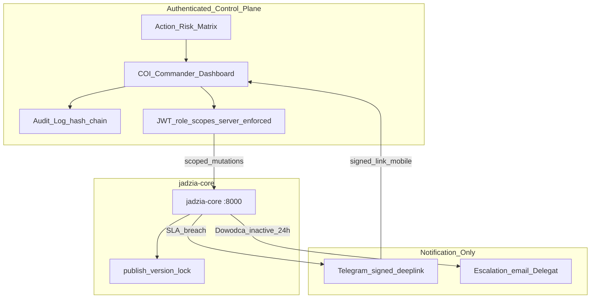

# Plan: COI Commander Dashboard + HITL Control Layer (v3 — post AUDYT-V2-GAP)

**Status:** `APPROVED 2026-07-09` (deploy MVP `1706b6a`; closure program active)

## IMPLEMENTATION STATUS (2026-07-09)

| Faza | % | Gate |
|------|---|------|
| F0 Spec D0.1–D0.14 | 100% | Workshop handoff + human TG proof pending |
| F1 Backend | 100% | N13 lock, authz matrix, scope gates |
| F2 MVP UI | 100% | ApprovalCard, undo60, audit tab, bulk UI |
| F3 HOTL | 100% | graduation runtime + confidence_avg |
| F3.1 Delegation | 100% | commander_roles + JWT --role |
| Deploy | DONE | redeploy after closure commit |
| Scorecard v3 | 6/6 | closure handoff |

**Weryfikacja T1–T13:** [`T1-T13-VERIFICATION.md`](T1-T13-VERIFICATION.md)

**Gate dokumenty (oba blokujące, w tej kolejności):**

1. [`docs/AUDYT-HIL-KONTROLA.md`](../../AUDYT-HIL-KONTROLA.md) — CE-01..CE-10
2. [`AUDYT-V2-GAP.md`](AUDYT-V2-GAP.md) — resztkowe luki v2 (N1..N15, T1..T13)

**Pytanie przewodnie:** *Czy Dowódca po otwarciu dashboardu **panuje**, czy jest **panikowany**?*

---

## v2 → v3: co audyt GAP wykrył

v2 zamknął **intencje** CE-01..CE-10, ale **7 z 10** miało resztkowy gap. **3 nowe krytyczne otwarcia** (N1, N3, N7) blokują approve.

**Reguła v3:** Nie puszczać bez domknięcia **N1, N2, N3, N5, N6, N7** w tekście planu i deliverables F0.

---

## GATE STATUS — CE + resztkowe N

| CE | v2 | Resztkowy gap | Fix v3 |
|----|-----|---------------|--------|
| CE-01 | tiered queue | brak polityki severity | D0.8 severity-assignment policy + SLA registry (N4/N8) |
| CE-02 | revoke SSH | dziura no-laptop | D0.14 Emergency + signed deep-link (N1/N12) |
| CE-03 | SLA amber/red | push do samego siebie | D0.9 escalation recipient model (N6) |
| CE-04 | Home 3 prio | mapowanie 11→nav | D0.1 module→nav table (N4b) |
| CE-05 | 60s undo | public FB ≠ soft undo | public: unpublish+notify; internal: 60s (N5) |
| CE-06 | Risk Matrix | race + bulk cost | publish lock (N13) + cost guardrail (N14) |
| CE-07 | ApprovalCard | — | ✅ |
| CE-08 | POST /feedback | brak progów graduacji | D0.11 graduation thresholds (N3) |
| CE-09 | F3.1 odroczone | brak authz model | D0.13 JWT roles server-side (N7); CE-09 **nie odroczone** |
| CE-10 | freshness | brak per-source SLA | D0.8 SLA registry per source (N8) |

---

## BLOKERY (N1..N7) — muszą być w planie przed approve

### N1 — Emergency bez laptopa (CE-02 recovery path)

**Problem:** Revoke `/zadanie` SSH bez ścieżki zastępczej = Dowódca bez laptopa jest ślepy.

**Fix (D0.14):**

- TG `/ticket` tworzy wpis CRITICAL w Commander Queue
- Push z **signed deep-link** (expireable, bez sesji w URL) → otwiera ticket w **mobile browser**
- Dowódca na telefonie: read + approve/publish w authenticated dashboard (responsive)
- Alternatywa: eskalacja ticketu do **Delegata** z dostępem dashboard
- **Nigdy** SSH z Telegram

### N2 — Audit log pełna spec (D0.10 rozszerzone)

**Problem:** "append-only schema" to za mało dla rozliczalności / EU AI Act.

**Fix (D0.10):**

| Aspekt | Spec |
|--------|------|
| Storage | SQLite tabela `commander_audit_log`, **INSERT-only** (no UPDATE/DELETE) |
| Retencja | 24 miesiące (GDPR — zdefiniowane; export przed purge) |
| Reader roles | Dowódca + Delegat (read); Viewer **bez** audit |
| Tamper-evidence | hash-chain per row (`prev_hash` + canonical payload hash) |
| Required fields | `id, ts, actor_id, actor_role, action, source, target_type, target_id, before_json, after_json, reason, risk_tier, session_id` |

### N3 — Graduation thresholds HITL→HOTL (D0.11)

**Problem:** `POST /feedback` bez metryki przejścia = wieczny recenzent.

**Fix (D0.11 + F3):**

Per action-type (np. `fb_post_approve`, `lead_score`):

```
IF approved_without_edit >= N (default 20)
   AND override_rate < X% (default 5%) over rolling 30d
   AND confidence_avg >= threshold
THEN graduate to HOTL (auto with notify) OR reduce HITL to spot-check %
```

Revert graduation on override spike. UI: badge "HITL / HOTL / auto" per action-type.

### N5 — Public vs internal undo semantics (CE-05)

**Problem:** 60s undo na publicznym FB nie cofa "zobaczenia" przez audience.

**Fix — dwa tryby odwracalności:**

| Typ akcji | Mechanizm | Przykład |
|-----------|-----------|----------|
| **Publiczna** | confirm → publish → **unpublish/delete + notify** + audit `"published_then_unpublished"` | FB post |
| **Wewnętrzna** | confirm → **60s soft undo** | draft approve, calendar reschedule |

Scorecard Odwracalność: pass wymaga obu trybów zdefiniowanych w D0.8 Risk Matrix.

### N6 — Escalation recipient (CE-03)

**Problem:** SLA push do Dowódcy, który sam ignoruje = fałszywa eskalacja.

**Fix (D0.9):**

```
pending > 12h  → amber (dashboard only)
pending > 24h  → red + push Dowódca
pending > 24h AND Dowódca inactive → push + email **Delegat** (2nd recipient)
agent silent > 2× interval → push Dowódca + Delegat if configured
```

**Wymaga:** min. 1 Delegat skonfigurowany przed prod (Settings). Bez Delegata: email fallback + warning banner.

### N7 — Multi-role authz (CE-09 — nie odroczone do F3.1)

**Problem:** "Viewer read-only w UI" ≠ security. JWT był pod jednego usera.

**Fix (D0.13 — w F0 spec, enforced F1):**

| Role | Scopes (server-side) |
|------|---------------------|
| **Dowódca** | `*` all mutations |
| **Delegat** | `marketing:approve`, `marketing:publish`, `queue:act`, `leads:act` — **NOT** `agents:pause`, `wp:ssh`, `settings:roles` |
| **Viewer** | `*:read` only |

- JWT claims: `role`, `scopes[]`
- **Backend** sprawdza scope na każdej mutacji (403 if denied)
- UI ukrywa przyciski, ale **nie polega** na UI alone
- Blokada escalate-through-UI: Delegat nie może nadać sobie Dowódca

**CE-09 przesunięte:** role model w F0 spec; minimal enforcement F1; pełne role UI F2 Settings.

---

## POZOSTAŁE LUKI (T7–T13) — explicit w planie

### N4/N8 — Severity policy + SLA registry (D0.8)

**Severity assignment (rule-based MVP):**

| Queue type | Default severity | SLA pending |
|------------|------------------|-------------|
| hot_lead | CRITICAL | 4h |
| agent_error | CRITICAL | 2h |
| wp_ticket | CRITICAL | 8h |
| fb_post_pending | ACTION | 12h amber / 24h red |
| scheduled_publish_due | ACTION | 1h |
| weekly_brief_ready | INFO | 48h |
| analytics_stale | ACTION | per-source SLA |

**Per-source freshness SLA (CE-10/N8):**

| Source | Stale amber | Stale red |
|--------|-------------|-----------|
| GA4 | > 30 min | > 2h |
| Orders (INT-002) | > 15 min | > 1h |
| Leads (INT-004) | > 15 min | > 1h |
| Worker heartbeat | > 2 min | > 5 min |

### N4b — Mapowanie 11 modułów → nav (D0.1)

| Moduł agenta | Nav / drill-down |
|--------------|------------------|
| Marketing | top: Marketing |
| Analytics | top: Analytics |
| Sales | Analytics → Leads tab |
| Operations | Analytics → Orders tab |
| Design | Agents → INSPIRE link |
| Engineering | Agents → Agent OS link |
| Governance | Settings → VCMS link |
| Procurement, Finance, Support, Negotiation | Agents → placeholder cards (Phase C) |

Home **nie** listuje 11 modułów — tylko 3 priorytety + tiered queue + health.

### N9 — Pause/resume blast radius (F2 Agents)

Gdy pause agenta FB/marketing:

- Zaplanowane posty → status **held** (nie publish)
- Queue pokazuje: "N postów wstrzymanych — agent paused"
- Resume → held wraca do normalnego flow
- Manual fallback: Dowódca może publish pojedynczo z held queue

### N10/N16 — WCAG + dashboard-down continuity (F2 global)

- WCAG 2.1 AA: keyboard nav, focus visible, contrast, reduced motion option
- Gdy dashboard health check fail > 5 min → TG push "Commander unreachable" + link status
- TG staje się **notify-only fallback**, nie control plane

### N12 — TG deep-link security (D0.14)

- Signed token: `HMAC(secret, ticket_id + exp)` — TTL 15 min default
- One-time use optional for high-impact tickets
- **Brak** session token w URL — normal login flow po otwarciu

### N13 — Human/auto publish race (F1 + F2)

- Optimistic lock: `version` field on calendar entry
- Publish: `IF version mismatch → 409 Conflict` + show diff
- Auto-hook (`publish_due_scheduled_entries`) respektuje lock + HITL state
- Last-writer-wins **zabronione** dla public publish

### N14 — Cost guardrail bulk approve (CE-06 / KILLSWITCH)

- Bulk approve > 5 items → wymaga explicit confirm + reason
- Daily human-action budget (configurable) — exceed → block + alert
- Aligns with KILLSWITCH cost-limit pattern

### N15 — UI language (D0.12)

| Warstwa | Język |
|---------|-------|
| Commander UI (nav, labels, SLA, errors) | **PL** (Dowódca ADHD) |
| Content biznesowy (posty FB, lead copy) | **NL** |
| Audit log action codes | EN (machine) + PL label in UI |

Decyzja F0 — nie default Next.js EN.

---

## Korekta założeń (v3)

**COI Commander** = authenticated control plane (marketing, stats, agenci, strategia).

**Telegram** = notify + signed deep-links. **Zero** SSH prod, **zero** mutations.

**CE-09** = część F0 spec (D0.13), nie "później".

---

## Architektura control plane (v3)



---

## Faza 0 — UX/IA + HITL spec (BLOKUJĄCA)

**Wejście:** AUDYT-HIL-KONTROLA.md + AUDYT-V2-GAP.md + scorecard 6 wymiarów.

### Deliverables F0 (D0.1 — D0.14)

| # | Deliverable | Closes |
|---|-------------|--------|
| D0.1 | IA + sitemap max 5 nav + **module→nav map (N4b)** | CE-04 |
| D0.2 | Commander Daily Loop (3 prio → 1 approve → done) | CE-01, CE-04 |
| D0.3 | Wireframes: Home, Marketing, Analytics freshness, Agents pause-held | CE-01,04,10,N9 |
| D0.4 | Components: ApprovalCard, QueueItem, StaleDataBadge, HeldQueueBanner | CE-07, CE-10 |
| D0.5 | ADR hosting | — |
| D0.6 | API gap list (F1) | — |
| D0.7 | Telegram boundary + **signed links (N12)** | CE-02, N12 |
| D0.8 | **Risk Matrix + severity policy + SLA registry** | CE-01,06, N4,N8 |
| D0.9 | **ApprovalCard + escalation recipient model** | CE-03,07, **N6** |
| D0.10 | **Audit log full spec** (retention, immutability, fields, hash-chain) | CE-05, **N2** |
| D0.11 | **HITL→HOTL graduation thresholds** per action-type | CE-08, **N3** |
| D0.12 | **UI language: PL shell / NL content** | **N15** |
| D0.13 | **Multi-role authz: JWT claims + server scopes** | CE-09, **N7** |
| D0.14 | **Emergency bez laptopa**: /ticket + mobile signed deep-link | CE-02, **N1** |

### Workshop 2h — 5 testów (rozszerzone)

1. Test odwracalności — **public vs internal** (N5)
2. Test "czy ktoś słucha" — Dowódca 3 dni offline → **Delegat dostaje push** (N6)
3. Test obciążenia — Home max 7 chunków
4. Walkthrough poniedziałek rano — dashboard only
5. **Test no-laptop** — telefon + signed link → approve ticket (N1)

**Output:** `docs/design/coi-commander/` w jadzia-core.

**DoD F0:** Dowódca approve D0.1–D0.14 + scorecard draft ≥ acceptable na papierze.

---

## Faza 1 — Backend (control-plane ready)

| Endpoint | Cel | Closes |
|----------|-----|--------|
| `GET /commander/queue` | severity, age, sla_status, severity_policy_ref | CE-01, N4 |
| `GET /commander/priorities/today` | max 3 | CE-04 |
| `GET /audit-log` | paginated, role-gated read | N2 |
| `POST /feedback` | rejection/correction + graduation counters | CE-08, N3 |
| `GET /analytics/snapshot` | per-source freshness + SLA breach flags | CE-10, N8 |
| `POST .../publish` | version lock, audit row, risk tier check | N5, N13 |
| `POST .../unpublish` | public reversal + audit | N5 |
| `POST /agents/{id}/pause` | held queue side-effect + scope check | N9, N7 |
| All mutations | `@require_scope(...)` server-side | N7 |
| `POST /auth/deeplink` | signed ticket token mint | N1, N12 |

**DoD F1:** pytest; 403 on scope violation; audit hash-chain; publish 409 on version conflict.

---

## Faza 2 — MVP UI (4 ekrany)

### Home
3 priorytety + tiered queue (default CRITICAL+ACTION) + health strip + freshness summary

### Marketing Studio
ApprovalCard (CE-07) → confirm → publish → **unpublish path** (N5) + held banner if agent paused (N9)

### Analytics
Tiles z per-source SLA (N8) + StaleDataBadge

### Agents
SLA ok/breach + pause/resume (scope-gated) + held count + INSPIRE/Agent OS links

### Settings (minimal F2)
- Delegat email + role assignment (Dowódca only)
- UI language confirm PL
- Escalation recipient config

### Global F2
- WCAG keyboard/contrast/reduced-motion (N10)
- Bulk approve guardrail UI (N14)
- Dashboard-down → TG health push hook (N16)

**DoD F2:** scorecard 6 wymiarów pass; test no-laptop pass; zero SSH z TG.

---

## Faza 3 — Moduły + HOTL runtime

Iteracyjnie 1 moduł / sesja. Graduation counters live (D0.11). Feedback → threshold tuning.

## Faza 3.1 — Delegation live

Delegat/Viewer accounts prod-ready. 24h escalate to 2nd. Email fallback.

## Faza 4 — Paid ads (po HITL mature)

Placeholder IA only.

---

## Telegram — granica finalna (v3)

| DOZWOLONE | ZABRONIONE |
|-----------|------------|
| Push alert + **signed deep-link** (15 min TTL) | SSH prod |
| Push SLA breach → Dowódca, potem Delegat | Approve/publish w TG |
| Push published confirmation | Registry / pause |
| Push dashboard-down health | Session token w URL |
| `/ticket` → queue entry + link | `/zadanie` (deprecated) |

---

## Scorecard — exit criteria (v3)

| Wymiar | Pass criteria |
|--------|---------------|
| Autorytet | Risk Matrix + server-side scopes |
| Odwracalność | Public unpublish + internal 60s undo |
| Wykrywalność | SLA + escalate to **inny** człowiek (N6) |
| Obciążenie | Home ≤7 chunks; PL UI |
| Ciągłość | Delegat + 24h 2nd recipient |
| Rozliczalność | Audit hash-chain 24mo retention |

---

## Harmonogram

| Tydzień | Faza | Gate |
|---------|------|------|
| 1 | F0 D0.1–D0.14 + workshop | **Approve plan v3** |
| 2 | F1 backend + authz | N7 enforced |
| 3–4 | F2 MVP + N1 no-laptop test | scorecard |
| 5+ | F3 modules + graduation | 1 moduł / sesja |
| 6+ | F3.1 delegation prod | CE-09 live |

---

## Anti-patterns (v3)

- Start kodu przed approve v3
- Push SLA do samego ignorującego (N6)
- 60s undo na public FB (N5)
- Audit "schema only" bez retention (N2)
- Role tylko w UI (N7)
- SSH z TG w jakiejkolwiek formie
- UI po angielsku dla PL-foundera (N15)
- Approve bez version lock (N13)

---

## Następny krok (po tej aktualizacji v3)

1. **Dowódca review** tego planu + AUDYT-V2-GAP — czy N1–N7 domknięte wystarczająco
2. **Approve plan v3** — dopiero wtedy
3. Utworzyć `UX-BRIEF-COMMANDER.md` z CE + N blockers
4. Workshop F0 z **testem no-laptop**
5. **Stop** — zero kodu do approve D0.1–D0.14

**NIE STARTUJEMY** implementacji, F0 workshopu ani UX briefu bez explicit approve v3 od Dowódcy.
