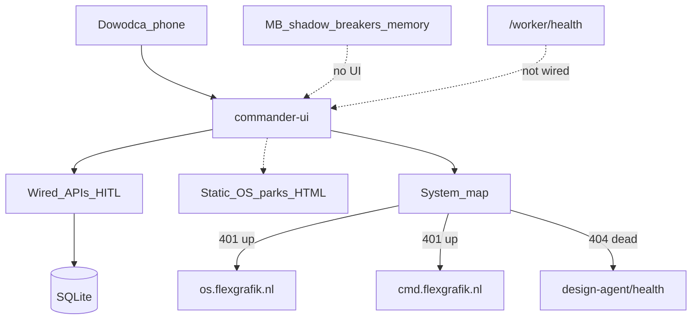

# COI Commander — Dashboard Potential Audit

**Task:** `CMD-DASH-AUDIT-01`  
**Date:** 2026-07-21  
**Scope:** COI Commander (`commander-ui/` + `api/routes/commander.py`) — utilization vs potential  
**Out of scope:** Mission Control / VCMS merge · UI implementation · deploy  
**Prod tip:** VPS `/opt/jadzia` @ `3604f60`  
**Dogfood TS:** `2026-07-21T17:48:09Z`  
**Auditor:** Cursor Agent (evidence-first; no fake PASS)

---

## Executive verdict

**UTILIZATION: ~58%** of valuable Commander API surface is wired into UI.  
**Overall:** **PARTIAL** — Home/Marketing/Analityka deliver real HITL decisions, but ops truth and Marketing Brain controls are largely invisible to Dowódca.

| Werdykt | Znaczenie |
|---------|-----------|
| CEO daily path | **PASS** — priorities + CRITICAL queue + CS follow-up + organic publish HITL |
| Potencjał API (MB/ops) | **FAIL coverage** — shadow/breakers/brain-bus/memory/preflight/graduation = API-only |
| Ops visibility | **FAIL** — `/worker/health` healthy on prod, Home strip never shows SSH/WAL/worker_loop |
| Hop integrity | **PARTIAL** — OS/VCMS respond (401 Basic Auth = alive); Design Agent health = **404 dead hop** |

Commander jest żywy jako **telefonowy hub decyzji**. Nie jest jeszcze pełnym **cockpitem potencjału** jadzia (ops + Marketing Brain).

---

## Scorecard potencjału (1–5)

| Wymiar | Ocena | Status | Dowód |
|--------|------:|--------|-------|
| Decision density | 4.0 | PASS | Home: 3 priorities + CRITICAL/ACTION queue + CS form; Marketing: compose→approve→publish |
| Truth wiring | 3.0 | PARTIAL | Live: FB health, weekly draft, DTL, calendar. Static: Marketing OS parks strip (H-Meta…H-F4x) |
| Coverage (API↔UI) | 2.5 | FAIL | ~22/38 valuable routes wired; 12+ Marketing Brain routes orphan |
| Ops visibility | 1.5 | FAIL | Home = GA4/worker *freshness* + SLA breach count; not `/worker/health` (SSH/sqlite/uptime) |
| Marketing OS | 2.5 | PARTIAL | Organic HITL strong; breakers/shadow/memory/preflight invisible |
| Trust / authz | 4.0 | PASS | Unauth → 401 on protected routes; soft-fail `.catch()` on secondary panels |
| Hop integrity | 2.5 | PARTIAL | OS/VCMS 401 (up); Wizard 200; **design-agent/health 404** (map + Agenci INSPIRE link) |
| Mobile hub | 4.0 | PASS | Phone-first nav, PWA stubs, cold-open surface LIVE per AI OS #1 |
| **Łącznie** | **3.0/5** | **PARTIAL** | CEO path OK; potencjał MB+ops niewykorzystany |

**UTILIZATION formula:** wired valuable endpoints / (wired + orphan valuable)  
Counted from `commander.py` + content-calendar used by UI ≈ **22 wired / 38 valuable ≈ 58%**.  
(Stubs and TG-only deeplink counted as “valuable but unused in UI”.)

---

## Macierz UI ↔ API

### Wired (UI calls)

| View / widget | Endpoint | Soft-fail? |
|---------------|----------|------------|
| Auth | `POST /api/v1/commander/auth/exchange` | no |
| Home priorities | `GET …/priorities/today` | no (hard fail) |
| Home queue | `GET …/queue` | no |
| Home health strip | `GET /api/v1/agents` + `…/analytics/snapshot` + `…/settings` | yes (catch) |
| Home CS form | `POST …/cs/followup` | no |
| Home lead/ticket disp | `POST …/leads/{id}/disposition` · `POST …/tickets/{id}/disposition` | no |
| Marketing FB | `GET …/marketing/fb-health` | yes |
| Marketing weekly | `GET …/marketing/weekly-draft` | no (panel) |
| Marketing calendar | `GET/POST/PATCH /api/v1/content-calendar` + publish/unpublish | partial |
| Marketing undo | `POST …/actions/calendar/{id}/undo` | no |
| Analityka tiles | `GET …/analytics/snapshot` · `/orders` · `/leads` · `…/data-health` | mixed |
| DTL ingest | `POST …/marketing/dtl/ingest` | no |
| Agenci | `GET/POST /api/v1/agents` pause/resume | no |
| Audyt | `GET …/audit-log` · `…/verify` | no |
| Ustawienia | `GET/PATCH …/settings` | no |
| Ticket deeplink | `GET …/tickets/{id}?token=` | no |

### Orphan (route exists · no Commander UI)

| Endpoint | Role | Severity |
|----------|------|----------|
| `GET …/marketing/shadow` (+ eval-pack, accuracy) | Shadow eval visibility | **P1** |
| `POST …/marketing/shadow/eval-*` | Staff scoring | P2 |
| `GET …/marketing/breakers` | Circuit breaker status | **P1** |
| `GET …/marketing/brain-bus` | Bus health / events | P1 |
| `POST …/marketing/brain-bus/ceo-priority` | **Explicit stub** (no Ads) | P2 (document or UI “stub”) |
| `GET/POST …/marketing/memory/*` | RAG/memory status | P2 |
| `GET …/marketing/propose-preflight` | Preflight before propose | **P1** |
| `POST …/marketing/brain/cycle` | Trigger brain cycle | P2 |
| `POST /api/v1/marketing/actions/execute` | Execute (token) | P1 — keep TG/HITL; UI would be dangerous without Gate |
| `GET …/graduation/{action_type}` | Graduation meters | P2 |
| `POST …/feedback` | Feedback loop | P3 |
| `POST …/bulk-approve` | Bulk HITL | P2 |
| `POST …/deeplink` | TG deeplink mint | P3 (TG path OK) |
| `GET /worker/health` · `/worker/dashboard` | Ops health JSON | **P0** for Home strip |

### Dead / broken hops

| Surface | Expected | Live `2026-07-21T17:48:09Z` |
|---------|----------|------------------------------|
| System map → Design Agent | health 200 | **404** public + local |
| Agenci → INSPIRE link | same | **404** |
| System map → Agent OS | alive | **401** Basic Auth (UP) |
| System map → VCMS / docs | alive | **401** Basic Auth (UP) |
| Wizard | 200 | **200** |
| `engineering` agent OS hop in cards | render if `agent_id===engineering` | **never** — not in `DEFAULT_AGENTS` |

### Stubs / incomplete truth

| Item | Evidence |
|------|----------|
| `next_expected_run: null` always | `agent/commander/agents_registry.py:69` |
| CEO priority stub | `publish_ceo_priority_stub` · `source_brain=ceo_stub` |
| Marketing OS parks strip | static HTML in `index.html` `#mkt-os-strip` — not `propose-preflight` / `breakers` |
| Home “Worker” label | analytics freshness key `snap.freshness.worker` — **not** `worker_loop_alive` from `/worker/health` |
| Verify script drift | Local park `deployment/mkt-dash01-verify.sh` greps `mkt-dash01`; live HTML is `mkt-dash02`; script **absent on VPS tip** |

---

## Live dogfood evidence (non-mutating)

```text
TS=2026-07-21T17:48:09Z tip=3604f60
commander/                 200  (16601 B)
commander/app.js?v=mkt-dash02  200
commander/styles.css?v=mkt-dash02  200
cache mkt-dash02 count=2 · mkt-dash01 count=0
/worker/health local+public 200 · status=healthy · ssh=ok · sqlite=true · worker_loop_alive=true
/api/v1/design-agent/health 404
os.flexgrafik.nl / cmd.flexgrafik.nl /docs  401 (auth wall = up)
wizard 200
Commander APIs without JWT → 401 (routes exist)
Orphan MB routes → 401 (exist, UI-orphan)
GET /api/v1/commander/leads → 404 (OK: UI uses POST …/leads/{id}/disposition + GET /api/v1/leads)
```

**Mismatch proof (Ops visibility):**  
Prod `/worker/health` = `healthy` + `ssh_connection=ok`, but Home strip only renders `Agenci SLA breach · GA4 · Worker(freshness)` — Dowódca **nie widzi** SSH/SQLite/uptime w hubie CEO.

---

## Top gaps (severity-ranked)

| # | ID (proposed) | Gap | Why it hurts | Effort |
|---|---------------|-----|--------------|--------|
| 1 | `CMD-DASH-OPS-HEALTH-01` | Home strip ≠ `/worker/health` | False calm during SSH/WAL outage | S |
| 2 | `CMD-DASH-DEAD-HOP-01` | `design-agent/health` 404 in map + Agenci | Broken trust in system map | S |
| 3 | `CMD-DASH-PARKS-LIVE-01` | Parks strip static | Marketing OS looks “green” without breakers/preflight | M |
| 4 | `CMD-DASH-MB-PANEL-01` | Orphan: breakers + brain-bus + shadow (read-only strip) | MB potential invisible to CEO | M |
| 5 | `CMD-DASH-AGENTS-TRUTH-01` | `next_expected_run` null; no `engineering` hop | Agenci view incomplete vs AI OS #5 | S |
| 6 | `CMD-DASH-VERIFY-01` | verify script tag/VPS absence | False miss on cache smoke | S |
| 7 | `CMD-DASH-ORPHAN-SOT-01` | Document intentional API-only (execute/graduation/feedback) | Prevents accidental unsafe UI | S |

**Recommended order after this audit:** 1 → 2 → 3 → 4 (trust first, then Marketing OS truth).

---

## Architecture (as audited)



---

## What is already strong (do not “fix”)

- Phone hub + JWT/TG auth exchange
- CRITICAL/ACTION queue dispositions
- Organic calendar HITL + 60s undo
- Data Health / weekly draft / FB token amber
- Soft-fail on secondary panels (JWT resilience CMD-MKT-DASH-02)
- ADR D0.6: no merge with Mission Control / VCMS

---

## Definition of Done (this audit)

- [x] Macierz UI↔API + orphan list
- [x] Live dogfood timestamp + HTTP codes
- [x] Scorecard + UTILIZATION %
- [x] Top gaps → follow-up tasks in `todo.json`
- [x] Handoff file

**Decyzja:** `CMD-DASH-AUDIT-01 PASS as audit` · product utilization **PARTIAL (58%)** · next implement **`CMD-DASH-OPS-HEALTH-01`**
