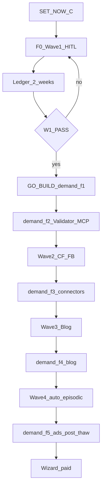
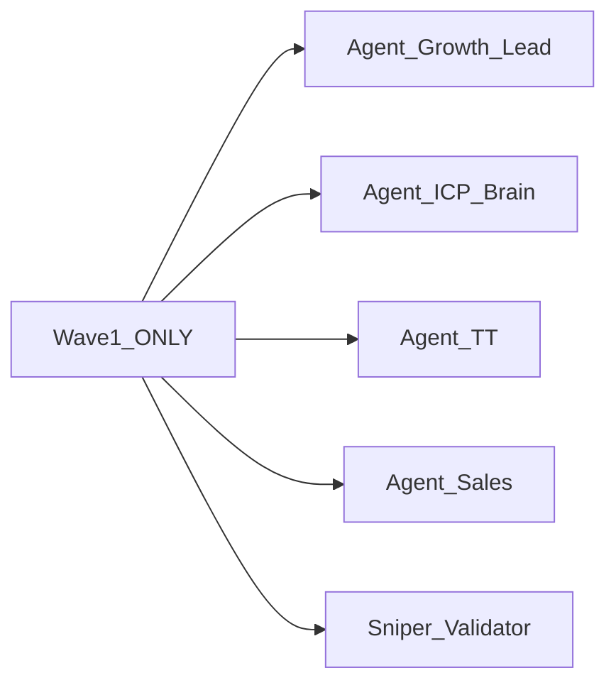
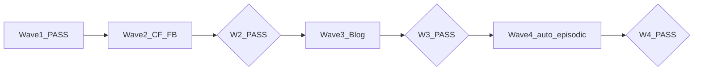
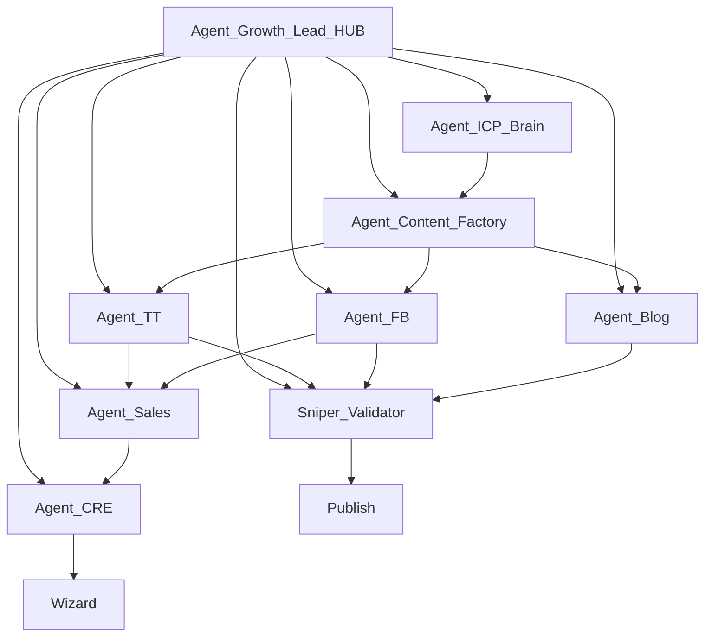
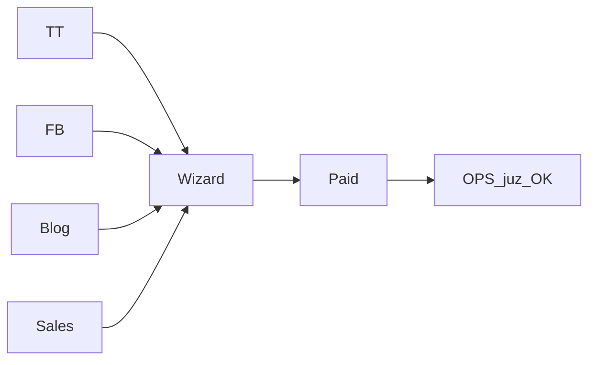

# DEMAND OS — Enterprise Action Plan

> **Problem nr 1:** NIE MA KLIENTÓW.  
> **SoT egzekucji:** [`SYSTEM-FIRM-OPERATING-SYSTEM-TARGET.md`](./SYSTEM-FIRM-OPERATING-SYSTEM-TARGET.md) v5 INSIDER — ten plan mapuje 1:1, nie inventuje strategii.  
> **Task ledger:** [`DEMAND-OS-TODO.md`](./DEMAND-OS-TODO.md) — każde zadanie ma DoD + `os_target_section_ref`.  
> **Start operatora:** [`marketing/OPERATOR-TODAY.md`](./marketing/OPERATOR-TODAY.md).

---

## 0. Doktryna (zamrożona)

| Reguła | Wartość |
|--------|---------|
| Cash | tylko Wizard paid (≥€199 · marża ≥60%) |
| CTA | **1** — Wizard (+ UTM). Gra = osobny post. |
| ICP | **1 rola / tydzień** (W1 = `installateur`) |
| Kanał primary | TikTok organic ≥**2026-08-02** |
| Ads | OFF / FREEZE do **2026-08-06** + GO Foundera |
| Równanie (§B.1) | `€ = (Qualified touches → Wizard starts) × (Start→Paid %) × AOV × marża` |
| Priorytet | najpierw **wolumen starts** — nie AOV, nie HQ |
| Ops po sprzedaży | **OUT OF SCOPE** |

**Signal stack (§B.2):** ten sam ból ICP na TT + FB + Blog → ten sam 1 CTA Wizard.  
**Polowanie (§B.5):** komentarz > post. STL <15 min (§B.6). Dual cash Design Agent = KILL (§B.7).

---

## Master sequence (OS §O)



| Krok | Akcja | Gate |
|------|-------|------|
| 1 | **SET NOW** (sekcja C) — dziś, HITL | wszystkie `DOS-C*` done |
| 2 | `GO TIKTOK ORGANIC` ≥2026-08-02 — F0 Wave1 | `DOS-F0-01` |
| 3 | Ledger 2 tygodnie | `DOS-LEDGER-2W` |
| 4 | `GO BUILD demand-f1` … f5 | tylko po F0 / W1 PASS |
| 5 | Wave 2+ | tylko po `DOS-W1-PASS` |

---

## 1. SET NOW — CO USTAWIĆ TERAZ (OS §C)

**To jest najważniejsze zadanie — ustawienia, nie build.** Taski: `DOS-C1-01` … `DOS-C7-01`.

### 1.1 Ustawienia twarde (C.1)

| # | Ustaw | Wartość | TODO |
|---|-------|---------|------|
| 1 | ICP role week 1 | `installateur` | DOS-C1-01 |
| 2 | Primary channel | TikTok organic ≥2026-08-02 | DOS-C1-02 |
| 3 | 1 CTA URL template | `https://zzpackage.flexgrafik.nl/wizard/?utm_source={channel}&utm_medium=organic&utm_campaign=icp_{role}&utm_content={asset_id}` | DOS-C1-03 |
| 4 | Gra bridge | osobny post = tylko `app.flexgrafik.nl` + GAME10 → Wizard coupon | DOS-C1-04 |
| 5 | Ads | OFF do 2026-08-06 | DOS-C1-05 |
| 6 | STL SLA | hot &lt;15 min · 0 overnight | DOS-C1-06 |
| 7 | Design Agent | każdy lead → Wizard deeplink &lt;24h (HITL) | DOS-C1-07 |
| 8 | Money Check | co Pon: starts UTM · paid · top 1 hook · FAIL validator | DOS-C1-08 |

### 1.2 FB allowlist (C.2)

| Pole | Ustawienie | TODO |
|------|------------|------|
| Własna strona | flexgrafik FB — reply 100% hot | DOS-C2-01 |
| Grupy NL bouw/ZZP | max **5** na start, zero spam | DOS-C2-01 |
| Konkurenci | read-only — komentuj tylko ICP score &gt;70 | DOS-C2-01 |
| Zakaz | ten sam copy-paste 20 grup / dzień | DOS-C2-01 |

### 1.3 TT engage (C.3)

| Pole | Ustawienie | TODO |
|------|------------|------|
| Publish | ≥3 / tydzień | DOS-C3-01 |
| Reply własne | &lt;2h na pytanie z intencją | DOS-C3-01 |
| Outbound | tylko bouw/ZZP NL — 1 wartość + link | DOS-C3-01 |
| Zakaz | follow/unfollow masowy | DOS-C3-01 |

### 1.4 Blog ICP (C.4)

| Pole | Ustawienie | TODO |
|------|------------|------|
| Cadence | 1 / tydzień (auto dopiero Wave 3) | DOS-C4-01 |
| Tydzień 1 | installateur + bus 50m herkenbaar (NL) | DOS-C4-01 |
| CTA | tylko Wizard + UTM `blog` | DOS-C4-01 |

### 1.5 Validator rules — HITL od razu (C.5)

**FAIL** jeśli: &gt;1 CTA · brak UTM · brak `icp_role` tag · multi-CTA słowa · Ads w freeze · HQ screenshot jako hero.

TODO: `DOS-C5-01`.

### 1.6 Wave 1 roster (C.6) — tylko 5 ról



Reszta = Wave 2–4. **Zakaz:** Blog auto / SEO auto / 15 agentów przed Wave1 PASS.  
TODO: `DOS-C6-01`.

### 1.7 Ledger (C.7) — zanim dashboard

Kolumny obowiązkowe:

`date | channel | icp_role | asset_id | utm_link | publish_Y/N | comments_sent | hot_leads | wizard_starts | paid | notes`

**Bez ledgera = ślepa optymalizacja = manowiec.**  
TODO: `DOS-C7-01`.

**Phase 0 PASS** = wszystkie `DOS-C*` = `done` → wejście w F0.

---

## 2. F0 + Wave 1 HITL (OS §F0 · §J W1 · §H)

Owner HITL = Dowódca (do czasu auto). Playbook: `DOS-F0-01`.

| Rola | Job | KPI | TODO |
|------|-----|-----|------|
| Agent_Growth_Lead | Money Check · ICP week · kill vanity | starts + paid WoW | DOS-W1-01 |
| Agent_ICP_Brain | 1 rola/tydz · brief NL | brief przed Wt asset | DOS-W1-02 |
| Agent_TT | ≥3 publish/tydz · engage | starts `utm_source=tiktok` | DOS-W1-03 |
| Agent_Sales | STL · Wizard w odpowiedzi | hot→Wizard median &lt;15m | DOS-W1-04 |
| Sniper_Validator | gate przed światem | 0 bypass · FAIL rate ↓ | DOS-W1-05 |

**W1 PASS (`DOS-W1-PASS`):** ≥3 TT/tydz × 2 tygodnie **oraz** ledger kompletny (`DOS-LEDGER-2W`).  
Dopiero wtedy: Wave 2 **i** `GO BUILD demand-f1`.

### Tydzień święty (OS §K)

| Dzień | Praca |
|-------|-------|
| Codziennie | TT/FB engage · Validator |
| Pon | Money Check + episodic |
| Wt | ICP brief + master asset |
| Śr | TT publish |
| Czw | Blog ICP (HITL; auto = W3) |
| Pt | FB hunt + STL drill |

---

## 3. Ledger 2 tygodnie (OS §O#3 · §C.7)

| Reguła | Wartość |
|--------|---------|
| Okres | 14 dni kalendarzowych ciągłych |
| Dziura max | &lt;48h bez wpisu |
| Dashboard | **NIE** — arkusz / Notion |
| Money Check | każdy Pon (starts UTM · paid · top hook · FAIL) |

TODO: `DOS-LEDGER-2W`.

---

## 4. Wave 2 → 4 (OS §J) — po W1 PASS



| Wave | Agenci | PASS | TODO |
|------|--------|------|------|
| W2 | + Content Factory + FB hunter | ≥1 qualified FB comment/day × 5 dni roboczych | DOS-W2-01 · DOS-W2-PASS |
| W3 | + Blog ICP | 2 kolejne tygodnie × 1 article z `icp_role` | DOS-W3-01 · DOS-W3-PASS |
| W4 | full auto engage + episodic | starts growth UTM WoW ↑ vs baseline ledger | DOS-W4-01 · DOS-W4-PASS |

**Hard gate:** Wave N tylko po Wave N−1 PASS. Zero skoku do 15 agentów Day 1.

---

## 5. Build fazy F1 → F5 (OS §L) — po F0 PASS

| Faza | Co | NIE | Komenda | TODO |
|------|-----|-----|---------|------|
| **F0** | HITL Wave1 + ledger | ops desk | (SET NOW + organic) | DOS-F0-01 |
| **F1** | UTM Lock + growth_events | vanity HQ | `GO BUILD demand-f1` | DOS-F1-GO · DOS-F1-01 |
| **F2** | Validator + calendar MCP | 15 agentów | `GO BUILD demand-f2` | DOS-F2-01 |
| **F3** | TT/FB connectors | spam | `GO BUILD demand-f3` | DOS-F3-01 |
| **F4** | Blog pipeline ICP | ogólne AI blogi | `GO BUILD demand-f4` | DOS-F4-01 |
| **F5** | Ads post-thaw | spend w freeze | `GO BUILD demand-f5` | DOS-F5-01 |

`GO BUILD demand-f1` dopiero gdy audit ledger pokazuje: **brak UTM na growth linkach = ból operacyjny** (OS §O#4).

---

## 6. Hub-spoke + MCP + A2A (OS §E · §H)



### MCP (tools) — Day1 bez nowych narzędzi

| Tool | Agent | TODO |
|------|-------|------|
| jadzia.db + UTM | Growth Lead, CRE | DOS-MCP-01 |
| content_calendar | TT, FB, Blog | DOS-MCP-01 |
| GA4 | Growth Lead | DOS-MCP-01 |
| publish path | TT, FB | DOS-MCP-01 |
| GDrive | Content Factory | DOS-MCP-01 |
| widget/leads | Sales | DOS-MCP-01 |
| social connectors TO-BE | TT, FB read/comment | DOS-F3-01 |

### A2A handoffs (SLA)

| Handoff | SLA | TODO |
|---------|-----|------|
| `brief_icp` | instant | DOS-A2A-01 |
| `publish_request` → Validator | &lt;5 min | DOS-A2A-01 |
| `engage_event` → Sales | hot &lt;15 min | DOS-A2A-01 |
| `lead_hot` → Wizard | &lt;15 min | DOS-A2A-01 |

HITL ≠ wszystko: komentarze/reply = autonomia **po** Validator PASS (OS §G).

---

## 7. Insider ops rules (OS §A · §B)

| Reguła | Cite | TODO |
|--------|------|------|
| Signal stack: ten sam ból, wiele powierzchni, 1 CTA | B.2 | DOS-INS-01 |
| Comment &gt; post (FB/TT engage = rdzeń) | B.5 | DOS-W2-01 · DOS-W1-03 |
| STL hot &lt;15 min · 0 overnight | B.6 | DOS-C1-06 · DOS-W1-04 |
| Creative fatigue TT: nowy kąt co 7–14 dni | B.4 | DOS-INS-02 |
| Kill dual cash: DA mockup → Wizard &lt;24h | B.7 | DOS-C1-07 · DOS-INS-03 |
| Proof hierarchy: zakaz HQ/Agent OS jako hero | B.8 | DOS-C5-01 |
| Decoy 2 bieguny tylko w Wizard — w poście nigdy menu | B.9 | DOS-C5-01 |
| Memory: 1 ulepszenie/tydz z #1 hook episodic | F | DOS-W4-01 |

### Money Highway (ops ucięte — §I)



---

## 8. Observability — jeden ekran (OS §M · §D)

| Widoczne | NIE (manowiec) |
|----------|----------------|
| Publish · comments · validator FAIL | views vanity |
| Wizard starts by UTM · paid | VHQ polish |
| Top hook · HITL queue | tickets ops desk |

**North Star:** P0 = Wizard starts growth UTM · P1 = Paid real / tydzień · P2 = Social touchpoints / dzień · P3 = Sniper compliance %.

---

## 9. STOP list (OS §N) — `wont_do`

- HQ / VHQ polish jako P0 tygodnia  
- Order desk / S7 / fulfilment build  
- QuietForge zamiast TT / QuietForge P0  
- Multi-CTA post  
- Offerte jako koniec sprzedaży  
- 15 agentów Day 1  
- Dashboard bez UTM  
- „Później zrobimy marketing”  
- Viral bez STL  
- Blog bez ICP role tag  
- Ads w freeze / Mollie scale bez GO  

---

## 10. AS-IS → TO-BE (mapa firmy)

Źródło AS-IS: [`SYSTEM-FIRM-OPERATING-MAP.md`](./SYSTEM-FIRM-OPERATING-MAP.md).  
Dziś piłka pada: Marketing (brak rytmu TT) · Sales (STL HITL) · HQ/Eng zabiera czas.  
Ten plan naprawia **tylko** demand → Wizard. Ops/CS/Finance po paid = nie ruszamy.

---

## ACCEPT

```text
ACCEPT DEMAND-OS-ACTION-PLAN
```

**Status:** ACCEPTED 2026-07-31 · Phase 0 SET NOW pack = LIVE (`docs/ops/demand-os/set-now/`) · `python tools/demand_os_phase0_check.py` → PASS.

**Następny krok (nie kod):**

1. ≥2026-08-02: `GO TIKTOK ORGANIC` + F0 Wave1 (`/demand-os-execute`).  
2. Ledger 2 tygodnie → `DOS-W1-PASS`.  
3. Dopiero potem: `GO BUILD demand-f1`.

*Demand Machine · polowanie > publikacja · 1 ICP · 1 CTA · STL · ledger · ops OUT*
)
