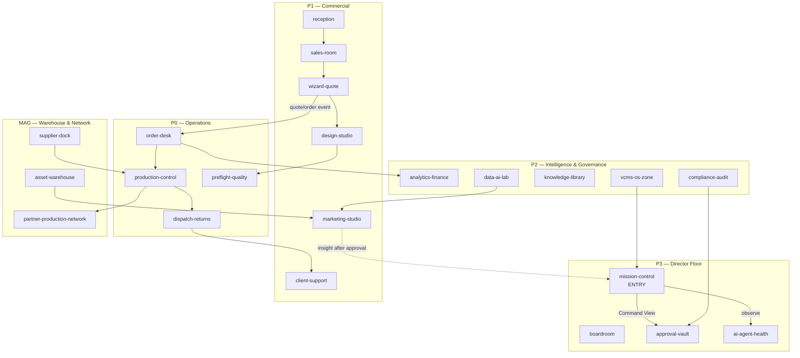
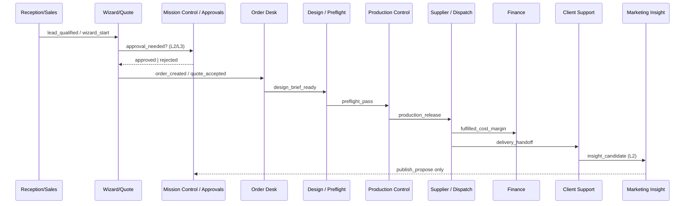

# FlexGrafik Virtual HQ — Architecture

## 0. Relationship to Campus / Commander

| Layer | Role | Status |
|-------|------|--------|
| **Virtual HQ** | **Primary operational dashboard** — World / Work / Command experience | W1–W6 CLOSED+DEPLOY · cache `vhq-w60a` · tip `014c791` · runtime `06212d7` |
| **Commander (jadzia)** | **Underlying control, data, audit and action engine** — queues, JWT, Marketing, Analytics, Agents, Audit, Settings | LIVE tip `014c791` · runtime `06212d7` · `?v=vhq-w60a` · ops_bus_events + Approval Vault (PARTIAL) |
| **Campus W1–W3** | Truthful map hops, evidence badges, 5 Truth Cards | DONE — foundation absorbed into VHQ path |
| **Agent OS / VCMS** | Build + Govern brains — hop destinations, not merged into jadzia | PARTIAL post-auth |

### Founder product direction (2026-07-27 CLOSE W1)

> Virtual HQ becomes the primary operational dashboard.  
> Commander is the underlying control, data, audit and action engine.  
> Existing dashboard content must progressively be reorganized into Mission Control and department Work Views, **not duplicated**.

**Rules**
- Virtual HQ orients and surfaces decisions; Work Views open real Commander surfaces / external SoT — **no parallel fake dashboards**.
- Progressive reorganization of existing Home/Campus content into MC + room Work Views (W2+).
- No 6th primary Commander tab (D0.15).
- Talk&Buy = inspiration for spatial discoverability only. No code/assets/branding clone.

**Non-copy:** Talk&Buy = inspiration for spatial interaction and discoverability only. No code, assets, branding, or UI clone.

---

## 1. Product target (what HQ is / is not)

### IS
- Operational digital twin of FlexGrafik B.V.
- Visual, room-based Director management
- Real departments ↔ real SoT systems
- Human-approved AI operations
- Typed cross-department task flow (Operations Bus)

### IS NOT
- Decorative game / fake 3D office theatre
- Second disconnected app
- Chatbot page
- Static dashboard with room labels only
- Uncontrolled agent-to-agent chat

---

## 2. Visual strategy

| Phase | Approach | Gate |
|-------|----------|------|
| **Now → MVP** | **2D / isometric** building · floors · rooms · teleport / map / search | VF-VHQ-W1-SHELL … W7 |
| **Later** | Richer motion / ambient presence (still 2D/iso) | after dogfood |
| **Roadmap only** | True 3D | **VF-VHQ-3D-PARKED** — only after operational usage proves value |

**UX principles**
1. No forced walking — teleport, floor jump, search always available.
2. Visual world helps decisions; Work View wins over decoration.
3. Every room: one Director question + one primary action.
4. Status colour/label honest: LIVE / PARTIAL / UNVERIFIED / PARKED / PLANNED.
5. No fake people/agents “working” without real task SoT.
6. Responsive: phone Mission Control first; desktop World View optional.
7. No 6th primary Commander tab (D0.15) — HQ shell embeds or overlays existing 5 tabs / deep-links.

---

## 3. Three views (Director UX)

### A. World View
- Building · floors · rooms
- Orientation + company understanding
- Click room → Work View or status sheet if PARKED/PLANNED
- Always: floor picker, search, “teleport to Mission Control”

### B. Work View
- Inside a room: queues, cards, evidence IDs, actions, approvals
- Prefer existing Commander panels / proven URLs over reinventing CRUD
- Efficiency > décor

### C. Command View (Mission Control)
Answers **≤30s**:
1. What is making money now?
2. What is blocked or at risk?
3. What needs my decision today?
4. Which department is behind?
5. Which agent/action failed or waits for approval?
6. What is the next best action?
7. What is not yet implemented or not trusted?

---

## 4. Approval model (room actions)

| Level | Meaning | Examples | Who |
|-------|---------|----------|-----|
| **L0** | Observe / auto-read | health strip, Truth Card status | system |
| **L1** | Operator disposition | Ack / Snooze / Close ticket | Ops/COI |
| **L2** | Approve agent **proposal** | MB card, calendar draft, brief CTA | Director / Ops |
| **L3** | Founder GO (reversible ops risk) | deploy VPS, organic publish pack, OS approve→prod | Dowódca |
| **L4** | Hard STOP / irreversible | Ads spend, Mollie LIVE, Gate D, secrets, OS↔jadzia merge | Dowódca + explicit GO only |

Agents never skip approval levels. No silent execute.

---

## 5. Building layout (floors)

```text
P3 Director          Mission Control · Boardroom · Approval Vault · AI/Agent Health
P2 Intelligence      Analytics/Finance · Compliance/Audit · Knowledge · Data&AI Lab · VCMS/OS zone
P1 Commercial        Reception · Sales · Wizard/Quote · Marketing · Client Support · Design
P0 Operations        Order Desk · Production Control · Preflight/Quality · Dispatch/Returns
MAG Warehouse        Supplier Dock · Inventory/Asset Warehouse · Partner Production Network
```

### Blueprint (Mermaid)



### Operations Bus spine (happy path)



---

## 6. Honest status mapping

| Status | Meaning in HQ World View |
|--------|---------------------------|
| **LIVE** | Fresh evidence + usable primary action + SoT |
| **PARTIAL** | Works with documented limit (e.g. post-auth unseen) |
| **UNVERIFIED** | Path may exist; claim not proven this window |
| **PARKED** | Conscious stop — room may render as dark/locked |
| **PLANNED** | Architecture only — shell placeholder OK |
| **DEGRADED** | LIVE capability with SLO breach → incident badge |

Room may **visually exist** while workflow is unfinished — label must stay honest.

---

## 7. Room registry (full)

Field legend: `approval` = max level for primary action in that room; `MVP` = now / later / parked.

### P3 — Director Floor

#### mission-control
| Field | Value |
|-------|-------|
| room_id | `mission-control` |
| floor | P3 |
| visual metaphor | command console + priority board |
| business purpose | Company-wide priorities, alerts, approvals, system health |
| Director question | What needs my decision today? |
| primary action | Confirm / snooze / close CRITICAL+ACTION queue |
| human owner | Ops/COI (Dowódca Accountable) |
| AI/agent role | COI brief · queue ranking · MB propose (read) |
| source of truth | Commander Home `https://api.zzpackage.flexgrafik.nl/commander/?v=vhq-w60a` · `jadzia.db` · `ops_bus_events` |
| current status | **LIVE** |
| data shown | queue tickets, worker health strip, Truth Cards, evidence IDs |
| approval level | L1 (disposition) · L2/L3 for escalations |
| department inputs | alerts from all floors via Ops Bus + tickets |
| department outputs | GO / disposition / escalate |
| next room / workflow | → approval-vault · → room of failing dept |
| MVP phase | **now** (Command View core) |
| evidence requirement | EV-W2-001 style hop + session dogfood |

#### boardroom
| Field | Value |
|-------|-------|
| room_id | `boardroom` |
| floor | P3 |
| visual metaphor | strategy table + plan wall |
| business purpose | Strategy alignment to master-plan / scorecard |
| Director question | Are we still on the plan that matters? |
| primary action | Open master-plan / scorecard SoT |
| human owner | Dowódca |
| AI/agent role | none execute; brief summarize optional L2 |
| source of truth | `flexgrafik-meta/docs/core/master-plan.md` · SCORECARD |
| current status | **PARTIAL** (docs LIVE; no interactive board UI) |
| data shown | stage labels, freeze dates — no invented OKRs |
| approval level | L0 read · L3 for plan changes |
| inputs | program status from HQ registry |
| outputs | strategic GO / park decisions |
| next | mission-control |
| MVP | later |
| evidence | docs tip + link 200 |

#### approval-vault
| Field | Value |
|-------|-------|
| room_id | `approval-vault` |
| floor | P3 |
| visual metaphor | sealed vault / stamp desk |
| business purpose | Pending human approvals + audit trail |
| Director question | What waits for my stamp? |
| primary action | Open Approval Vault Work View (`?vhq=approval-vault`) · pending `approval_needed` |
| human owner | Dowódca / Ops |
| AI/agent role | propose only; never auto-approve L3/L4 |
| source of truth | `ops_bus_events` (filter `approval_state=pending` + `type=approval_needed`) · Audyt = secondary chain |
| current status | **PARTIAL** (thin Ops Bus Vault path DEPLOYED; not full approval OS) |
| data shown | pending companion cards + evidence IDs · L3/L4 STOP (no Approve) |
| approval level | L2–L4 by item class · L2 Approve flips **companion only** (parent may stay pending) |
| inputs | Ops Bus emit companions from cash-spine / STOP paths |
| outputs | approved / rejected on companion + audit · no side effects |
| next | source room of proposal |
| MVP | **now** (thin: Vault Work View + MC strip) |
| evidence | EV-W6-001 class · EV-W2-009 historical Audyt thin path |

#### ai-agent-health
| Field | Value |
|-------|-------|
| room_id | `ai-agent-health` |
| floor | P3 |
| visual metaphor | agent gallery with heartbeat lights |
| business purpose | Overview of agents/workers health and waits |
| Director question | Which agent failed or waits? |
| primary action | Open Agenci tab + DA health + worker health |
| human owner | Ops/COI |
| AI/agent role | self-report only |
| source of truth | `/worker/health` · `/api/v1/design-agent/health` · Agents view |
| current status | **PARTIAL** (DA LIVE; worker SSH **ok** · INC-SSH-RECOVERY-00 **CLOSED** 2026-07-31; OS/VCMS post-auth PARTIAL) |
| data shown | status enums only — no fake busy avatars |
| approval level | L0 · L3 for recovery deploy |
| inputs | health events |
| outputs | incident tickets |
| next | mission-control · INC room |
| MVP | **now** |
| evidence | EV-W2-006 · INC-SSH-RECOVERY-00 CLOSE (EV-W2-011 historical) |

### P2 — Intelligence & Governance

#### analytics-finance
| Field | Value |
|-------|-------|
| room_id | `analytics-finance` |
| floor | P2 |
| visual metaphor | ledger console |
| business purpose | Revenue/margin visibility via proven analytics |
| Director question | What is making money / what margin risk? |
| primary action | Open Analityka tab (existing) |
| human owner | Finance/Ops |
| AI/agent role | analytics_node snapshots — no Purchase invent |
| source of truth | Commander Analityka · UNIT-ECONOMICS · INT-009 (when fresh) |
| current status | **UNVERIFIED** (finance data) |
| data shown | insufficient_data until authenticated freshness |
| approval level | L0 · L4 Mollie/Purchase |
| inputs | fulfilled orders, spend (parked) |
| outputs | margin alerts |
| next | mission-control · order-desk |
| MVP | later (read-only bind) |
| evidence | EV-W2-008 + session DTL |

#### compliance-audit
| Field | Value |
|-------|-------|
| room_id | `compliance-audit` |
| floor | P2 |
| visual metaphor | rule wall + red STOP doors |
| business purpose | Hard STOP list, parks, audit chain |
| Director question | Are we about to break a STOP rule? |
| primary action | Open parks / Audyt |
| human owner | Ops/Security |
| AI/agent role | none for Gate D |
| source of truth | AGENTS.md · OPERATOR parks · audit API |
| current status | **PARTIAL** |
| data shown | STOP list, park flags |
| approval level | L4 for exceptions |
| inputs | proposed actions |
| outputs | block / allow |
| next | approval-vault |
| MVP | later |
| evidence | EV-W2-009 |

#### knowledge-library
| Field | Value |
|-------|-------|
| room_id | `knowledge-library` |
| floor | P2 |
| visual metaphor | library shelves |
| business purpose | Canonical docs index — zero conflicting canons |
| Director question | Where is the SoT for this decision? |
| primary action | Open KNOWLEDGE-SYSTEM-INDEX / VCMS docs |
| human owner | Govern |
| AI/agent role | retrieval assist L0 |
| source of truth | `docs/ops/KNOWLEDGE-SYSTEM-INDEX.md` · cmd docs |
| current status | **UNVERIFIED** (Basic Auth body unseen in W2) |
| data shown | index titles only until verified |
| approval level | L0 |
| inputs | handoffs / program docs |
| outputs | canon pointers |
| next | boardroom |
| MVP | later |
| evidence | post-auth docs body |

#### data-ai-lab
| Field | Value |
|-------|-------|
| room_id | `data-ai-lab` |
| floor | P2 |
| visual metaphor | lab benches + experiment cards |
| business purpose | MB propose, eval, analytics experiments |
| Director question | What is AI proposing that I have not approved? |
| primary action | Score MB Decision Rail card (propose-only) |
| human owner | Marketing/Ops |
| AI/agent role | MB propose — **no Ads execute** |
| source of truth | brain_events · Marketing rail |
| current status | **PARTIAL** (rail exists; campaign UNVERIFIED) |
| data shown | propose cards, accuracy shadows |
| approval level | L2 propose · L4 Ads |
| inputs | funnel signals |
| outputs | tickets / proposes |
| next | marketing-studio · approval-vault |
| MVP | later |
| evidence | MB rail dogfood |

#### vcms-os-zone
| Field | Value |
|-------|-------|
| room_id | `vcms-os-zone` |
| floor | P2 |
| visual metaphor | twin control pods (Govern + Build) |
| business purpose | VCMS conflicts + Agent OS HITL tasks |
| Director question | Is governance clean and are OS tasks waiting? |
| primary action | Hop cmd.flexgrafik.nl / os.flexgrafik.nl (separate apps) |
| human owner | Govern / Build owners |
| AI/agent role | LangGraph runner · vcms-scan |
| source of truth | `conflicts.md` · OS tasks DB |
| current status | **PARTIAL** (challenge OK; post-auth PARTIAL) |
| data shown | Conflicts:0 claim only with fresh scan evidence |
| approval level | L3 OS approve |
| inputs | repo scan · OS tasks |
| outputs | conflict alerts · task DONE |
| next | mission-control |
| MVP | later (World pins only in MVP) |
| evidence | EV-W2 OS/VCMS · vcms-scan |

### P1 — Commercial Floor

#### reception
| Field | Value |
|-------|-------|
| room_id | `reception` |
| floor | P1 |
| visual metaphor | front desk |
| business purpose | First contact — widget / Telegram intent route |
| Director question | Who just walked in? |
| primary action | Open widget sessions / TG ops queue |
| human owner | Ops/Sales |
| AI/agent role | customer_agent |
| source of truth | widget sessions · Telegram |
| current status | **LIVE** (capability) / HQ UI **PLANNED** |
| data shown | session counts when queried — else insufficient_data |
| approval level | L1 |
| inputs | visitor messages |
| outputs | lead / intent route |
| next | sales-room · wizard-quote |
| MVP | later |
| evidence | REV-DEMAND chain |

#### sales-room
| Field | Value |
|-------|-------|
| room_id | `sales-room` |
| floor | P1 |
| visual metaphor | deal desks |
| business purpose | Hot leads and sales CTAs |
| Director question | Which lead needs a human push now? |
| primary action | Disposition hot_lead / sales_cta on Home queue |
| human owner | Sales/Ops |
| AI/agent role | lead_node · sales_cta |
| source of truth | Commander queue · leads table |
| current status | **LIVE** |
| data shown | CRITICAL/ACTION tickets |
| approval level | L1 |
| inputs | leads from reception/game |
| outputs | wizard deeplink / follow-up |
| next | wizard-quote · client-support |
| MVP | **now** (via Mission Control Work View) |
| evidence | REV-DEMAND LIVE |

#### wizard-quote
| Field | Value |
|-------|-------|
| room_id | `wizard-quote` |
| floor | P1 |
| visual metaphor | configurator showroom |
| business purpose | Cash path — ZZP branding Wizard (min €199) |
| Director question | Is the cash machine reachable and healthy? |
| primary action | Open Wizard SPA |
| human owner | Sales/Ops |
| AI/agent role | design-agent in-wizard |
| source of truth | `https://zzpackage.flexgrafik.nl/wizard/` |
| current status | **LIVE** |
| data shown | hop LIVE · starts KPI only if fresh GA4 |
| approval level | L0 open · L4 Mollie checkout |
| inputs | lead deeplinks |
| outputs | quote / order intent |
| next | order-desk · design-studio · approval-vault |
| MVP | **now** |
| evidence | EV-W2-005 |

#### marketing-studio
| Field | Value |
|-------|-------|
| room_id | `marketing-studio` |
| floor | P1 |
| visual metaphor | creative studio |
| business purpose | Organic HITL surface; paid Ads out of freeze |
| Director question | What organic work is ready — and what must stay parked? |
| primary action | Observe Marketing tab — no Campus/VHQ Ads execute |
| human owner | Marketing/Ops |
| AI/agent role | MB · calendar · TT-PUB (token gates) |
| source of truth | Marketing tab · OPERATOR-TODAY (docs) — campaign state **UNVERIFIED** |
| current status | **UNVERIFIED** (campaign) · paid **PARKED** to 2026-08-06 |
| data shown | insufficient_data for campaign KPIs |
| approval level | L2 organic propose · L4 paid |
| inputs | assets from warehouse |
| outputs | publish propose · insight after approval |
| next | approval-vault · data-ai-lab |
| MVP | later (pin + honest label in MVP) |
| evidence | EV-W3-001 |

#### client-support
| Field | Value |
|-------|-------|
| room_id | `client-support` |
| floor | P1 |
| visual metaphor | support booth |
| business purpose | Post-sale CS follow-up |
| Director question | Who is waiting after purchase/delivery? |
| primary action | CS follow-up form / tickets |
| human owner | Ops/CS |
| AI/agent role | cs_followup |
| source of truth | CS tickets · Home form |
| current status | **PARTIAL** |
| data shown | open CS items when present |
| approval level | L1 |
| inputs | delivery/fulfil events |
| outputs | WA/follow-up actions |
| next | sales-room · mission-control |
| MVP | later |
| evidence | cs_followup dogfood |

#### design-studio
| Field | Value |
|-------|-------|
| room_id | `design-studio` |
| floor | P1 |
| visual metaphor | art desks + proof wall |
| business purpose | Mockups / briefs before price |
| Director question | Is design ready for quote/production? |
| primary action | Open Wizard DA / DA health |
| human owner | Design/Ops |
| AI/agent role | inspire · design-agent |
| source of truth | zzpackage DA · jadzia INSPIRE · health API |
| current status | **PARTIAL** |
| data shown | health=ok · no fake mockup gallery |
| approval level | L2 brief edit |
| inputs | wizard brief |
| outputs | mockup / preflight package |
| next | preflight-quality · wizard-quote |
| MVP | later |
| evidence | EV-W2-006 |

### P0 — Operations Floor

#### order-desk
| Field | Value |
|-------|-------|
| room_id | `order-desk` |
| floor | P0 |
| visual metaphor | order counter |
| business purpose | Orders operational desk |
| Director question | Which orders are stuck? |
| primary action | None until desk SoT — then exception triage |
| human owner | Ops |
| AI/agent role | order_node (ingest exists) |
| source of truth | **none for desk UI** · history INT-002 #3149 ≠ live desk |
| current status | **PARKED** (desk) · ingest capability separate |
| data shown | insufficient_data / PARKED label |
| approval level | L1 when desk exists |
| inputs | wizard/WC order events |
| outputs | production release / exception |
| next | design-studio · production-control · finance |
| MVP | later (PLANNED shell OK) |
| evidence | EV-W2-010 · future desk query |

#### production-control
| Field | Value |
|-------|-------|
| room_id | `production-control` |
| floor | P0 |
| visual metaphor | production board |
| business purpose | Partner production status |
| Director question | What is in production and late? |
| primary action | Manual Erka status (HITL) until SoT |
| human owner | Ops / Dowódca↔Erka |
| AI/agent role | none LIVE |
| source of truth | external partner — **none in jadzia UI** |
| current status | **PLANNED** / UNVERIFIED dashboard |
| data shown | none invented |
| approval level | L2 status update |
| inputs | preflight_pass |
| outputs | production_release |
| next | partner-production-network · dispatch-returns |
| MVP | parked |
| evidence | partner SoT required |

#### preflight-quality
| Field | Value |
|-------|-------|
| room_id | `preflight-quality` |
| floor | P0 |
| visual metaphor | QA gate |
| business purpose | Media/design quality gate before release |
| Director question | Did this job pass preflight? |
| primary action | Approve / reject media probe |
| human owner | Ops/Design |
| AI/agent role | media probe |
| source of truth | gdrive probe / publish_result |
| current status | **PARTIAL** |
| data shown | probe pass/fail only |
| approval level | L2 |
| inputs | design package |
| outputs | preflight_pass / fail |
| next | production-control · marketing-studio |
| MVP | later |
| evidence | probe log |

#### dispatch-returns
| Field | Value |
|-------|-------|
| room_id | `dispatch-returns` |
| floor | P0 |
| visual metaphor | loading bay |
| business purpose | Fulfilment / returns tracking |
| Director question | What shipped or came back? |
| primary action | — |
| human owner | Ops |
| AI/agent role | — |
| source of truth | none |
| current status | **PARKED** (`VF-PARK-DISPATCH`) |
| data shown | PARKED |
| approval level | L1 future |
| inputs | production_release |
| outputs | delivery_handoff |
| next | client-support · finance |
| MVP | parked |
| evidence | tracker SoT required |

### MAG — Warehouse & Supplier Network

#### supplier-dock
| Field | Value |
|-------|-------|
| room_id | `supplier-dock` |
| floor | MAG |
| visual metaphor | supplier dock |
| business purpose | Procurement / RFQ |
| Director question | Which supplier commitment is open? |
| primary action | — |
| human owner | Dowódca |
| AI/agent role | future Procurement Brain |
| source of truth | none |
| current status | **PARKED** / ROADMAP (`VF-PARK-PROCUREMENT`) |
| data shown | PARKED |
| approval level | L3+ |
| inputs | production needs |
| outputs | PO / RFQ |
| next | partner-production-network |
| MVP | parked |
| evidence | Phase C |

#### asset-warehouse
| Field | Value |
|-------|-------|
| room_id | `asset-warehouse` |
| floor | MAG |
| visual metaphor | shelves / crates |
| business purpose | Marketing asset inventory (GDrive WW) |
| Director question | Do we have this week’s assets? |
| primary action | Inventory checklist (HITL) — **MKT files not auto-edited in VHQ sessions** |
| human owner | Marketing/Dowódca |
| AI/agent role | — |
| source of truth | GDrive `MKT/YYYY-WW/` · ASSET-MATERIALS-PREP |
| current status | **PARKED** by Founder override (MKT-ASSET-00) · materials dirty locally |
| data shown | insufficient_data unless inventory evidence |
| approval level | L1 inventory · L2 publish pack |
| inputs | shoot plans |
| outputs | media_url candidates |
| next | marketing-studio |
| MVP | parked (until MKT GO) |
| evidence | WW complete checklist |

#### partner-production-network
| Field | Value |
|-------|-------|
| room_id | `partner-production-network` |
| floor | MAG |
| visual metaphor | partner map pins |
| business purpose | External production partners network |
| Director question | Which partner holds the job? |
| primary action | Manual status |
| human owner | Ops |
| AI/agent role | — |
| source of truth | external |
| current status | **PLANNED** |
| data shown | none invented |
| approval level | L2 |
| inputs | production_release |
| outputs | partner ack |
| next | dispatch-returns |
| MVP | parked |
| evidence | partner SoT |

---

## 8. Operations Bus (typed events — not agent chat)

### Principles
- Typed **events/tasks** with schema, SoT record ID, evidence ID
- Explicit human approval gate per hop
- Audit trail mandatory
- Failure → escalate to `mission-control` + optional Telegram
- **Forbidden:** free-form agent-to-agent chat as workflow

### Core event catalog (MVP subset bold)

| Event | Source → Dest | Data contract (min) | Approval | Audit | Failure |
|-------|---------------|---------------------|----------|-------|---------|
| **lead_qualified** | reception/sales → wizard-quote | lead_id, score, consent | L0/L1 | ticket | requeue sales |
| **wizard_started** | wizard → sales/MC | session_id, UTM | L0 | analytics snap | insufficient_data KPI |
| **quote_ready** | wizard/design → approval-vault? | quote_id, amount≥199 | L2 if discount/exception | handoff | reject → sales |
| **order_created** | wizard/WC → order-desk | order_id, line items | L1 exception | INT-002 | INC + MC |
| **design_brief_ready** | order/sales → design-studio | brief_id, order_id | L2 | brief ticket | return sales |
| **preflight_pass** | design → production | media_url, probe | L2 | probe log | rework design |
| **production_release** | production → partner/dispatch | job_id, partner | L2 | partner ack | escalate Dir |
| **fulfilled** | dispatch → finance + CS | job_id, cost | L1 | finance note | margin alert |
| **insight_candidate** | CS/funnel → marketing | insight_id | **L2** before any publish use | MB card | drop |
| **publish_propose** | marketing → approval-vault | draft_id, channel | L2 organic / **L4 paid** | calendar | reject |
| **agent_failed** | any → ai-agent-health → MC | agent_id, error | L0→L3 recovery | health | INC |
| **founder_go_required** | any → approval-vault | go_type, SHA/scope | **L3/L4** | handoff | STOP |

### Example spine (cash)

```text
Sales lead → Wizard/Quote → (Dir approval if needed) → Order Desk
→ Design/Preflight → Production Control → Supplier/Dispatch
→ Finance/Margin → Customer Success → Marketing insight (only after approval)
```

---

## 9. Role / agent model

| Role | Where | May do | May not |
|------|-------|--------|---------|
| Dowódca (Director) | Command + Approvals | L1–L4 GO | leave secrets in chat |
| Ops/COI | Mission Control | L1 dispositions | Ads / Mollie without GO |
| Marketing operator | Marketing Studio | organic HITL after L2 | paid spend in freeze |
| Agent (Jadzia nodes) | Work View backends | propose, draft, ingest | silent L3/L4 |
| Agent OS runner | vcms-os-zone | HITL tasks | merge into jadzia |
| VCMS | vcms-os-zone | conflict scan | rewrite product SoT |

**No fake busy workers.** Agent presence = real task state or hidden.

---

## 10. Data model (experience layer)

```yaml
# RoomState: VHQ_ROOMS (commander-ui) remains UX SoT
# BusEvent: RUNTIME as of VF-VHQ-W5 (2026-07-31) — table ops_bus_events + agent/ops_bus/
# Cash-spine types LIVE: lead_qualified, wizard_started, order_created, approval_needed
# Full §8 catalog beyond cash spine = later gates (not W5)
RoomState:
  room_id: string
  status: LIVE|PARTIAL|UNVERIFIED|PARKED|PLANNED|DEGRADED
  evidence_id: string|null
  last_verified_at: iso8601|null
  sot_url: string|null
  primary_action: {label, href|command_id, approval_level}
BusEvent:
  event_id: string
  type: enum
  source_room: room_id
  dest_room: room_id
  payload_ref: sot_record_id
  approval_level: L0..L4
  approval_state: none|pending|approved|rejected
  evidence_id: string
```

Reuse Campus Contract schema intent (`room_id`, evidence, SoT). W5 implements BusEvent cash spine in SQLite; remaining catalog events stay design-only until their gates.

---

## 11. Interaction model (2D/iso)

1. Enter HQ → default **Command View** (Mission Control) on small screens; World View optional toggle on desktop.
2. World View: floors as layers; rooms as selectable zones with status chip.
3. Enter room → Work View loads SoT panel (iframe/deeplink/native Commander view — decision in DESIGN-00; prefer deeplink to existing surfaces in W1–W2).
4. Search / teleport always visible.
5. PARKED/PLANNED rooms open **honest sheet** (why parked, evidence, unblock gate) — never fake LIVE desk.

---

## 12. MVP room set (first usable)

Must ship as usable HQ experience (not full building polish):

1. `mission-control` (Command View)
2. `approval-vault` (thin)
3. `ai-agent-health`
4. `wizard-quote`
5. `sales-room` (via queue)
6. World pins for: `marketing-studio` (UNVERIFIED), `order-desk` (PARKED), `analytics-finance` (UNVERIFIED)

All other rooms = PLANNED/PARKED placeholders with honest labels.

---

## 13. STOP rules (architecture)

- No 3D before VF-VHQ-3D-PARKED unpark + dogfood proof
- No 6th Commander tab
- No OS↔jadzia merge / SSO iframe merge
- No fake LIVE / fake KPI / fake agents
- No Ads / Mollie / Gate D without explicit GO
- No uncontrolled agent chat bus
- No deploy without Zasada 11 GO
- Campus foundation remains; do not delete Truth Cards / map evidence

---

## 14. Docs-only SVG sketch (floors)

```svg
<svg xmlns="http://www.w3.org/2000/svg" viewBox="0 0 800 520" role="img" aria-label="FlexGrafik Virtual HQ floors sketch">
  <rect width="800" height="520" fill="#0f1419"/>
  <text x="24" y="36" fill="#e8eef5" font-family="Segoe UI,sans-serif" font-size="18">FlexGrafik Virtual HQ — 2D floors (docs sketch)</text>
  <g font-family="Segoe UI,sans-serif" font-size="12" fill="#c5d0dc">
    <rect x="40" y="60" width="720" height="70" rx="8" fill="#1b2733" stroke="#3d8bfd"/>
    <text x="56" y="90" fill="#8ec5ff">P3 Director — Mission Control ENTRY · Boardroom · Approval Vault · AI Health</text>
    <rect x="40" y="150" width="720" height="70" rx="8" fill="#1b2733" stroke="#6bcf8e"/>
    <text x="56" y="180" fill="#9BE1B0">P2 Intelligence — Finance · Compliance · Knowledge · AI Lab · VCMS/OS</text>
    <rect x="40" y="240" width="720" height="70" rx="8" fill="#1b2733" stroke="#e6b35a"/>
    <text x="56" y="270" fill="#F0D08A">P1 Commercial — Reception · Sales · Wizard · Marketing · CS · Design</text>
    <rect x="40" y="330" width="720" height="70" rx="8" fill="#1b2733" stroke="#d97b6c"/>
    <text x="56" y="360" fill="#F0AFA5">P0 Operations — Order Desk · Production · Preflight · Dispatch</text>
    <rect x="40" y="420" width="720" height="70" rx="8" fill="#1b2733" stroke="#9aa4b2"/>
    <text x="56" y="450" fill="#C9D1D9">MAG — Supplier Dock · Asset Warehouse · Partner Network</text>
  </g>
</svg>
```
