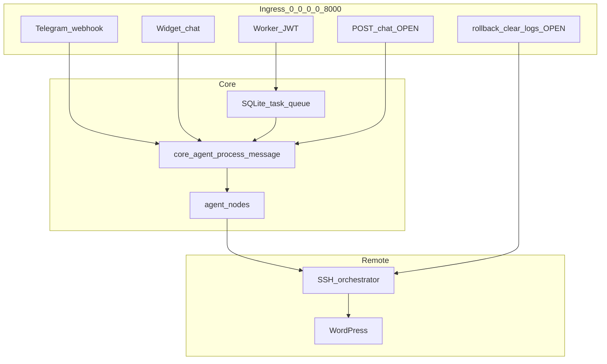

# Jadzia Core — Specialist Audit (2026-07-03)

**Repo:** jadzia-core  
**Scope:** Production COI backend — security, runtime, contracts, CI, COI readiness  
**Method:** Static code review + local pytest (no secrets read, no deploy)

---

## Executive Verdict

| Dimension | Score | Verdict |
|-----------|-------|---------|
| **Production readiness (ops agent)** | **7/10** | WP SSH pipeline + worker/HITL are mature; live on VPS with E2E proofs |
| **Security posture** | **4/10** | Critical gap: unauthenticated agent/admin routes on public bind `0.0.0.0:8000` |
| **COI vision readiness** | **5/10** | Revenue + content loops live; strategy synthesis and analytics persist missing |
| **Engineering hygiene** | **7/10** | 359 tests, CI lint/bandit/mypy, SQLite SSoT, guardrails — but lockfile broken |
| **Overall** | **6/10** | **Shippable for controlled ops use; not hardened for internet-facing exposure** |

**Bottom line:** This is a real production backend, not a prototype. Phase A/B integrations are proven. The blocker to “enterprise-grade” is not features — it is **auth surface hardening**, **secret lifecycle (S1-01)**, and **COI sense layer** (analytics persist + strategy brief).

---

## What Is Strong

### Architecture & SSoT
- Clear layering: `api/routes/*` → `core/agent.py` → `agent/nodes/*` → SSH/tools.
- **SQLite-only** task/session state (`agent/db.py`, `agent/state/`) — aligns with repo rules.
- Pydantic contracts in `core/models.py` match integration specs (INT-002/004/009/010/011).
- Idempotent schema migrations in `agent/db.py` (`_migrate_content_calendar_columns`, `test_mode` column).

### Agent Safety (SSH write path)
- `agent/guardrails.py`: forbidden paths (`.env`, `wp-config.php`, keys), size limits, PHP safety checks.
- `agent/tools/ssh_orchestrator.py`: backup-before-write, content validation, retry wrapper.
- HITL approval node + rollback path documented in PRD pipeline.

### Integrations — LIVE with proof
| ID | Contract | Code | Prod proof |
|----|----------|------|------------|
| INT-001 | Widget chat | `api/routes/chat.py` | LIVE |
| INT-002 | WC order webhook | `api/routes/webhooks.py` | order 3149 handoff |
| INT-004 | Game leads | `api/routes/leads.py` | DEPLOY-02 handoff |
| INT-009 | GA4 snapshot | `api/routes/analytics.py` | DEPLOY-03 handoff |
| INT-010 | Content calendar | `api/routes/content_calendar.py` | B2 E2E handoff |
| INT-011 | FB publish | `agent/publishers/facebook.py` | B3 E2E 2026-07-01 |
| INT-012 | Portal qualify | `api/routes/portal_qualify.py` | LIVE |

### Runtime & Ops
- Worker loop (`api/app.py`): configurable timeouts (`WORKER_TASK_TIMEOUT_SECONDS=600`, stale 15m, awaiting 1440m).
- File locks per session (`agent/state/locks.py`, 300s stale detection).
- systemd unit: non-root `jadzia`, `NoNewPrivileges`, `PrivateTmp`, `MemoryMax=2G`.
- Deploy script preserves `data/`, `logs/`, `.env`; DB backup before upload.
- `deployment/prod-smoke.sh` checks health + JWT-protected routes + env presence.

### Test & CI
- **359 passed**, 1 skipped, 1 xfailed (local run 2026-07-03).
- `.github/workflows/ci.yml`: ruff, black, pytest+coverage, bandit, mypy.
- Dedicated unit tests per integration node and API route.

---

## Critical Risks

### P0 — Unauthenticated High-Privilege Endpoints

API binds `0.0.0.0:8000` (`main.py`). These routes have **no JWT/API-key auth**:

| Route | Risk |
|-------|------|
| `POST /chat` | Triggers full `process_message` → planning → SSH file writes |
| `POST /rollback` | Reverts remote WordPress files |
| `GET /test-ssh` | Probes SSH connectivity |
| `POST /clear` | Clears session state / unlocks |
| `GET /logs` | Exposes recent agent logs |
| `GET /sessions` | Lists all active sessions |
| `POST /sessions/cleanup` | Deletes old sessions |
| `GET /costs`, `POST /costs/reset` | Cost stats exposure / reset |

**Mitigation today (partial):** Worker API (`/worker/*`), analytics, content-calendar require JWT when `JWT_SECRET` set.  
**Gap:** `/chat` and admin maintenance routes remain open even when JWT is configured.

**Evidence:** `api/routes/chat.py`, `api/routes/health.py`, `api/routes/sessions.py`, `api/routes/costs.py` — no `Depends(verify_jwt)`.

### P0 — Fail-Open Auth When Secrets Missing

| Secret | Behavior if unset | File |
|--------|-------------------|------|
| `JWT_SECRET` | Worker auth **disabled** | `api/dependencies.py:69-70` |
| `WC_WEBHOOK_SECRET` | Webhook HMAC **skipped** (warning only) | `api/routes/webhooks.py:24-26` |
| `LEADS_API_KEY` | Lead API auth **skipped** | `api/routes/leads.py:21-23` |

Acceptable for dev/CI; **unacceptable for prod** without startup gate. No `REQUIRE_SECRETS=1` or fail-fast on boot.

### P0 — S1-01 Blocked (Human Required)

`todo.json` → `S1-01`: rotate API/SSH/Telegram secrets + git history cleanup (BFG/filter-branch).  
Historical risk: `list_models.py` with hardcoded Google key was deleted (2026-06-30 hygiene handoff) but rotation still pending.

### P1 — Production Uses Dev Server Mode

`jadzia.service` → `ExecStart=/opt/jadzia/venv/bin/python main.py`  
`main.py` → `uvicorn.run(..., reload=True)` — **hot reload in production** (extra processes, file watchers, not suitable for systemd prod).

**Fix:** Use `uvicorn main:app --host 0.0.0.0 --port 8000` without reload in service unit.

### P1 — `requirements.lock` Is Not Canonical

`requirements.lock` contains unrelated packages (torch, browser-use, agent-os, image generator).  
Deploy uses `pip install -r requirements.txt` only (`deployment/deploy-to-vps.sh:167`).  
Task `S1-04` marked completed but lockfile is **not usable** for reproducible jadzia deploys.

### P1 — CI Gate Weakening

`.github/workflows/tests.yml` runs full suite with `continue-on-error: true` — failures do not block.  
Primary gate is `ci.yml`; dual workflows can confuse signal.

### P1 — Documentation Drift

| Doc | Issue |
|-----|-------|
| `docs/PRD-core.md` | Still says DEPLOY-02/03 pending in feature table; brain/todo say completed |
| `.env.example` | Missing `WC_WEBHOOK_SECRET`, `LEADS_API_KEY`, GA4 vars — incomplete ops template |
| `brain.md` updated | 2026-06-26; audit is 2026-07-03 |

### P2 — Analytics Not Persisted

`agent/nodes/analytics_node.py` uses TTL in-memory cache only (`cachetools.TTLCache`).  
No `analytics_snapshots` table in `agent/db.py`. COI “sense” layer cannot do weekly brief from history without re-fetching GA4.

### P2 — Public-by-Design Endpoints (Acceptable with Rate Limits)

These are intentionally public but need edge protection (nginx rate limit, WAF):
- `POST /api/v1/widget/chat` (INT-001)
- `POST /api/v1/portal/qualify` (INT-012)
- `POST /api/v1/leads` (when `LEADS_API_KEY` set — OK)

### P2 — CORS Permissive

`api/app.py` allows credentials + all methods/headers for known origins. Fine for widget; review if new origins added.

---

## Runtime Assessment

| Mechanism | Status | Notes |
|-----------|--------|-------|
| Worker loop | Good | 15s interval, busy backoff, FB publish scheduler |
| Task timeout | Good | 600s `asyncio.wait_for` |
| Stale task recovery | Good | 15m → FAILED + advance |
| Session locks | Good | filelock, 300s stale |
| SSH retry | Good | `@with_retry` on read/write |
| Ghost task cleanup | Good | DB vs state reconciliation in loop |
| Prod process model | **Weak** | reload=True via main.py |

---

## Integration Contract Audit

| INT | Model | DB table | Auth | Persist | Gap |
|-----|-------|----------|------|---------|-----|
| INT-002 | `WooOrderWebhookRequest` | `orders` | HMAC if secret set | Yes | Fail-open without secret |
| INT-004 | `LeadCreateRequest` | `leads` | X-API-Key if set | Yes | Fail-open; duplicate handling tested |
| INT-009 | `AnalyticsSnapshotResponse` | — | JWT | Cache only | **No SQLite persist** |
| INT-010 | `ContentCalendarEntry` | `content_calendar` | JWT | Yes | OK |
| INT-011 | publish status | `content_calendar` cols | JWT | Yes | FB token rotation manual |
| INT-012 | `PortalQualifyResponse` | `portal_qual_leads` | None | Yes | Rate limit at edge recommended |

Schema ↔ model alignment: **PASS** for all checked tables (`agent/db.py` lines 146–216 vs `core/models.py`).

---

## Test & Verification Matrix

| Check | Command / artifact | Result (2026-07-03) |
|-------|-------------------|---------------------|
| Full pytest | `pytest tests/` | **359 passed**, 1 skipped, 1 xfailed |
| Test count | `--collect-only` | 361 collected |
| CI lint | `.github/workflows/ci.yml` | ruff + black |
| CI security | bandit `-ll` | configured |
| CI types | mypy strict config | configured |
| Prod smoke | `deployment/prod-smoke.sh` | script exists; run on VPS |
| E2E proofs | `docs/handoffs/*` | INT-002/004/009, B2, B3 PASS |

**CI gap:** `tests.yml` non-blocking full suite. **Recommend:** merge into single blocking workflow or remove `continue-on-error`.

---

## COI Readiness (Sense → Act)

| Pillar | AS-IS | Evidence | TO-BE gap |
|--------|-------|----------|-----------|
| **Sense** | 30% | GA4 read-through cache | Snapshot persist, cross-module funnel |
| **Think** | 15% | Nodes exist; no synthesis | Weekly brief, anomaly detection |
| **Plan** | 40% | Content calendar from orders | Automated CRO recommendations |
| **Act** | 85% | SSH agent, FB publish, webhooks | — |
| **Guard** | 60% | Guardrails, HITL, backup | Auth hardening, secret rotation |

Matches `brain.md` ~50% overall; audit confirms number is fair.

---

## Recommended 1-1-1 Next Task

**Task ID (proposed):** `S2-01-PROD-AUTH-HARDENING`

**Scope (single session):**
1. Add startup gate: if `ENV=production` (or `REQUIRE_SECRETS=1`), fail boot when `JWT_SECRET`, `WC_WEBHOOK_SECRET`, `LEADS_API_KEY` missing.
2. Protect with JWT: `POST /chat`, `POST /rollback`, `POST /clear`, `GET /test-ssh`, `GET /logs`, `GET /sessions`, `POST /sessions/cleanup`, `/costs/*`.
3. Fix `jadzia.service` / `main.py`: prod path without `reload=True`.
4. Regenerate clean `requirements.lock` from jadzia venv only.
5. Sync `docs/PRD-core.md` + `.env.example`.

**Why this first:** Highest risk reduction per hour. Does not require Dowódca key rotation (S1-01 remains parallel human task).

**Alternative if revenue priority:** GA4 snapshot persist table + weekly Telegram brief (COI sense layer).

---

## Human Actions (Not Agent)

| Item | Owner | Notes |
|------|-------|-------|
| S1-01 secret rotation + git BFG | Dowódca | Critical backlog |
| FB Page Access Token rotation | Dowódca | Noted in phase-b-close handoff |
| Firewall / reverse proxy for :8000 | Dowódca | Limit exposure until S2-01 ships |
| GA4 DebugView manual | Dowódca | Cross-ref zzpackage funnel proof |

---

## Audit Sign-Off

- **Auditor:** Agent (jadzia-core session)
- **Date:** 2026-07-03
- **Deploy required:** No (docs only)
- **Next command:** `/blast` or `/implement` for `S2-01-PROD-AUTH-HARDENING`
