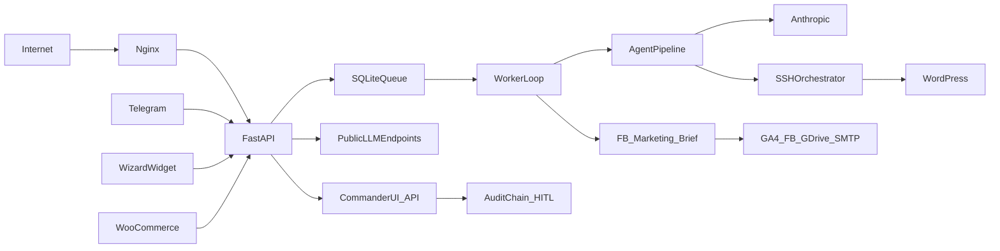

# Jadzia Core — niezależny audyt systemowy

**Data:** 2026-07-21  
**Zakres:** repo `jadzia-core` — architektura, bezpieczeństwo, dane, runtime, CI, operacje i governance  
**Baseline:** `master` @ `29043cb76aea934ab74d263655383f0787876311`  
**Środowisko audytu:** Windows, Python 3.13.11, pip 26.1.1  
**Tryb:** statyczny przegląd kodu + testy lokalne + skany; bez VPS, sekretów, deployu i side-effectów w integracjach  
**Poprzedni audyt:** `docs/ops/JADZIA-CORE-AUDIT-2026-07-03.md`

## Executive verdict

**Werdykt repo: PASS (remediated Wave1–4 · CI green · tip `3604f60`)**  
**Werdykt produkcji: PASS — VPS evidence 2026-07-21T17:37:31Z @ `3604f60` (aneks poniżej).**

Jadzia nie jest prototypem. Ma realny worker, SQLite SSoT, HITL, backup-before-write,
role/scopes, audit chain i circuit breakers. Jednocześnie obecny proces wydania daje
fałszywy zielony sygnał: gate CI przechodzi 14/14, gdy pełny suite kończy się
`6 failed, 601 passed, 17 skipped, 1 xfailed`. Do tego dochodzą potwierdzone ryzyka:
SSRF przez callback workera, brak weryfikacji host key SSH, nieatomowy zapis wielu
plików, odłączone health metrics oraz podatna wersja ChromaDB w niepełnym lockfile.

Nie potwierdzono aktywnego włamania ani awarii produkcji. Nie ma też podstaw do
utrzymania ogólnego `PASS/LIVE` jako świeżego werdyktu technicznego bez wykonania
bramki VPS opisanej na końcu raportu.

## Skala oceny

- `PASS` — kontrola działa i ma aktualny dowód.
- `PARTIAL` — działa część kontroli albo dowód jest niepełny.
- `FAIL` — kontrola nie działa, test jest czerwony lub istnieje potwierdzona luka.
- `STALE` — dowód był prawidłowy, ale nie odpowiada aktualnemu tipowi/oknu.
- `UNVERIFIED` — brak bezpiecznej możliwości potwierdzenia w tym audycie.

Skala domen: 1 = krytycznie słabo, 3 = kontrolowany poziom operacyjny, 5 = dojrzałość
profesjonalna z powtarzalnym dowodem.

## Scorecard

| Domena | Ocena | Status | Najważniejszy powód |
|---|---:|---|---|
| Architektura | 3.0/5 | PARTIAL | Czytelne warstwy, ale jeden proces łączy API, queue i schedulery |
| Bezpieczeństwo | 2.0/5 | FAIL | SSRF, SSH TOFU, Telegram native secret bypass, publiczny metadata surface |
| Niezawodność i dane | 2.2/5 | FAIL | Partial write może dostać `COMPLETED`; brak WAL/busy timeout |
| Jakość i CI | 1.5/5 | FAIL | Pełny suite czerwony, CI sprawdza tylko 14 z 625 testów |
| Prywatność | 2.7/5 | PARTIAL | Consent/retencja istnieją; brak cleanup i PII trafia do Telegram |
| Operacje i DR | 2.2/5 | PARTIAL | Non-root systemd i backup są; brak SLO, RPO/RTO i restore drill |
| Governance / SoT | 2.4/5 | PARTIAL | Dobre zasady, lecz aktywne dowody i dokumenty są rozjechane |
| **Łącznie** | **2.3/5** | **FAIL** | Najpierw odzyskać wiarygodność gate i zamknąć P1 |

## Mapa systemu i granice zaufania

Repo rejestruje 84 bazowe operacje HTTP (87 z opcjonalnym routerem Telegram).
WP-agent i moduły COI nie są jednym grafem: pierwszy przechodzi przez
`core/agent.py` i `agent/nodes/*`, a order/lead/analytics/marketing mają osobne
entrypointy API i schedulery. `api/app.py` uruchamia worker loop wewnątrz procesu
FastAPI; skalowanie Uvicorn przez wiele workerów uruchomiłoby wiele schedulerów.

## Wyniki kontroli lokalnych

| Kontrola | Wynik | Werdykt |
|---|---|---|
| Kolekcja pytest | 625 testów | PASS inventory |
| Pełny pytest + coverage | 6 failed, 601 passed, 17 skipped, 1 xfailed, 852 warnings | FAIL |
| Coverage `agent/api/core/cli` | 63% (13 588 statements) | PARTIAL |
| Dokładny gate CI | 14 passed, 41 warnings | PASS, lecz niewystarczający |
| Ruff całe repo | 2 734 błędy | FAIL |
| Black całe repo | 165 plików do formatowania | FAIL |
| Mypy `agent api core cli` | 734 błędy w 97/160 plikach | FAIL |
| Bandit `-ll` | 4 high, 18 medium | FAIL |
| pip-audit | 1 znana podatność: `chromadb 1.5.9`, `PYSEC-2026-311` | FAIL |
| Lock completeness | 13/18 direct deps; brak 5 | FAIL |
| `tests/integration/` | katalog nie istnieje | FAIL względem workflow |

Pełny suite był uruchomiony na Pythonie 3.13, a CI używa 3.11. Trzy regresje
Telegram i route inventory wynikają z dryfu test-kontrakt; pozostałe obejmują
Design Agent opening copy oraz organic ingest. Niezależnie od przyczyny hard gate
z `.agents/workflows/jadzia-test.md` wymaga zera błędów, więc wynik jest `FAIL`.

## Findings

### F-01 — P0 — release gate daje fałszywy zielony sygnał

**Status:** PASS (remediated 2026-07-21 · PR #9) · **Pewność:** wysoka  
**Dowód:** `.github/workflows/ci.yml:22-44`, `.github/workflows/tests.yml:34-38`,
pełny lokalny run 2026-07-21.

CI uruchamia tylko `tests/unit/test_design_agent_route.py` i
`tests/test_worker_scenarios_ci.py`: 14 testów, czyli 2,24% z 625 zebranych.
Pełny suite ma sześć błędów. Coverage upload wskazuje `coverage.xml`, którego
komenda CI nie generuje, a `fail_ci_if_error: false` ukrywa ten problem.

**Wpływ:** merge/deploy może być zielony mimo regresji w Telegram, route contract,
Design Agent lub Marketing Brain.  
**Reprodukcja:** porównać dokładną komendę CI z `pytest tests/`.  
**Kryterium zamknięcia:** jeden blocking workflow, pełny wymagany tier bez błędów,
rzeczywisty coverage artifact i udokumentowany czas gate.

### F-02 — P1 — callback workera umożliwia SSRF

**Status:** PASS (remediated 2026-07-21 · PR #9) · **Pewność:** wysoka  
**Dowód:** `core/models.py:398-402`, `api/routes/worker.py:97-101`,
`api/webhooks.py:49-74`.

`WorkerTaskRequest.webhook_url` jest dowolnym `str`. Po wykonaniu taska serwer
wykonuje `httpx.post()` bez walidacji schematu, hosta, DNS i adresów prywatnych.
Endpoint worker wymaga JWT, więc nie jest to pre-auth; po przejęciu uprawnionego
tokenu pozwala jednak sondować localhost, metadata endpoints i sieć wewnętrzną.
Pełny URL jest dodatkowo logowany.

**Wpływ:** dostęp do usług wewnętrznych, skan sieci i wyciek metadanych.  
**Reprodukcja:** test jednostkowy z URL `http://127.0.0.1`, link-local oraz
redirectem do private IP; bez wykonywania requestu poza kontrolowanym mockiem.  
**Kryterium zamknięcia:** HTTPS allowlist lub signed callback registry, blokada
private/link-local po resolve i po każdym redirect, limity URL/payload, redakcja logu.

### F-03 — P1 — SSH nie weryfikuje tożsamości hosta

**Status:** PASS (remediated 2026-07-21 · PR #9; VPS host-key HITL remaining) · **Pewność:** wysoka  
**Dowód:** `agent/tools/ssh_pure.py:113,186`,
`agent/tools/wp_explorer/ssh_connector.py:230`; Bandit B507.

`paramiko.AutoAddPolicy()` automatycznie akceptuje nieznany host key.

**Wpływ:** MITM może przejąć poświadczenia lub podmienić dane/zapis WP.  
**Kryterium zamknięcia:** `load_system_host_keys()`/dedykowany known_hosts,
`RejectPolicy`, pinning i negatywny test nieznanego/zmienionego klucza.

### F-04 — P1 — wieloplikowy zapis nie jest atomowy i może zostać oznaczony sukcesem

**Status:** PASS (remediated 2026-07-21 · Wave3 WRITE-01) · **Pewność:** wysoka  
**Dowód:** `agent/nodes/approval.py:131-148`.

Każdy plik jest zapisywany niezależnie. Jeśli pierwszy zapis się uda, a drugi
zawiedzie, lista `errors` nie blokuje `OperationStatus.COMPLETED`. Health check
może być zielony mimo niekompletnej zmiany.

**Wpływ:** częściowo wdrożona funkcja i fałszywy status sukcesu.  
**Reprodukcja:** mock dwóch plików, wyjątek na drugim, zdrowy HTTP endpoint.  
**Kryterium zamknięcia:** etap prepare/validate, rollback wszystkich zapisanych
plików przy dowolnym błędzie, status `FAILED/ROLLED_BACK`, test fault-injection.

### F-05 — P1 — dependency gate jest niespójny i zawiera podatny ChromaDB

**Status:** PASS (remediated 2026-07-21 · PR #9) · **Pewność:** wysoka  
**Dowód:** `requirements.txt`, `requirements.lock`, `deployment/deploy-to-vps.sh:167`,
pip-audit 2.10.1.

W lockfile brakuje `Pillow`, `jsonschema`, `fal-client`, `easyocr` i `chromadb`,
ale deploy zawsze preferuje lock. Deklaracja `chromadb>=0.5.0` rozwiązała się do
1.5.9, objętego `PYSEC-2026-311` / `CVE-2026-45829` (CVSS 9.3, pre-auth RCE
w Python FastAPI server ChromaDB). Jadzia używa lokalnego `PersistentClient`, nie
uruchamia w tym repo publicznego Chroma servera, więc bezpośrednia ekspozycja RCE
nie została potwierdzona. Podatny pakiet pozostaje jednak w supply chain.
Źródło advisory: https://osv.dev/vulnerability/GHSA-f4j7-r4q5-qw2c

**Kryterium zamknięcia:** jeden lock z wszystkimi direct/transitive deps, install
test na czystym Python 3.11, `pip-audit` jako blocking gate; Chroma ograniczone do
embedded client albo usunięte/zastąpione do czasu bezpiecznej wersji.

### F-06 — P1 — telemetryka health jest odłączona od callbacków runtime

**Status:** PASS (remediated 2026-07-21 · Wave3 HEALTH-01; process-local) · **Pewność:** wysoka  
**Dowód:** `api/webhooks.py:10-46`, `api/routes/dashboard.py:118-157`; brak
jakiegokolwiek wywołania `set_health_metrics()`.

`record_task_failure`, `record_task_success` i deployment verification zapisują
tylko wtedy, gdy prywatny `_health_metrics` został podłączony. Nie jest. Publiczny
`/worker/health` czyta inny obiekt z `api._state`.

**Wpływ:** dashboard może raportować zero błędów i brak verification mimo realnych
zdarzeń.  
**Kryterium zamknięcia:** jeden metrics store, test end-to-end forced failure →
`errors_last_hour > 0`, trwałość lub jawne oznaczenie metryk jako process-local.

### F-07 — P1 — ingress publiczny nie ma spójnej ochrony przed abuse/replay

**Status:** PASS (remediated 2026-07-21 · PR #9; widget FE session adopt in flexgrafik-nl) · **Pewność:** wysoka  

- Widget i Portal są publiczne; widget wywołuje LLM bez rate limitu.
- `CustomerChatRequest` nie ma limitu wiadomości, a client-controlled `session_id`
  wybiera historię sesji.
- Native Telegram update omija `validate_webhook_secret`
  (`api/telegram.py:513-521`); pozostaje whitelist user ID.
- Dedup Telegram jest wyłącznie w RAM na 300 s.
- Brain Bus nie ma UNIQUE/upsert po `correlation_id`.
- OpenAPI `/docs`, `/redoc`, `/openapi.json` pozostają domyślnie aktywne.

**Wpływ:** koszt LLM/DoS, przejęcie przewidywalnej sesji, replay po restarcie,
duplikacja side-effectów i łatwiejsze reconnaissance.  
**Kryterium zamknięcia:** edge + app rate limit, server-issued opaque session ID,
limity modeli, Telegram secret token również dla native update, trwały dedup i
idempotency key, świadoma polityka OpenAPI na produkcji.

### F-08 — P2 — SQLite ma ograniczoną odporność na contention

**Status:** PASS (remediated 2026-07-21 · Wave3 DB-01 WAL/busy; VPS journal verify pending) · **Pewność:** wysoka  
**Dowód:** `agent/db.py:24-47,697-749`.

Połączenia są thread-local i mają transakcje oraz trzy retry, lecz brak
`PRAGMA journal_mode=WAL` i `busy_timeout`. Worker, HTTP i schedulery współdzielą
ten sam plik. Worker skanuje sesje cyklicznie, a wieloprocesowy Uvicorn
uruchomiłby duplikowane schedulery.

**Kryterium zamknięcia:** udokumentowany single-process invariant, WAL/busy timeout
po pomiarze, kontrolowany contention test oraz idempotentne schedulery/leader lock.

### F-09 — P2 — command/tar safety w narzędziach SSH wymaga domknięcia

**Status:** PASS (remediated 2026-07-21 · PR #9) · **Pewność:** średnia-wysoka  
**Dowód:** `agent/tools/ssh_orchestrator.py:238-242`,
`agent/tools/wp_explorer/ssh_connector.py:466`; Bandit B202/B601.

`list_files()` składa shell command z `directory` i `pattern`. WP explorer używa
`tar.extractall()` bez walidacji członków archiwum. Nie potwierdzono publicznej
ścieżki użytkownika do obu parametrów, dlatego ryzyko nie jest opisane jako
zdalny exploit.

**Kryterium zamknięcia:** SFTP zamiast shell lub `shlex.quote` + allowlist,
safe extraction z kontrolą resolved path i testy payloadów `../`/symlink.

### F-10 — P2 — prywatność ma retencję bez egzekucji

**Status:** PASS (remediated 2026-07-21 · Wave4 PRIVACY-01; VPS purge evidence pending) · **Pewność:** wysoka  
**Dowód:** `agent/portal_qualification/lead_store.py:28-52,70-81`.

Lead jest zapisywany po consent i dostaje `expires_at`, ale audyt nie znalazł
jobu kasującego/anonimizującego rekord po terminie. Pełny profil hot lead jest
serializowany do wiadomości Telegram. Widget identyfikuje historię tylko
client-supplied session ID.

**Kryterium zamknięcia:** wykonywalny retention job z audytem, data minimization
w Telegram/logach, threat model sesji oraz test usunięcia po TTL.

### F-11 — P2 — workflow jakości nie odpowiada repo

**Status:** PASS (remediated 2026-07-21 · PR #9) · **Pewność:** wysoka  
**Dowód:** `.agents/workflows/jadzia-test.md:12-18`.

Workflow wymaga `ruff check .`, `mypy .`, wszystkich unit tests i
`pytest tests/integration`. Pierwsze trzy gate są czerwone, a katalog
`tests/integration` nie istnieje. Ruff raportuje 2 734 błędy, Black 165 plików,
Mypy 734 błędy.

**Kryterium zamknięcia:** realistyczny, egzekwowany baseline; zero nowych błędów
nie może oznaczać globalnego `PASS`, jeśli gate opisuje zero wszystkich błędów.

### F-12 — P2 — operacje nie mają formalnego SLO i DR

**Status:** PARTIAL (runbook+systemd+safe deploy default shipped; restore drill HITL pending) · **Pewność:** wysoka  
**Dowód:** `deployment/jadzia.service`, `deployment/deploy-to-vps.sh`,
`.agents/workflows/panic.md`, brak dedykowanych dokumentów SLO/DR.

Mocne elementy: non-root `jadzia`, restart policy, limity, `NoNewPrivileges`,
`PrivateTmp`, backup DB i smoke. Brakuje SLO/error budget, RPO/RTO, off-site
backup policy i udokumentowanego restore drill. Systemd nie ma m.in.
`ProtectSystem`, `ProtectHome`, `PrivateDevices` ani `RestrictAddressFamilies`.
Deploy może domyślnie nadpisać produkcyjną DB lokalnym plikiem po interaktywnym
pytaniu i preferuje niepełny lockfile.

**Kryterium zamknięcia:** kanoniczny release runbook bez domyślnego DB upload,
SLO + alert mapping, DR runbook i udokumentowany restore test.

### F-13 — P2 — SoT i dowody operacyjne są stare lub sprzeczne

**Status:** PARTIAL (handoffs ≤15 + tip fields refreshed; prod tip after VPS verify) · **Pewność:** wysoka  

- `brain.md` deklaruje ~93% operational spine, aktywny Marketing OS ~86%;
  metryki mierzą inne mianowniki, ale nie wyjaśniają relacji.
- `MKT-BRAIN-PRO.md` wskazuje runtime tip `3c2fc6e`; ostatni SESSION CLOSE
  deklaruje VPS `29043cb`.
- OPS-AI 60,6% jest rolling 14d, ale dowód pochodzi z 2026-07-18 @ `d97939a`.
- Aktywny folder ma 19 tracked handoffów przy polityce ≤15.
- `docs/handoffs/README.md` wskazuje pliki przeniesione do archive.
- Poprzedni audyt 2026-07-03 opisuje naprawione już problemy jako otwarte.

**Kryterium zamknięcia:** jeden current-tip field, jawne definicje procentów,
re-window metryk, ≤15 aktywnych handoffów i działające linki.

## Kontrole pozytywne

1. `core/config.py` fail-fast wymaga w produkcji JWT, WC HMAC i leads API key.
2. WC webhook używa `hmac.compare_digest`, a order/lead persistence ma dedup/upsert.
3. Commander ma role/scopes, hash-chain audit oraz testowaną macierz authz.
4. Marketing execute ma one-time token, TTL, circuit breakers i ticket-only mode.
5. SSH write tworzy backup przed zapisem i ma zakazane ścieżki.
6. SQLite jest faktycznym SSoT dla task/session i ma transakcje + FK.
7. Systemd uruchamia usługę jako `jadzia`, bez reload i z limitem pamięci/CPU.
8. 601 testów przechodzi; pokrycie kluczowych modeli i auth dependencies jest wysokie.

Te kontrole ograniczają ryzyko, ale nie kompensują czerwonego release gate i P1.

## Priorytety remediacji 1-1-1

| Kolejność | Task | Zakres jednej sesji | Owner / gate |
|---:|---|---|---|
| 1 | `AUD-REM-CI-01` | Pełny blocking pytest + prawdziwy coverage artifact | agent |
| 2 | `AUD-REM-CALLBACK-01` | Callback allowlist + SSRF tests + log redaction | agent |
| 3 | `AUD-REM-SSH-01` | Known-host pinning w aktywnym SSH path | agent + host key HITL |
| 4 | `AUD-REM-WRITE-01` | All-or-rollback multi-file write + fault test | agent |
| 5 | `AUD-REM-DEPS-01` | Pełny lock + Chroma mitigation + pip-audit CI | agent |
| 6 | `AUD-REM-HEALTH-01` | Spięcie metrics store + forced-failure test | agent |
| 7 | `AUD-REM-INGRESS-01` | Widget limits/rate limit + Telegram secret/dedup | agent |
| 8 | `AUD-REM-DB-01` | SQLite contention benchmark i single-process guard | agent |
| 9 | `AUD-REM-OPS-01` | SLO/DR/restore runbook bez deployu | agent + human evidence |
| 10 | `AUD-REM-SOT-01` | Tip/readiness/handoffs truth repair | agent |

Nie łączyć tych zadań w jeden mega-diff. Pozycje 2–7 są blokadą przejścia do
oceny „professionally hardened”; pozycja 1 jest blokadą każdego kolejnego deployu.

## Bramka VPS — READY_FOR_HUMAN

Audyt nie łączył się z VPS. Po świeżym GO wykonać wyłącznie read-only evidence:

1. Potwierdzić `/opt/jadzia` HEAD, service unit i liczbę procesów.
2. Sprawdzić z zewnątrz HTTP codes dla OpenAPI, `/status`, `/worker/health`,
   admin routes bez JWT i publicznych LLM endpoints.
3. Wykonać `PRAGMA integrity_check`, `journal_mode`, rozmiar DB i listę backupów
   bez odczytu danych osobowych.
4. Zweryfikować bind portu 8000, aktywną konfigurację nginx i firewall.
5. Uruchomić bez-mutacyjny health smoke; skrypty tworzące rekordy są poza zakresem.
6. Re-window OPS-AI 14d oraz porównać tip `d97939a`/`3c2fc6e`/`29043cb`.
7. Potwierdzić, że Chroma działa embedded i nie wystawia Python FastAPI servera.
8. Zebrać timestamp, exit code i zredagowany output do aneksu; dopiero wtedy
   zmieniać `UNVERIFIED` na `PASS/FAIL`.

## Aneks VPS — AUD-REM-VPS-VERIFY-01 (2026-07-21T17:37:31Z)

**Authority:** fresh Dowódca GO w sesji `AUD-REM-DEPLOY-PIPELINE-01`  
**Werdykt produkcji:** **PASS** (evidence poniżej)  
**Tip:** `/opt/jadzia` @ **`3604f60`** (`3604f60a691449e121cfc33334acfeba145b5258`)  
**Runtime:** CPython **3.11.15** venv + `pip install --require-hashes -r requirements.lock`  
**Prev tip:** `29043cb` · backup `jadzia-pre-deploy-20260721-192349.db` integrity=ok

| Check | Result |
|-------|--------|
| `systemctl is-active jadzia` | `active` |
| uvicorn `/opt/jadzia/venv` count | **1** (single-process) |
| `GET /docs` / `/openapi.json` | **404** / **404** |
| `GET /worker/health` | **200** · `status=healthy` · `ssh_connection=ok` · `sqlite_connection=true` |
| `PRAGMA journal_mode` | **wal** |
| `PRAGMA integrity_check` | **ok** |
| Telegram wrong `X-Telegram-Bot-Api-Secret-Token` | **401** |
| Widget API 2× message same `session_id` | **PASS** (`33c24fcb-…`) |
| flexgrafik-nl live `chat-widget.js` adoptSessionId | **deployed** (theme `flexgrafik-child`, 19549 B) |
| nginx `-t` | syntax ok |
| Public Chroma FastAPI | **none** |
| Env HITL | docs-off, Telegram secret, ingress salt, SSH known_hosts+fingerprint, key under `/opt/jadzia/secrets`, callback allowlist, WP health URL — **SET** |

**Fix podczas deployu (nie residual produkcyjny):** VPS miał CPython 3.12; lock wymaga `>=3.11,<3.12` — zainstalowano 3.11.15 + nowy venv. `ProtectHome=true` blokował `/root/.ssh/wordpress_key` — klucz przeniesiony do `/opt/jadzia/secrets/` + `ReadWritePaths` rozszerzone.

**Residual (nie blokuje PASS bramki Wave1–4):** Meta Graph organic metrics 400 (osobny token/API); lokalny patch `deployment/jadzia.service` (secrets path) jeszcze nie na tipie git — **już zastosowany na VPS**.

## Ograniczenia i sign-off

- Nie badano historii Git pod kątem sekretów; task S1-01 pozostaje human-only.
- Nie wykonywano DAST, load testu, browser dogfood ani requestów do Meta/GA4/LLM.
- Nie weryfikowano konfiguracji VPS, nginx, firewall, env ani backupów runtime **przed** aneksem powyżej (aneks zamyka lukę evidence).
- Python 3.13 lokalnie może ujawniać ostrzeżenia inne niż produkcyjny 3.11; nie wyjaśnia
  jednak wąskiego CI ani kontraktowych błędów testów.
- Skany Bandit zawierają również false positives; findings wysokiej wagi zostały
  ręcznie powiązane z aktywnym kodem lub opisane jako warunkowe.

**Audytor:** Cursor Agent, niezależny przebieg read-only/local + VPS evidence 2026-07-21  
**Decyzja:** `LOCAL remediations PASS (F-01..F-13)` · **`production PASS @ 3604f60`**  
**Następny właściwy task:** tip-sync `jadzia.service` secrets path na master (opcjonalny docs/ops closeout)  
**Prod tip (git):** `master` @ **`3604f60`**
