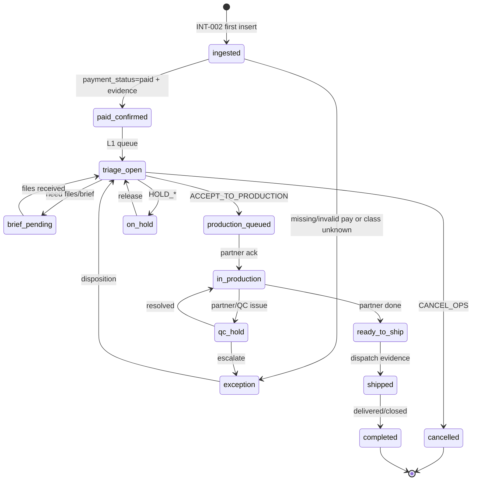

# Order Desk SoT v0 — discovery contract

**Verdict:** **ACCEPTED** (expert review + Dowódca). **S7 / Order LIVE pozostają PARKED** do D5 unpark — ACCEPT SoT ≠ LIVE desk.

## Authority split (invariant)

| Layer | Authority | Role |
|-------|-----------|------|
| Commercial order + payment | **WooCommerce** | Canonical paid order identity (`order_id`), payment capture |
| Revenue / ingest mirror | **Jadzia `orders` (INT-002)** | Idempotent SQLite mirror + classification (`real`/`test`/`unknown`) |
| Ops Bus signal | **`order_created`** | First-insert handoff Wizard→Order Desk room (not lifecycle) |
| Operational desk lifecycle | **MISSING today** | Target SoT for Order Desk Work View / S7 — **not** INT-002 rows alone |
| Analytics | GA4 | Projection only — never ops truth |

**Hard rule:** `orders` mirror ≠ operational desk. `#3149` / Mollie test ≠ unlock EV-W2-010.

---

## D1 — Lifecycle state machine

### Recommended path

Keep **WC `status`** (`processing`|`completed`) as commerce mirror. Add separate **`ops_state`** (Jadzia-owned) for desk workflow. Never overload WC status with production states.



### State table

| ops_state | Meaning | Entry evidence | Exit |
|-----------|---------|----------------|------|
| `ingested` | Mirror row exists | `order_id` + INT-002 persist | pay check |
| `paid_confirmed` | Paid live (or explicit test path) | `payment_id`, `paid_at`, `payment_status=paid` | L1 triage |
| `triage_open` | Human L1 owns next action | owner set | disposition |
| `brief_pending` | Waiting customer brief/files | note / ticket ref | back to triage |
| `production_queued` | Accepted for partner | disposition ACCEPT | partner handoff |
| `in_production` | At partner | partner ref | QC / ship |
| `qc_hold` | Quality / reprint hold | reason code | resolve / exception |
| `ready_to_ship` | Partner complete | partner done evidence | dispatch |
| `shipped` | Left warehouse/partner | tracking / ship note | close |
| `completed` | Ops closed | close note | — |
| `on_hold` | Temporary stop | HOLD disposition | release |
| `exception` | Needs structured disposition | exception code | triage |
| `cancelled` | Ops cancelled (commerce may still exist) | CANCEL_OPS | — |

**Today (clarified on ACCEPT):**
- INT-002 starts at commerce ingest (`processing`/`completed`) — **quote** lives in Wizard, not in `orders`.
- Mirror can show commerce signals (`payment_status`, `classification`) — that is **not** `ops_state`.
- All desk lifecycle states after implicit `ingested` = `insufficient_data` until ops store exists.

---

## D2 — Field dictionary

### A) INT-002 mirror fields (exist · commerce/revenue)

| Field | Source | Ops desk use |
|-------|--------|--------------|
| `order_id` | WC numeric string | Primary key / correlation |
| `id` | Jadzia internal | Internal ref only |
| `status` | WC `processing`\|`completed` | Commerce status — **not** ops_state |
| `items_json` | webhook items | SKU/qty/price summary |
| `customer_email` / `customer_name` | webhook | Contact display |
| `total_gross` / `total_net` / `tax_total` / `currency` | webhook | Money display (never invent) |
| `payment_id` / `payment_status` / `payment_method` / `payment_provider` / `payment_mode` / `paid_at` | webhook v2 | Pay evidence |
| `classification` / `classification_reason` / `is_test` / `test_reason` | webhook v2 | KPI filter — test ≠ revenue |
| `checkout_id` / `checkout_started_at` / `checkout_environment` | webhook v2 | Wizard link / env honesty |
| `attribution_json` | webhook v2 | Growth — not desk SLA |
| `schema_version` | `int-002.v1`\|`v2` | Contract maturity |
| `created_at` / `updated_at` | Jadzia | Ingest freshness |

### B) Ops Bus `order_created` (exist · signal only)

| Field | Value / rule |
|-------|----------------|
| Emit | `order_node.process_order_webhook` on **first insert only** |
| `event_type` | `order_created` |
| `source_room` → `dest_room` | `wizard-quote` → `order-desk` |
| `payload_ref` | `order_id` |
| `source_system` | `woocommerce` |
| `source_event_id` | `wc_order:{order_id}:created` (dedupe) |
| `evidence_id` | `EV-W5-003` |
| `approval_level` | `L1` |
| Payload | `order_id`, `status`, `total_gross`, `currency`, `customer_email`, `is_test`, `classification`, `item_count` |

**Gap:** no bus events for production / ship / exception / disposition.

### C) Required ops fields (MISSING · target SoT)

| Field | Required for desk | Notes |
|-------|-------------------|-------|
| `ops_state` | yes | Enum from D1 |
| `ops_owner` | yes when ≥ triage | Human / role id |
| `ops_updated_at` | yes | Last ops transition |
| `disposition` | on exception/hold | From D3 |
| `exception_code` | on exception | From D3 |
| `partner_ref` | from production_queued | External Erka/HITL |
| `brief_ref` | brief_pending | File/ticket pointer — no binary in SQLite |
| `ship_ref` | shipped | Tracking / note |
| `evidence_ids[]` | transitions | Audit / dogfood |
| `correlation_id` | yes | Align bus `corr:order:{order_id}` |

---

## D3 — Exception / disposition matrix (L1)

| Code | Trigger | Default disposition | Owner | Escalate |
|------|---------|---------------------|-------|----------|
| `EX-PAY-MISSING` | paid expected but no `payment_id`/`paid_at` | `HOLD_PAYMENT` | Ops L1 | L2 Finance if stuck >SLA |
| `EX-CLASS-UNKNOWN` | `classification=unknown` | `HOLD_DATA` | Ops L1 | L2 Revenue |
| `EX-TEST-LEAK` | `is_test=true` in live queue | `MARK_TEST` (exclude KPI) | Ops L1 | — |
| `EX-BRIEF-MISSING` | no files/brief for production SKU | `REQUEST_BRIEF` | Ops L1 | customer HITL |
| `EX-DATA-INVALID` | totals/items inconsistent | `HOLD_DATA` | Ops L1 | L2 |
| `EX-PARTNER-SLA` | partner late / no ack | `ESCALATE_L2` | Ops L1 | Founder if money risk |
| `EX-QC-FAIL` | QC / reprint | `HOLD_QC` → `qc_hold` | Ops L1 | partner |
| `EX-CUSTOMER` | customer change/cancel request | `HOLD_CUSTOMER` / `CANCEL_OPS` | Ops L1 | L2 if paid dispute |
| `EX-SHIP` | ship evidence missing | `HOLD_SHIP` | Ops L1 | Dispatch (parked room) |

### Disposition enum (L1)

| Disposition | Effect on ops_state |
|-------------|---------------------|
| `ACCEPT_TO_PRODUCTION` | → `production_queued` |
| `REQUEST_BRIEF` | → `brief_pending` |
| `HOLD_PAYMENT` / `HOLD_DATA` / `HOLD_CUSTOMER` / `HOLD_QC` / `HOLD_SHIP` | → `on_hold` or `qc_hold` |
| `MARK_TEST` | stay mirror; **exclude** from LIVE KPI |
| `ESCALATE_L2` | → `exception` + approval_needed bus (future) |
| `CANCEL_OPS` | → `cancelled` |

**RACI**

| Activity | R | A | C | I |
|----------|---|---|---|---|
| Ingest INT-002 | System | Dowódca (contract) | Agent | Ops |
| L1 triage / disposition | Ops L1 | Dowódca | Agent | Finance |
| Production partner handoff | Ops L1 | Dowódca | Partner | — |
| Unpark EV-W2-010 / S7 | Agent (evidence) | **Dowódca** | — | — |
| Mollie LIVE | — | **Dowódca L4 GO** | — | — |

---

## D4 — Minimal HQ Work View contract (read-only v1)

**Gate to build later:** `VF-ORDER-DESK-WV-00` — thin UI only after ACCEPT. **This gate = contract only.**

### Card fields (allowed)

| UI field | Binding | Honesty |
|----------|---------|---------|
| Order ID | `orders.order_id` | required |
| WC status | `orders.status` | label as commerce |
| Classification | `orders.classification` | badge; test filtered |
| Pay | `payment_status` + `paid_at` | `insufficient_data` if null |
| Gross | `total_gross` + `currency` | never invent 0 |
| Customer | email/name | mask if policy later |
| Items | count from `items_json` | SKU list optional |
| Ingested | `created_at` | freshness |
| Ops state | **target** `ops_state` | **v1 default: `insufficient_data`** until store |
| Owner | **target** `ops_owner` | `insufficient_data` until set |
| Next action | disposition hint | only if ops_state known |

### Explicit `insufficient_data` rules

1. Any KPI (`Open orders`, `Production SLA`, queue depth) **without** `ops_state` store → `insufficient_data` (never fake 0).
2. Listing INT-002 rows alone **must not** claim Order Desk LIVE.
3. Room status stays **PARKED · EV-W2-010** until unpark checklist (D5) complete.
4. No primary CTA that invents fulfilment (Accept/Ship buttons out of scope for WV-00).
5. Money narrative may show mirror ingest counts only with label **mirror / not desk**.

### Wire sketch (text)

```
Order Desk Work View [PARKED · EV-W2-010]
────────────────────────────────────────
Honesty: Operational desk SoT not LIVE · INT-002 = mirror
────────────────────────────────────────
Recent ingested (mirror, read-only)
  #ORDER  class  WC-status  pay  gross  ingested_at  ops=insufficient_data
────────────────────────────────────────
KPI: Open orders = insufficient_data
     Production SLA = insufficient_data
────────────────────────────────────────
Unlock: D5 checklist + Founder unpark GO
```

---

## D5 — EV-W2-010 unpark checklist

Unpark **PARKED → PARTIAL** only (never jump to LIVE). Evidence pack required.

| # | Evidence | Owner |
|---|----------|-------|
| U1 | Founder **ACCEPT** this SoT (D1–D5) logged in CLOSE | Dowódca |
| U2 | `ops_state` persistence design accepted (table/columns) — implement in later gate | Agent + Dowódca |
| U3 | `VF-ORDER-DESK-WV-00` thin read-only Work View shipped + dogfood | Agent |
| U4 | Dogfood: ≥1 order card shows mirror fields + honest `ops_state` (even if triage empty) | Agent |
| U5 | No invented KPI; contract tests assert EV-W2-010 honesty until PARTIAL stamp | Agent |
| U6 | Scorecard S7.0 note updated with evidence paths — S7 still not auto-5 | Agent |
| U7 | Founder **GO UNPARK EV-W2-010** (explicit) | Dowódca |
| U8 | Mollie LIVE / Purchase L4 = **separate** GO — not implied by unpark | Dowódca |

**Still STOP after PARTIAL:** fake S7=5 · Ads · 3D · mega fulfilment factory · deploy without GO.

---

## Gap list (inventory summary)

| Need | Have today | Gap |
|------|------------|-----|
| Paid order identity | WC + INT-002 | — |
| Revenue classification | INT-002 v2 fields | — |
| Handoff signal | `order_created` bus | — |
| Ops lifecycle states | — | **missing `ops_state`** |
| Exception codes / dispositions | — | **missing** |
| Owner / SLA clock | — | **missing** |
| Production/ship events | — | **missing bus + store** |
| HQ Work View truth | PARKED shell | **contract only (this doc)** |

---

## Expert review (ACCEPT notes)

| # | Finding | Resolution |
|---|---------|------------|
| E1 | Quote not in INT-002 | Documented: quote = Wizard; ingest = paid/processing+ |
| E2 | Pay/class readable ≠ ops_state | Documented; KPI still `insufficient_data` without ops store |
| E3 | `db_list_orders` lacked pay columns for D4 WV | **WV-00** may additively project `payment_status`/`paid_at`/`currency` — still mirror, not desk LIVE |
| E4 | Unpark still needs U2–U8 | ACCEPT SoT closes U1 only |

## Founder decision block (D1–D5)

| ID | Decision | Agent recommendation | Founder |
|----|----------|----------------------|---------|
| D1 | Lifecycle = WC status + separate `ops_state` | **ACCEPT** | **ACCEPT** |
| D2 | Field dict + authority split | **ACCEPT** | **ACCEPT** |
| D3 | L1 exception/disposition matrix | **ACCEPT** | **ACCEPT** |
| D4 | Read-only WV contract + insufficient_data rules | **ACCEPT** | **ACCEPT** |
| D5 | Unpark checklist U1–U8 | **ACCEPT** | **ACCEPT** (U1 done; U2–U8 still open) |

Next gate: **`VF-ORDER-DESK-WV-00`** (thin read-only Work View).
