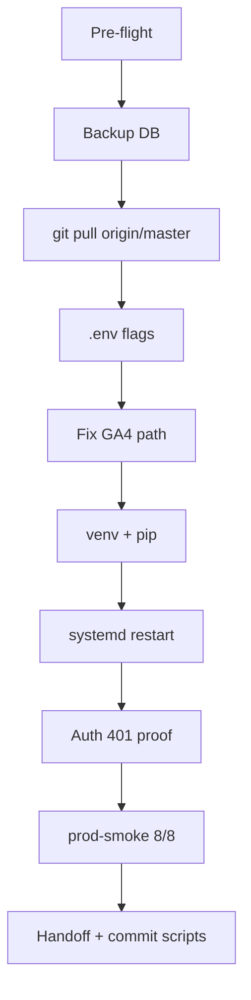

# Plan domknięcia deploy — jadzia-core post-audit (Zasada 11)

**Cel:** 100% zamknięcie manual deploy bez luk.  
**VPS:** `185.243.54.115` → `/opt/jadzia`  
**Status:** **COMPLETE** (2026-07-05)

---

## Macierz wymagań vs wynik

| # | Wymaganie | Exit criteria | Wynik |
|---|-----------|---------------|-------|
| 1 | Deploy kodu na prod | `git @ e1e63f8`, service active | **PASS** |
| 2 | `JADZIA_ENV=production` | w `.env`, boot gate aktywny | **PASS** |
| 3 | Auth proof | `POST /chat` bez JWT → **401** | **PASS** |
| 4 | prod-smoke | **8/8 PASS**, exit 0 | **PASS** |
| 5 | uvicorn prod | bez reload, 1 proces | **PASS** |
| 6 | Sekrety prod | JWT, WC, LEADS obecne | **PASS** |
| 7 | GA4 path | credentials readable by `jadzia` | **PASS** (fix path) |
| 8 | Weekly brief | `WEEKLY_BRIEF_INTERVAL_SECONDS=604800` | **PASS** |
| 9 | DB backup przed deploy | `.bak.YYYYMMDD-HHMMSS` | **PASS** |
| 10 | pytest lokalnie | 376+ pass | **PASS** (2026-07-03) |

---

## Fazy wykonania (kolejność obowiązkowa)



### Faza 0 — Pre-flight (przed każdym deployem)

- [ ] `git status` clean lokalnie; push `origin/master`
- [ ] SSH key: `~/.ssh/cyberfolks_key`
- [ ] VPS reachable: `ssh root@185.243.54.115`
- [ ] **Nie** commitować `.env` do repo

### Faza 1 — Backup

```bash
cp /opt/jadzia/data/jadzia.db /opt/jadzia/data/jadzia.db.bak.$(date +%Y%m%d-%H%M%S)
```

### Faza 2 — Deploy kodu

**Opcja A (zalecana — git na VPS):**

```bash
cd /opt/jadzia
git fetch origin && git reset --hard origin/master
```

**Opcja B (z lokalnej maszyny):**

```bash
./deployment/deploy-to-vps.sh
# odpowiedz N na upload .env i DB jeśli prod już skonfigurowany
```

### Faza 3 — `.env` produkcyjny (krytyczne)

| Zmienna | Wartość | Cel |
|---------|---------|-----|
| `JADZIA_ENV` | `production` | fail-fast bez sekretów |
| `JWT_SECRET` | ustawiony | admin + worker routes |
| `WC_WEBHOOK_SECRET` | = zzpackage `FG_JADZIA_WEBHOOK_SECRET` | INT-002 HMAC |
| `LEADS_API_KEY` | = app sender key | INT-004 |
| `GOOGLE_APPLICATION_CREDENTIALS` | `/opt/jadzia/secrets/ga4-service-account.json` | INT-009 (**nie** `/root/jadzia/...`) |
| `GA4_PROPERTY_ID_APP` | ustawiony | GA4 app |
| `GA4_PROPERTY_ID_ZZPACKAGE` | ustawiony | GA4 wizard |
| `WEEKLY_BRIEF_INTERVAL_SECONDS` | `604800` | COI weekly brief (7 dni) |

Uprawnienia:

```bash
chown jadzia:jadzia /opt/jadzia/.env /opt/jadzia/secrets/ga4-service-account.json
chmod 640 /opt/jadzia/.env /opt/jadzia/secrets/ga4-service-account.json
```

### Faza 4 — venv + systemd

```bash
cd /opt/jadzia
sudo -u jadzia venv/bin/python -m pip install -r requirements.txt -q
cp deployment/jadzia.service /etc/systemd/system/jadzia.service
systemctl daemon-reload
systemctl reset-failed jadzia 2>/dev/null || true
systemctl restart jadzia
```

Oczekiwany proces: `uvicorn main:app --host 0.0.0.0 --port 8000` (bez `--reload`).

### Faza 5 — Proof (obowiązkowe)

**5a. Auth — musi być 401:**

```bash
curl -s -o /dev/null -w '%{http_code}' -X POST http://localhost:8000/chat \
  -H 'Content-Type: application/json' \
  -d '{"message":"proof","chat_id":"deploy-proof"}'
# → 401
```

**5b. prod-smoke — musi być 8/8, exit 0:**

```bash
bash /opt/jadzia/deployment/prod-smoke.sh
# === RESULT pass=8 fail=0 ===
```

**5c. Service:**

```bash
systemctl is-active jadzia   # → active
curl -sf http://localhost:8000/worker/health
```

---

## Skrypt all-in-one (VPS)

Uruchom na VPS jako root:

```bash
bash deployment/vps-deploy-closure.sh
# jeśli analytics FAIL → bash deployment/vps-fix-ga4-path.sh
```

Pliki w repo:
- [`deployment/vps-deploy-closure.sh`](../../deployment/vps-deploy-closure.sh)
- [`deployment/vps-fix-ga4-path.sh`](../../deployment/vps-fix-ga4-path.sh)
- [`deployment/prod-smoke.sh`](../../deployment/prod-smoke.sh)

---

## Znane pułapki (nie pominąć)

| Pułapka | Objaw | Fix |
|---------|-------|-----|
| Stary GA4 path | `DefaultCredentialsError`, smoke 7/8 | `.env` → `/opt/jadzia/secrets/...` |
| Zepsuty venv shebang | `203/EXEC`, Permission denied | `rm -rf venv && python3 -m venv venv` |
| StartLimitBurst | service failed, won't restart | `systemctl reset-failed jadzia` |
| Dubious git ownership | fetch fail | `git config --global --add safe.directory /opt/jadzia` |
| CRLF w skryptach Windows | `pipefail: invalid option` | `sed -i 's/\r$//' script.sh` |

---

## Po deploy — poza scope tego planu

| Item | Owner | Doc |
|------|-------|-----|
| S1-01 secret rotation + BFG | Dowódca | `docs/handoffs/2026-07-03-s1-01-secret-rotation-checklist.md` |
| Edge nginx/firewall | Dowódca | `docs/ops/VPS-EDGE-HARDENING.md` |
| GA4 DebugView manual | Dowódca | zzpackage funnel proof doc |

---

## Dowód zamknięcia (2026-07-05)

| Check | Wynik |
|-------|-------|
| Git | `e1e63f8` |
| Service | active |
| `CHAT_NO_AUTH` | **401** |
| prod-smoke | **8/8 PASS** |
| `JADZIA_ENV` | production |
| `WEEKLY_BRIEF_INTERVAL_SECONDS` | 604800 |
| GA4 path | `/opt/jadzia/secrets/ga4-service-account.json` |

Handoff: [`docs/handoffs/2026-07-05-deploy-closure-complete.md`](../handoffs/2026-07-05-deploy-closure-complete.md)
