# SYSTEM FIRM OPERATING MAP

> Mapa **działów AS-IS** — kto za co odpowiada, kto co robi, po co (euro).  
> Silnik kasy = Wizard. Reszta albo karmi silnik, albo jest sterem/kosztem.  
> **Strategia SoT:** [`strategy/STRATEGY-PACK.md`](./strategy/STRATEGY-PACK.md) (snajper).  
> **OS TO-BE:** [`SYSTEM-FIRM-OPERATING-SYSTEM-TARGET.md`](./SYSTEM-FIRM-OPERATING-SYSTEM-TARGET.md).

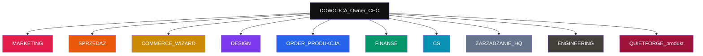

---

## MARKETING — czerwony

**Po co w firmie:** bez uwagi nie ma klientów → bez klientów Wizard = €0.

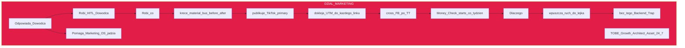

**Narzędzia:** TikTok, FB, GDrive, jadzia Marketing OS, GA4  
**Start:** `GO TIKTOK ORGANIC` · Ads FREEZE do 2026-08-06

---

## SPRZEDAŻ / CONCIERGE — pomarańcz

**Po co w firmie:** lead stygnie w godzinę — ktoś musi domknąć rozmowę do Wizard.

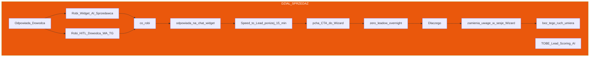

**Narzędzia:** widget INT-001, Commander, Telegram, WhatsApp

---

## COMMERCE / WIZARD — złoty = SILNIK €

**Po co w firmie:** jedyna droga zakupu. Tu powstają pieniądze. Reszta firmy istnieje, żeby tu ktoś wszedł i zapłacił.

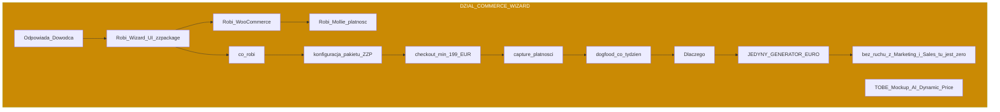

**Guard:** marża ≥60% · Gate D / skala Mollie tylko z GO

---

## DESIGN / INSPIRE — fiolet

**Po co w firmie:** ZZP kupuje oczami — musi zobaczyć bus / branding zanim zapłaci.

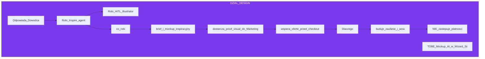

---

## ORDER / PRODUKCJA / ERKA — niebieski

**Po co w firmie:** po płatności ktoś musi zrobić i dostarczyć — inaczej nie ma powtórki ani case’a do Marketingu.

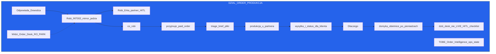

**Zakaz:** fake S7 / Order LIVE bez GO UNPARK

---

## FINANSE — zielony

**Po co w firmie:** pilnuje, żeby zamówienie nie było „sprzedażą na stratę”.

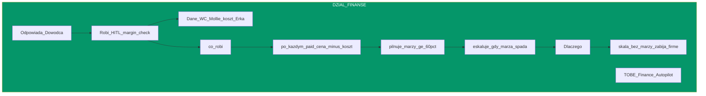

---

## CS — cyan

**Po co w firmie:** zadowolony klient = kolejny lead / case do TikToka.

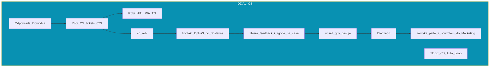

---

## ZARZĄDZANIE / HQ / VCMS — szary = STER

**Po co w firmie:** porządek i bezpieczeństwo decyzji — **nie sprzedaż**.

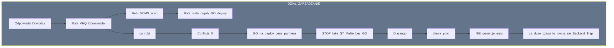

---

## ENGINEERING / AGENT OS — grafit = KOSZT

**Po co w firmie:** buduje bramki, które skracają drogę do euro — albo stoi.

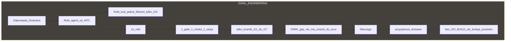

---

## QUIETFORGE — bordo = PRODUKT OS (osobno)

**Po co:** sprzedaż systemu innym — **po** tym jak FlexGrafik zarobi na sobie.

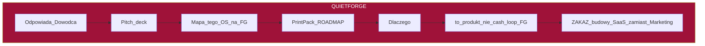

---

## JAK DZIAŁY PODAJĄ SOBIE PIŁKĘ (normalna firma)

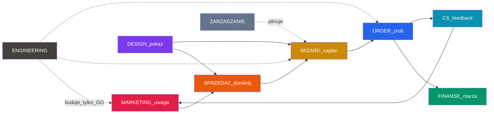

---

## GDZIE DZIŚ PADA PIŁKA

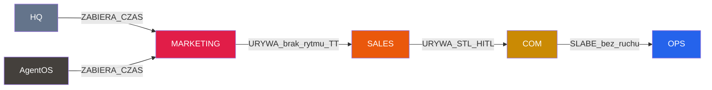

---

## JUTRO RANO — kto co robi

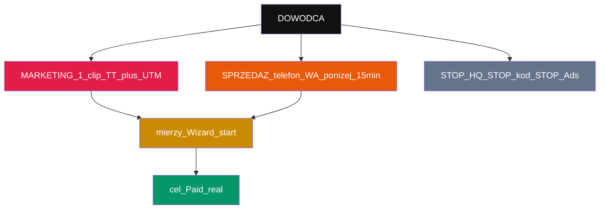

**ACCEPT:** `ACCEPT SYSTEM-FIRM-OPERATING-MAP`  
**START:** `GO TIKTOK ORGANIC`
