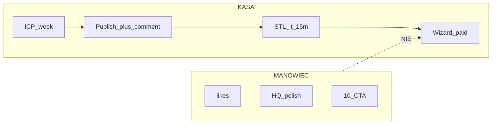
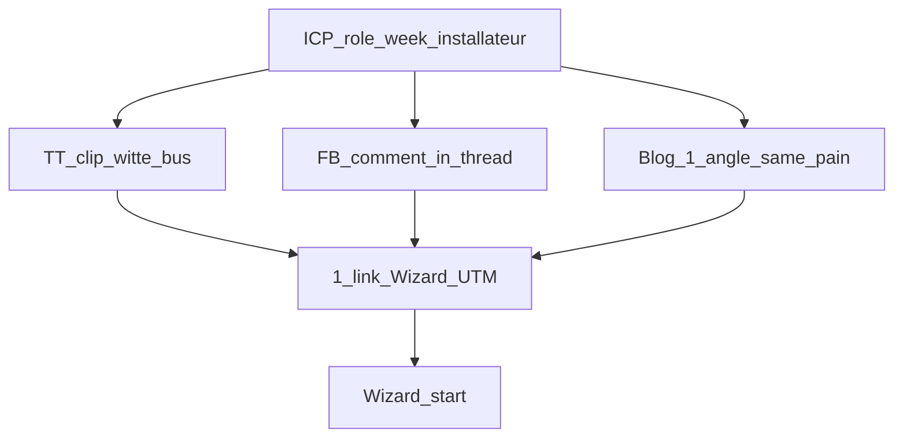
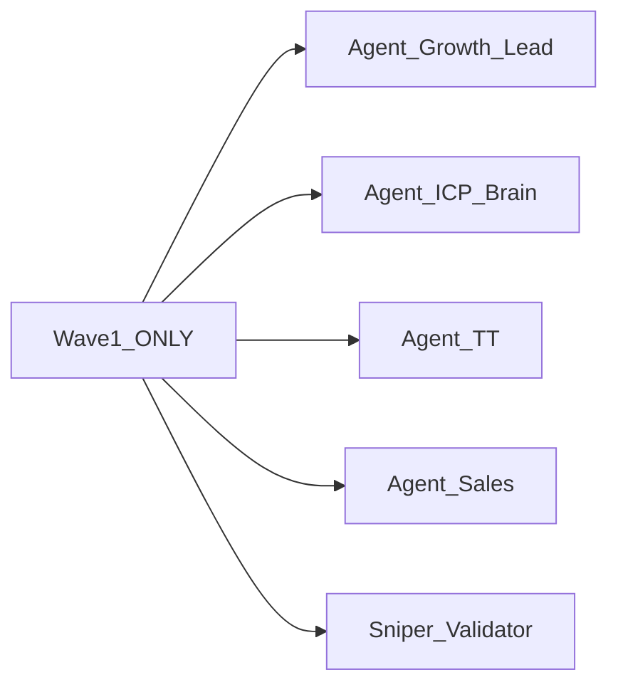
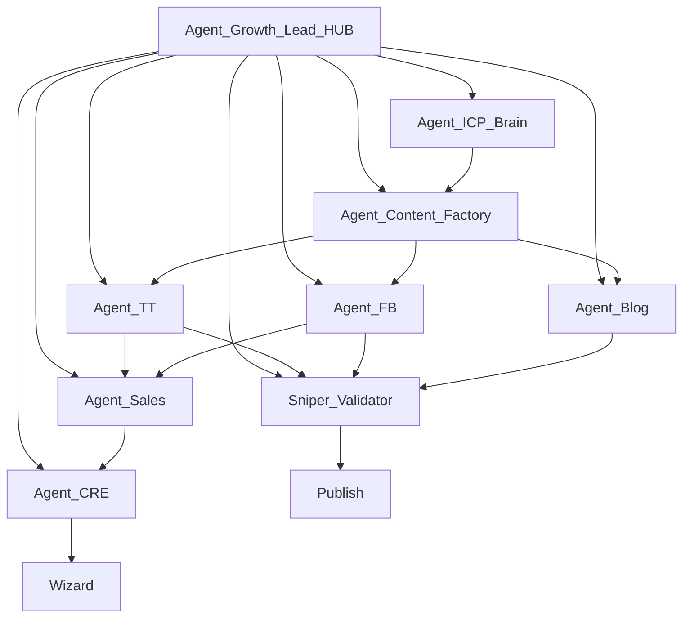
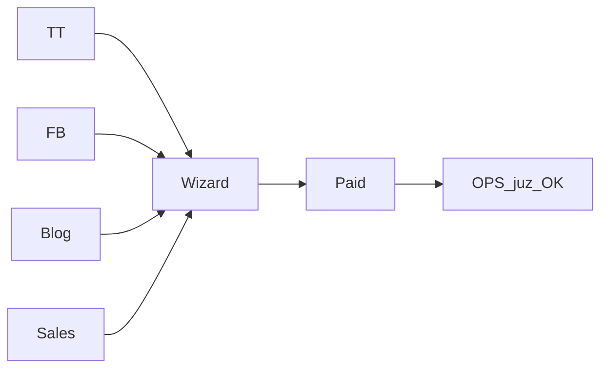

# SYSTEM FIRM OPERATING SYSTEM — TARGET v5

> **2 lata budowy systemu — ten dokument jest punktem zwrotnym.**  
> Nie kolejny dashboard. **Maszyna, która wpycha ZZP do Wizard.**  
> Ops po sprzedaży = gotowe. **Brakuje klientów.**

---

## A. INSIDER — czego nie mówią (a co robi kasę)

Agencje i „AI transformacja” pchają: branding, content calendar, likes, CRM, automation ops.  
**Przy zerowym popycie to manowiec.** Koncerny, które naprawdę liczą €, robią coś innego:

| Co sprzedają (manowiec) | Co robi € na Twoim etapie |
|-------------------------|---------------------------|
| „Buduj markę 12 miesięcy” | **Tygodniowy rytm uwagi** na 1 ICP |
| 10 CTA w bio i poście | **1 CTA Wizard** — decyzja binarna |
| Dashboard bez UTM | **Ledger starts→paid per źródło** |
| Ops/automation desk | **Masz już** — nie dotykamy |
| Viral lottery | **Komentarze + reply + STL** — powtarzalne, nudne, działa |
| „AI napisze blog” ogólnie | **1 artykuł = 1 rola ICP** — intencja jak paid search |
| Offerte / DM / „porozmawiajmy” | **Wizard session** — inaczej lead umiera |
| 15 agentów Day 1 | **Wave 1: 5 ról** — potem skala |

**Prawda operacyjna:** przy cold start **pierwsze paid** często idzie z **komentarza, DM, WA lub gorącego wątku FB** — nie z „pięknego” posta. System musi **polować**, nie tylko publikować.



---

## B. MECHANIKA KASY (FlexGrafik)

### B.1 Jedyna równanie, które liczy się dziś

```
€ = (Qualified touches → Wizard starts) × (Start → Paid %) × AOV × marża
```

| Zmienna | Ty dziś | Cel OS |
|---------|---------|--------|
| Qualified touches | ~0 | TT+FB comments + publish + blog ICP |
| Wizard starts UTM | ~0 / tydzień | mierzalne WoW |
| Start→Paid | ? (mała próba) | podnosimy proof + STL + Wizard clarity |
| AOV | ~€199–€800 | nie obniżamy pod €199 |
| Marża | ≥60% reguła | po paid, nie blokuje nabór |

**Nie optymalizujesz AOV zanim masz starts.** Najpierw **wolumen wejść do Wizard**.

### B.2 Signal stack (dlaczego 1 kanał nie wystarczy — ale 1 CTA tak)

Koncerny nie robią „wszystkiego naraz z 5 CTA”. Robią **ten sam sygnał ICP** na wielu powierzchniach z **tym samym jednym CTA**:



**Zasada:** różne **powierzchnie**, ten sam **ból**, ten sam **CTA**. Nie różne oferty.

### B.3 ICP concentration (tajemnica prostoty)

Amator: content „dla wszystkich ZZP”.  
Pro: **1 rola / 1 tydzień** — język, przykłady, komentarze tylko pod nią.

| Tydzień | Rola | Hook (NL) |
|---------|------|-----------|
| W1 | installateur | witte bus · opdrachtgever ziet je niet |
| W2 | hovenier | herkenbaar op 50 meter |
| W3 | schilder | particulier vs B2B uitstraling |
| … | rotacja | ten sam CTA Wizard |

Mózg algorytmu i odbiorcy **uczą się jednego segmentu** — potem paid idzie szybciej niż „generic bouw”.

### B.4 Creative fatigue (TT)

Ten sam hook **umiera w 7–14 dni** na TT. System musi:
- episodic memory: co dało starts
- **nowy kąt** co tydzień (nie ten sam clip w kółko)
- **komentarze** żyją dłużej niż stary post

### B.5 Komentarz > post (B2B lokalny — insider)

Dla usług jak wrap/kleding:
- Post = zasięg losowy
- **Komentarz wartościowy pod cudzym wątkiem bouw/ZZP** = intent gorący
- Reply pod własnym filmem = domykanie zainteresowanych

**Agent_FB + Agent_TT engage** to nie „nice to have” — to **rdzeń polowania**.

### B.6 Speed-to-lead (twarda matematyka)

| Opóźnienie odpowiedzi | Co się dzieje |
|----------------------|---------------|
| <5 min | najwyższa szansa na Wizard session |
| 5–15 min | akceptowalne (Twój SLA OS) |
| 15–60 min | lead „później” = scroll / konkurent |
| overnight | **strata** — internet nie ma „later” |

**Agent_Sales + Dowódca:** hot = Wizard link w pierwszej sensownej odpowiedzi, nie „wyślę ofertę jutro”.

### B.7 Design Agent — pułapka dual cash

Live: mockup + offerte 48h **bez** Wizard = lead kończy poza silnikiem €.  
**Insider fix:** mockup = emocja → **jeden link Wizard** w <24h. Offerte = notatka w CRM, nie sukces.

### B.8 Proof hierarchy (zaufanie bez bullshitu)

| Siła | Asset |
|------|-------|
| 1 | Real bus before/after (zgoda) |
| 2 | Google review volume (dziś ~6×5.0 — **rosnąć liczbę**) |
| 3 | Portfolio portal |
| 4 | AI mockup (feeder, nie dowód dostawy) |
| 0 | Screenshot HQ / Agent OS |

Content Factory **nigdy** nie produkuje tier 0.

### B.9 Decoy framing (2 bieguny — snajper)

W **Wizard** masz pakiety — OK. W **poście** nigdy menu.  
Jeśli musisz pokazać skalę: **masa (logo/stickers) vs premium (bus+kleding)** → oba prowadzą do **tego samego Wizard** z UTM. Cel: MAIN = pakiet, który chcesz sprzedawać.

---

## C. CO USTAWIĆ TERAZ (przed kodem — obowiązkowe)

**To jest najważniejsze zadanie — ustawienia, nie build.**

### C.1 Ustawienia twarde (dziś)

| # | Ustaw | Wartość / reguła |
|---|-------|------------------|
| 1 | **ICP role week 1** | `installateur` (potem rotacja) |
| 2 | **Primary channel** | TikTok organic ≥2026-08-02 |
| 3 | **1 CTA URL template** | `https://zzpackage.flexgrafik.nl/wizard/?utm_source={channel}&utm_medium=organic&utm_campaign=icp_{role}&utm_content={asset_id}` |
| 4 | **Gra bridge** | osobny post = tylko `app.flexgrafik.nl` + GAME10 → Wizard coupon |
| 5 | **Ads** | OFF do 2026-08-06 |
| 6 | **STL SLA** | hot <15 min · 0 overnight |
| 7 | **Design Agent rule** | każdy lead → Wizard deeplink <24h (HITL dopóki brak auto) |
| 8 | **Money Check** | co Pon: starts UTM · paid · top 1 hook · FAIL validator |

### C.2 FB allowlist (start pusty → uzupełniaj)

| Pole | Ustawienie |
|------|------------|
| Własna strona | flexgrafik FB profile — reply 100% hot |
| Grupy NL bouw/ZZP | **lista ręczna** — max 5 na start, zero spam |
| Konkurenci / inspiracja | read-only — komentuj tylko gdy ICP score >70 |
| Zakaz | ten sam copy paste 20 grup / dzień |

### C.3 TT engage (start)

| Pole | Ustawienie |
|------|------------|
| Publish | cel ≥3 / tydzień |
| Reply własne filmy | <2h na pytanie z intencją |
| Outbound | tylko bouw/ZZP NL — 1 wartość + link |
| Zakaz | follow/unfollow masowy |

### C.4 Blog ICP (start)

| Pole | Ustawienie |
|------|------------|
| Cadence | 1 / tydzień |
| Tydzień 1 temat | installateur + bus 50m herkenbaar (już masz szkielet na blogu — **dopasuj pod rolę**, nie ogólny) |
| CTA | tylko Wizard + UTM `blog` |

### C.5 Validator rules (od razu — nawet HITL)

FAIL jeśli: >1 CTA · brak UTM · brak `icp_role` tag · multi-CTA słowa · Ads w freeze · HQ screenshot jako hero.

### C.6 Wave 1 roster (kogo „zatrudniasz” najpierw)



Reszta agentów = **Wave 2–4**. Nie uruchamiaj Blog auto / SEO auto / 15 agentów przed Wave1 PASS.

### C.7 Ledger (arkusz / Notion — zanim dashboard)

Kolumny obowiązkowe:

`date | channel | icp_role | asset_id | utm_link | publish_Y/N | comments_sent | hot_leads | wizard_starts | paid | notes`

**Bez ledgera = ślepa optymalizacja = manowiec.**

---

## D. North Star (bez zmiany)

| KPI | Definicja |
|-----|-----------|
| P0 | Wizard starts growth UTM |
| P1 | Paid real / tydzień |
| P2 | Social touchpoints / dzień |
| P3 | Sniper compliance % |

---

## E. Agentic Architecture 2026 (hub-spoke)



### MCP (tools)

| Tool | Agent |
|------|-------|
| jadzia.db + UTM | Growth Lead, CRE |
| content_calendar | TT, FB, Blog |
| GA4 | Growth Lead |
| publish path | TT, FB |
| GDrive | Content Factory |
| widget/leads | Sales |
| social connectors TO-BE | TT, FB read/comment |

### A2A handoffs

| Handoff | SLA |
|---------|-----|
| `brief_icp` | instant |
| `publish_request` → Validator | <5 min |
| `engage_event` → Sales | hot <15 min |
| `lead_hot` → Wizard | <15 min |

---

## F. Memory (3 warstwy)

Semantic (ICP) · Episodic (co dało starts) · Procedural (sniper playbook).  
**Tydzień:** 1 ulepszenie na podstawie #1 hook w episodic — nie nowy agent.

---

## G. Control plane

Observability · Audit · HITL (batch publish · FB allowlist · Ads GO) · RBAC.  
**HITL ≠ wszystko.** Komentarze/reply = autonomia po Validator PASS.

---

## H. Agenci — insider job spec

### Agent_TT
Publish ≥3/tydz · auto reply · outbound engage ICP · KPI: starts tiktok.

### Agent_FB
Read allowlist · comment 1 value + 1 CTA · KPI: starts facebook + qualified comments/day.

### Agent_Blog
1 ICP role/article · SEO intencja ZZP · KPI: organic→starts.

### Agent_Sales
STL · zero overnight · KPI: hot→Wizard median time.

### Agent_Sniper_Validator
Gate przed światem · KPI: FAIL rate ↓ · zero bypass.

### Agent_Growth_Lead
Money Check · ICP week pick · kill vanity · KPI: starts+paid WoW.

---

## I. Money Highway (ops ucięte)



---

## J. Rollout Waves

| Wave | Agenci | PASS |
|------|--------|------|
| W1 | Hub+ICP+TT+Sales+Validator | 3 TT/tydz · ledger prowadzony |
| W2 | +CF + FB hunter | comments daily |
| W3 | + Blog ICP | 1 article/tydz |
| W4 | full auto engage + episodic | starts WoW ↑ |

---

## K. Tydzień (święty)

| Dzień | Praca |
|-------|-------|
| Codziennie | TT/FB engage · Validator |
| Pon | Money Check + episodic |
| Wt | ICP brief + master asset |
| Śr | TT publish |
| Czw | Blog ICP |
| Pt | FB hunt + STL drill |

Organic ≥ **2026-08-02** · Ads FREEZE **2026-08-06**.

---

## L. Build fazy (po SET NOW)

| Faza | Co | NIE |
|------|-----|-----|
| **F0** | HITL Wave1 + ledger | ops desk |
| **F1** | UTM Lock + growth_events | vanity HQ |
| **F2** | Validator + calendar MCP | 15 agentów |
| **F3** | TT/FB connectors | spam |
| **F4** | Blog pipeline | ogólne AI blogi |
| **F5** | Ads post-thaw | spend w freeze |

`GO BUILD demand-f1` … `f5` — tylko po F0 PASS.

---

## M. Observability (jeden ekran)

Publish · comments · validator FAIL · starts by utm · paid · top hook · HITL queue.  
**Nie:** views · VHQ · tickets ops.

---

## N. Manowce — twardy STOP list

- HQ / VHQ polish jako P0 tygodnia  
- Order desk / S7 / fulfilment build  
- QuietForge zamiast TT  
- Multi-CTA post  
- Offerte jako koniec sprzedaży  
- 15 agentów Day 1  
- Dashboard bez UTM  
- „Później zrobimy marketing”  
- Viral bez STL  
- Blog bez ICP role tag  

---

## O. START — kolejność komend

| Krok | Komenda / akcja |
|------|-----------------|
| 1 | **Ustaw sekcję C (SET NOW)** — dziś |
| 2 | `GO TIKTOK ORGANIC` ≥2026-08-02 — F0 Wave1 |
| 3 | Prowadź ledger 2 tygodnie |
| 4 | `GO BUILD demand-f1` gdy 100% linków bez UTM = ból |
| 5 | Wave 2 dopiero po W1 PASS |

---

*v5 INSIDER · 2 lata systemu = ten dokument · polowanie > publikacja · 1 ICP · 1 CTA · STL · ledger · ops OUT*
