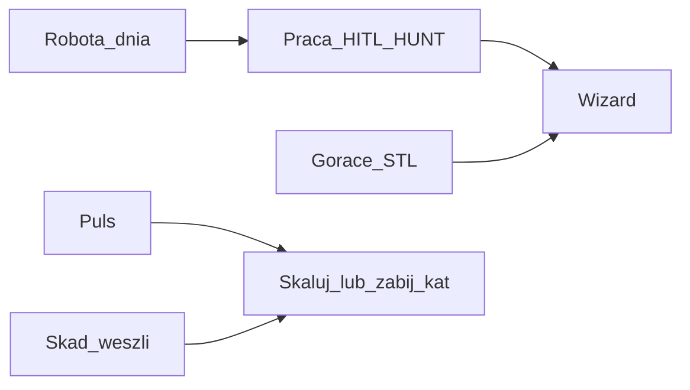

# DEMAND DESK v2.1 — Biuro Popytu (enterprise)

> Stanowisko Dowódcy jak w realnej firmie cash: **puls → praca → jakość → gorące → skąd → dziś.**  
> Nie Mission Control. Nie VHQ. Nie teatr 15 agentów.

**Język UI:** PL · API: EN.  
**Rada:** [`ENTERPRISE-COUNCIL-FLEXGRAFIK.md`](./ENTERPRISE-COUNCIL-FLEXGRAFIK.md)

---

## 0. Dlaczego v2.1 (po radzie enterprise)

| v2 | v2.1 | Efekt |
|----|------|-------|
| Brak „co robię dziś” | **ROBOTA DNIA** (1 linia) | ADHD / solo CEO — jedna decyzja |
| HITL = tylko publish | **Praca = HITL + HUNT** | Polowanie = rdzeń € (OS TARGET B.5) |
| 5 ról „ludzie w firmie” | **1 wiersz: Operator = Dowódca** | Koniec org-theater |
| Brak dual-cash | **Flaga DA bez Wizard 24h** | Path D — nie wyciek poza silnik |
| Sniper % zawsze | **n/a gdy 0 publish** | Koniec fałszywej zieleni |
| Build po ACCEPT | **Build po ACCEPT + 1 tyg REAL** | Nie SCADA na pustej fabryce |
| Puls bez trendu | **Δ WoW starts** | Sterowanie, nie fotografia |

v2 było dobrym sterem; v2.1 dopina **proces €**, nie więcej gadżetów.

---

## 1. Misja

| | |
|--|--|
| **Nazwa** | Demand Desk · Biuro Popytu |
| **Pytanie** | „Czy dziś wpychamy ZZP do Wizard — i co blokuje?” |
| **Czas** | ≤ 60 s |
| **Droga kasy** | touch → Wizard start UTM → paid (≥€199 · marża ≥60%) |
| **Operator** | Dowódca (= wszystkie Wave1 role naraz — bez udawania działów) |

---

## 2. Mapa ekranu (1 strona)

```text
╔════════════════════════════════════════════════════════════════════════════╗
║ A0  FLEXGRAFIK · BIURO POPYTU                                              ║
║ ICP: installateur   Stan: PARKED | LIVE   Tydzień: 2026-Wxx                ║
║ ★ ROBOTA DNIA: PUBLISH | HUNT | STL | MONEY_CHECK | PARKED_STOP            ║
╠═══════════════════════════════════╦════════════════════════════════════════╣
║ A  PULS KASY                      ║ B  PRACA (zrób to)                     ║
║ Starts UTM  (+Δ WoW)              ║ B1 Do akceptacji przed światem (HITL)  ║
║ Paid                              ║    asset · kanał · GOTOWY/BLOKADA      ║
║ Top hook                          ║ B2 Polowanie HUNT                      ║
║ Publish Y                         ║    cel · draft · SENT/BLOCK            ║
║ [DANE_FICT?]                      ║                                        ║
╠═══════════════════════════════════╬════════════════════════════════════════╣
║ C  JAKOŚĆ WYJŚCIA (snajper)       ║ D  GORĄCE — ODPOWIEDZ TERAZ            ║
║ Val FAIL (n/a jeśli 0 publish)    ║ Open hot · breach · overnight · median ║
║ Comments sent                     ║ Dual-cash: DA bez Wizard >24h          ║
╠═══════════════════════════════════╩════════════════════════════════════════╣
║ E  SKĄD WESZLI DO WIZARD (top 5 asset · kanał · starts)                    ║
╠════════════════════════════════════════════════════════════════════════════╣
║ F  KALENDARZ TYGODNIA                                                      ║
║ Pon Money · Wt ICP/asset · Śr TT · Czw Blog · Pt Hunt/STL                  ║
║ Operator: Dowódca · shells Wave1: status read-only (1 linia)               ║
╠════════════════════════════════════════════════════════════════════════════╣
║ STOPKA  Gate · REAL|FIXTURE · ostatni REAL event · doctor                  ║
╚════════════════════════════════════════════════════════════════════════════╝
```



---

## 3. Sekcje — odpowiedzialność

### A0 — Nagłówek + Robota dnia

| Element | Za co | Gdy czerwone |
|---------|-------|--------------|
| ICP tygodnia | 1 segment języka | Brak ICP = nie publikuj |
| PARKED / LIVE | Czy wolno w świat | LIVE bez GO = STOP |
| **Robota dnia** | Jedyna praca Foundera dziś | PARKED_STOP przy PARKED — Desk **mówi wprost: € nie powstaje** |

Źródło roboty: `week_ritual` + `marketing` state.

---

### A — Puls kasy

| Metryka | Biznes | API |
|---------|--------|-----|
| Starts UTM + Δ WoW | Nabór | `kpi.wizard_starts_utm` + diff |
| Paid | Cash | `kpi.paid` |
| Top hook | Co skalować | `kpi.top_hook` |
| Publish Y | Czy wychodziliśmy | `kpi.publish_count` |

**FIXTURE:** obramowanie „DANE_FICT — to nie klienci”.

---

### B — Praca (prawa kolumna = działanie)

**B1 — Do akceptacji przed światem (HITL publish)**  
`screen.hitl_queue[]` · decyzja GOTOWY / BLOKADA · **bez one-click live publish**.

**B2 — Polowanie (HUNT)**  
Kolejka allowlist / wątek · 1 wartość + 1 CTA Wizard · SENT/BLOCK.  
Bez B2 Desk = studio contentu, nie biuro popytu.

---

### C — Jakość wyjścia

Val FAIL · comments.  
Jeśli `publish_count=0` → Val metrics = **n/a** (nie zielony spokój).

---

### D — Gorące — odpowiedz teraz

STL: open · breach · overnight · median.  
+ **Dual-cash:** leady DA bez Wizard deeplink &gt;24h = czerwone.

---

### E — Skąd weszli do Wizard

Top 5 `utm_content` → asset · kanał · count.  
Zmęczenie creatives: jeden asset 100% → nowy kąt (B.4).

---

### F — Kalendarz tygodnia

Pon–Pt jak OS TARGET §K.  
**Nie:** siatka 5 „działów”.  
**Tak:** `Operator: Dowódca` + opcjonalnie status shells 1 linia.

---

### Stopka

Gate · REAL|FIXTURE · **ostatni REAL event** (&gt;48h przy LIVE = „maszyna milczy”) · doctor.  
**CUT z Desk:** Sync DB/leads · go_ready hero · Ads CPA · GA4 charts.

---

## 4. Stany (3 + 1)

| Stan | Znaczenie |
|------|-----------|
| PARKED | Nie wychodzimy · € nie powstaje z Desk |
| LIVE | GO Foundera — rytm publish/hunt |
| DANE_FICT | Fixture ≠ kasa |
| BRAK POŁĄCZENIA | API down (stopka) |

---

## 5. RBAC + akcje (max 4)

| Rola | Decyzje |
|------|---------|
| Dowódca / Delegat+act | ICP · odśwież · otwórz HITL/Hunt item · Money Check Pon |
| Viewer | read-only |

Publish live **nigdy** z jednego kliknięcia Desk.

---

## 6. Potrzeby firmy, które Desk obsługuje (efekt €)

Zgodnie z radą — Desk **wspiera**, nie zastępuje:

1. Rytm publish+hunt  
2. UTM + uczciwy puls  
3. STL  
4. Dual-cash kill  
5. 1 ICP  
6. Val przed światem  
7. Money Check  

Szczegół rankingu: [`ENTERPRISE-COUNCIL-FLEXGRAFIK.md`](./ENTERPRISE-COUNCIL-FLEXGRAFIK.md).

---

## 7. Non-goals

VHQ · Order Desk · Ads · 15 agentów · QuietForge P0 · org-chart theater · Sync* · build przed REAL week.

---

## 8. Acceptance

- [x] Widzę Robota dnia + HITL + Hunt  
- [x] Przy PARKED Desk mówi, że € nie powstaje  
- [x] FIXTURE nie da się pomylić z kasą  
- [x] Brak 5-role theater  
- [x] Dual-cash flaga  
- [x] Brain wskazuje ten plik  
- [x] Rozumiem: Etap 5 build = tool 100% UI (override REAL week gate)

**ACCEPT:** `ACCEPT DEMAND DESK v2.1` — **ZAREJESTROWANE 2026-08-02**  
**§8 PROD PASS:** agent verify 2026-08-03 · [`2026-08-03-DEMAND-DESK-5F-P2-01-SECTION8-CLOSE.md`](../../archive/handoffs/2026-08-03-DEMAND-DESK-5F-P2-01-SECTION8-CLOSE.md)

---

## 9. Etap 5 (build) — warunki

1. ACCEPT v2.1 ✓  
2. Desk contract tool (Etap 1b) — [`DESK-CONTRACT.md`](./DESK-CONTRACT.md) ✓  
3. Surface **Biuro Popytu** (`#view-demand-desk`), bind `demand-os/status` + dry actions  
4. UI handoff — [`DESK-UI-HANDOFF.md`](./DESK-UI-HANDOFF.md)  
5. VPS tylko z GO  

**Override Dowódca 2026-08-02:** warunek „≥1 tyg REAL” **nie blokuje** buildu dashboardu.

---

*v2.1 ENTERPRISE · rada Revenue/BPM/IT/Founder · mniej teatru · więcej polowania*
