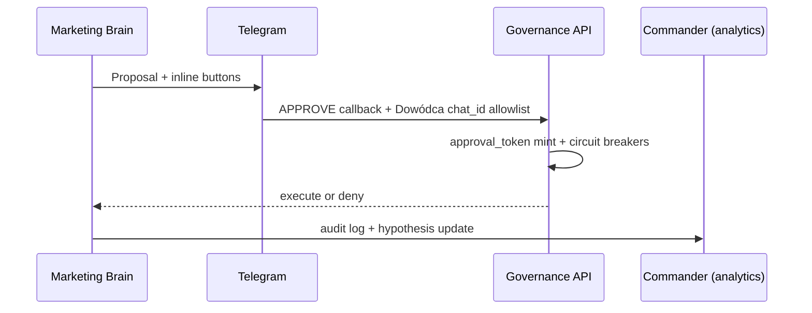
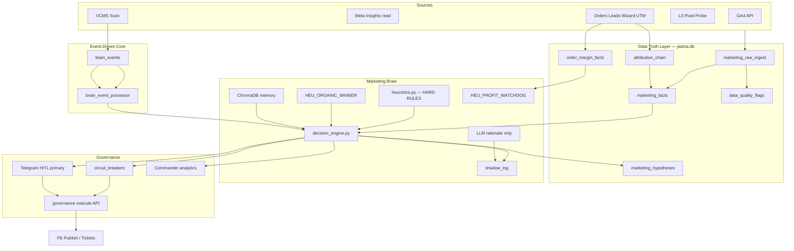

# MKT-BRAIN-PRO — plan bojowy (post-audit)

**Cel:** Marketing Brain (MB) klasy World-Class Ops — autonomiczna pętla decyzyjna z **Data Truth**, **atrybucją**, **event-driven runtime**, **Shadow Mode**, **Governance API** i **Telegram-first HITL** — bez halucynacji strategicznej i bez „czystych danych z API”.

**North Star (twarde):** `Net_Margin_per_Acquisition` + `CPA_wizard` — nie samo CPA z Meta.

**Nie zastępuje:** [META-PACK-LEAN.md](./META-PACK-LEAN.md) (paid L0 = Dowódca). MB **nie klika** Ads Manager do Gate MKT-STL-01 + economics proof.

---

## STATUS BOARD — 2026-07-19 (SoT)

**Runtime tip:** **`3c2fc6e`** · **MB_MODE:** `propose` · Data Health **ok** · F4b LIVE · Weekly draft LIVE · VCMS Brain Bus: **LIVE**  
**Handoff:** [PROGRAM-CLOSE](../../handoffs/2026-07-19-MKT-BRAIN-PRO-PROGRAM-CLOSE.md)

### Progress (SoT %)

| Warstwa | Done | Left | % |
|---------|------|------|---|
| **Runtime MB (F0→F4b + Eval + Preflight + Organic + CEO)** | 13/13 deliverables | — | **100%** |
| **Data Health honesty** | drivers + IC ack + insights park-info | observe | **~98%** |
| **Insights agent-half (#5)** | scopes + reason codes + DH park | Graph `read_insights` (HITL) | **READY** |
| **Weekly scorecard draft** | DTL → JSON/PL + CLI/API/TG | Ads spend paste HITL | **LIVE** |
| **Paid Meta ops (#1 lean)** | published €5 HOLD | optimize after 7d | **70%** |
| **L0 pixel events** | IC PASS | Purchase PARK (Mollie) | **50%** |
| **Faza 4 extras** (distribution / blog / lead webhook) | — | **ready_for_human** | **0%** |
| **Program overall** (runtime + ops + parks) | agent debt CLOSED | Meta · Purchase · Graph · F4x | **~86%** |

**Szacunek overall ~86%** = agent-only CLOSED; cap = HITL parks (nie „later”).

### DONE (LIVE / PASS)

| ID | Co | Dowód |
|----|-----|-------|
| **F0** | Data Truth Layer (schema, ingest, margin facts, Data Health) | tip `f28a938`+; DTL interval 3600s |
| **F1** | Decision engine + shadow log + Telegram HITL (no side-effects) + Organic-to-Paid + Profit Watchdog + hypotheses | tip `9314ddc`; shadow LIVE |
| **F2** | Governance execute API + circuit breakers (`CB_SHADOW`, margin, pixel, stale…) | tip `269248b`; Act zablokowany w shadow |
| **F2b** | Campaign Vector Memory (Chroma + SQL degrade) + shadow eval-pack | tip `3c4af26`; chroma LIVE |
| **Eval v2** | Stratified pack + `/mb_eval` + weekly nudge + **staff-eval** | tip **`ab1ed04`**; staff **n=20/20 acc=100% gate_ready** |
| **Preflight** | Propose cutover evidence + GO ticket | tip `d273b84` / LIVE `4ad1e99` |
| **F3** | Brain Bus webhook + `CB_ECOSYSTEM` + CEO stub + VCMS→jadzia notify | tip **`723a702`**; smoke degraded→recover; scan→HTTP 200 |
| **F4** | Propose mode + HITL execute → **ticket_only** (Ads API create PARK) | tip **`4ad1e99`**; smoke mint+execute ticket_only |
| **F4b** | paste_ready v1 templates + persist + idempotent Commander + TG no-token | tip **`0ae8244`**; smoke commander#15 cached |
| **DH-AMBER** | Data Health drivers + L0 IC ack / Purchase park-info (info ≠ amber) | `L0_IC_VERIFIED=1` |
| **Organic DTL** | FB post organic metrics → `organic_er_lift_pct` (+ link clicks lift) | `dtl/facebook_organic.py` in pipeline |
| **INSIGHTS-READY** | Token scopes + organic reason codes + DH park `fb_read_insights` | tip **`3c2fc6e`**; LIVE po Graph |
| **WEEKLY-DRAFT** | Scorecard draft z DTL (spend/CPL null) + CLI/API/TG | tip **`3c2fc6e`** |
| **CEO↔brief** | Weekly brief → `ceo.priority` Brain Bus (`BRIEF_CEO_PRIORITY_ENABLED`) | `brief_node._maybe_publish_ceo_priority` |
| **L0 IC** | Meta Test Events `InitiateCheckout` | pixel `1084197063740065` · PASS |

### ready_for_human (freeze — checklist, nie OPEN vague)

**SoT tygodnia:** [PLAN-14D.md](./PLAN-14D.md) · klik Meta: [META-CLICK-PATH.md](./META-CLICK-PATH.md) · start: [OPERATOR-TODAY.md](./OPERATOR-TODAY.md)

| Priorytet | Co | Owner | Checklist |
|-----------|-----|-------|-----------|
| **1** | **META lean** Instant Form HOLD | Dowódca | Hold 7d €5 → optimize ([META-CLICK-PATH](./META-CLICK-PATH.md)) |
| **2** | Shadow → GO `propose` | — | **DONE** LIVE tip `4ad1e99` |
| **3** | L0 **Purchase** w Test Events | Dowódca | Mollie GO → Test Events Purchase |
| **4** | **F4/F4b Act** ticket_only + paste_ready v1 | — | **DONE** tip `0ae8244` (Ads create PARK) |
| **5** | FB `read_insights` LIVE | Dowódca | Graph scope → nowy token → `set-fb-access-token` |
| **H-WA** | Speed-to-lead | Dowódca | Lead → WA &lt;15 min ([SPEED-TO-LEAD](./SPEED-TO-LEAD.md)) |
| **H-F4x** | Distribution / blog / lead webhook | Dowódca | dopiero po triggerach (leady / GO) |

### Shadow evaluation rubric (gate → propose)

| Score | Znaczenie |
|-------|-----------|
| **agree** | Decyzja MB = co zrobiłby Dowódca |
| **partial** | Kierunek OK, zły severity/timing/kanał |
| **disagree** | Zła / szkodliwa vs ocena Dowódcy |

**Formula:** `accuracy = avg(agree=1, partial=0.5, disagree=0)` · **gate:** ≥70% **oraz** `n_scored ≥ 20` na 14d · preferuj **2 tygodnie z rzędu** zielone przed GO propose.

**Kanał (v2, kanoniczny):** Telegram `/mb_eval` → karty ze score buttons · auto-nudge co 7d (`MARKETING_EVAL_PUSH_INTERVAL_SECONDS`) · API `GET …/shadow/accuracy` · `POST …/shadow/eval-push`.

**Backup CSV/JSON:** `GET …/shadow/eval-pack?limit=12` · CLI `python scripts/mb_shadow_eval_export.py --format csv -o eval.csv`

### F4 propose cutover checklist (NO ACT until GO)

Runbook: [PROPOSE-CUTOVER.md](./PROPOSE-CUTOVER.md) · CLI `python scripts/mb_propose_preflight.py`

- [x] Shadow accuracy ≥70% (rubryka) — n=20/20 acc=100% @ `ab1ed04`
- [x] Breakers: pre-GO tylko `CB_SHADOW`; po GO trips=`[]` allowed=true @ `4ad1e99`
- [x] Data Health: bez critical RED; drivers + IC ack (`L0_IC_VERIFIED`); Purchase park=info
- [x] L0 InitiateCheckout PASS (done); Purchase status jawny (PARK OK świadomie)
- [x] Jawny GO Dowódcy: `MB_MODE=propose` na VPS tip `4ad1e99`
- [x] Ticket + cutover: `CONFIRM=GO_PROPOSE` · cycle tg=1 · F4 ticket_only smoke PASS

### PARK (twarde — nie ruszamy)

Gate D · Mollie LIVE charge · Ads API **create** · TikTok API C1-01 · full auto-publish · MMM · Redis queue · fake PASS

### Human-only checklist (ready_for_human)

| # | Item | Status |
|---|------|--------|
| H-Meta | Meta HOLD 7d €5 → optimize | **ready_for_human** ([META-CLICK-PATH](./META-CLICK-PATH.md)) |
| H-Purchase | Purchase Test Events | **ready_for_human** (Mollie GO) |
| H-Insights | Graph `read_insights` → token | **ready_for_human** (agent-half READY @ `3c2fc6e`) |
| H-WA | WA &lt;15 min na lead | **ready_for_human** ([SPEED-TO-LEAD](./SPEED-TO-LEAD.md)) |
| H-F4x | Distribution / blog / lead webhook | **ready_for_human** (po triggerach) |
| H3 | Shadow n≥20 (staff-eval + /mb_eval) | **PASS** n=20/20 @ `ab1ed04` |

---

## 0. Co zostaje (fundamenty — nie psuć)

| Fundament | Decyzja | Dowód w ekosystemie |
|-----------|---------|---------------------|
| **Build vs Runtime** | Cursor = build; **jadzia VPS** = runtime mózgów 24/7 | `brain.md`, `JADZIA-OPERATOR-PLAYBOOK.md` |
| **OODA-G** | Reasoning → **Governance Gate** → Act / HITL / Deny | Tor A/B `FB-AUTOMATION-PLAYBOOK.md` |
| **Brain Bus** | Komunikacja **strukturalna** (JSON events), nie LLM↔LLM chat | **F3 LIVE** `POST /api/v1/brain-bus/events` + VCMS scan |
| **SQLite SoT** | Operacyjny stan w `jadzia.db` — bez in-memory task dicts | `CLAUDE.md`, `agent/db.py` |
| **HITL publish FB** | Publish tylko po `approved` | `content_calendar_node.py` LIVE |
| **Agent OS = Engineering Brain** | Kod multi-repo — **nie** runtime MB | `agent-os/graph.py`, SESSION-ANCHOR |

---

## 1. Audyt — błędy poprzedniego szkicu i poprawki

### A. Pułapka czystych danych (Dirty Data Trap)

**Błąd:** MB czyta bezpośrednio GA4 + Meta API → szum, opóźnienia, niespójne okna atrybucji.

**Poprawka — Data Truth Layer (DTL):**

```
[Sources]          [Ingest]              [DTL SQLite]           [MB reads]
GA4 API      ──►   ingest_ga4_snapshot   ──► marketing_facts     ──► ONLY facts
Meta Insights──►   ingest_meta_insights  ──► data_quality_flags       never raw API
Orders/Leads ──►   ingest_ops_events     ──► channel_rollups
Pixel probe  ──►   ingest_l0_health      ──► freshness_ts
FB/TT organic──►   ingest_post_metrics   ──► organic_engagement_facts
Orders COGS  ──►   ingest_order_margin   ──► net_margin_facts
```

| Tabela (propozycja) | Rola |
|---------------------|------|
| `marketing_raw_ingest` | Append-only surowe payloady + `source`, `fetched_at`, `checksum` |
| `marketing_facts` | Znormalizowane metryki: `metric_key`, `channel`, `window`, `value`, `confidence`, `as_of` |
| `data_quality_flags` | `stale`, `missing`, `conflict_1d_7d`, `api_error` — MB **musi** sprawdzić przed decyzją |
| `order_margin_facts` | `order_id`, `gross`, `cogs`, `shipping`, `net_margin`, `net_margin_pct` — **Profit Watchdog** |
| `marketing_hypotheses` | Experimentation Ledger — hipoteza → wynik → wnioski (patrz §2.6) |

**Reguła MB:** jeśli `confidence < threshold` lub flaga `stale` → decyzja = **HOLD + alert**, nie optymalizacja.

### B. Pustka atrybucji (Attribution Void)

**Błąd:** CPA_wizard bez modelu przypisania → MB przypisuje sukces złemu kanałowi.

**Poprawka — Unified Attribution (pragmatyczna, nie pełne MMM na start):**

| Warstwa | Mechanizm | Status AS-IS |
|---------|-----------|--------------|
| **L1 — Last-touch operacyjny** | UTM z sesji Wizard → lead/order | `orders.attribution_json`, widget sessions — **PARTIAL** |
| **L2 — Session stitch** | `session_id` + `utm_*` + timestamp chain do `order_id` | **TO-BE** w DTL |
| **L3 — Assisted (prosty)** | Jeśli 2+ touch w 7d → zapis `touch_path[]`, raport **nie** single-channel CPA | **TO-BE** |
| **L4 — MMM** | **PARK** do ≥90d danych + ≥50 konwersji | nie budować teraz |

**North Star liczy MB tylko na faktach z DTL:** `qualified_wizard_starts_by_channel`, `cpa_by_last_touch`, `net_margin_per_acquisition`, `assisted_conversion_note`.

### C. Kruchy worker loop

**Błąd:** jeden skrypt worker = single point of failure; brak heartbeat mózgów.

**Poprawka — Event-Driven Core (EDC) na SQLite (v1):**

| Element | v1 (min complexity) | v2 (scale) |
|---------|---------------------|------------|
| Kolejka | tabela `brain_events` (status: pending/processing/done/dead) | Redis Streams / RabbitMQ |
| Producers | ingest hooks, lead webhook, calendar, VCMS scan | same |
| Consumer | `brain_event_processor` w worker (idempotent) | dedicated worker |
| Heartbeat | `brain_heartbeats` co agent_id + SLA | Prometheus |
| Recovery | dead-letter + Telegram alert | auto-replay |

**Zasada:** akcja typu `lead_spike` → **event**, nie synchroniczny call w pętli.

Istniejący `health_monitor.py` + `agents_registry.py` → rozszerzyć do **Brain Health Panel**, nie zastępować.

### D. Halucynacja strategiczna

**Błąd:** North Star w promptcie LLM → dryf strategii.

**Poprawka — Heuristics First, LLM Second:**

| Warstwa | Implementacja |
|---------|---------------|
| **Strategia (twarde)** | `agent/marketing/heuristics.py` — Python reguły: marża net min, CPA cap 40% brutto, Purchase gate, spend cap, **Organic-to-Paid**, **Profit Watchdog** |
| **Taktyka (miękkie)** | LLM: draft copy, uzasadnienie propozycji, podsumowanie tygodnia |
| **MB Decision** | `heuristics.evaluate(facts) → Decision` ; LLM **opcjonalnie** `rationale_nl` |

LLM **nie może** nadpisać heurystyki — tylko ją opisać.

---

## 2. Ulepszenia Expert-Level (wbudowane w plan)

### 2A. Final Polish — Money-Making tweaks (2026-07-19)

| Funkcja | Złożoność | Zarabia? | Decyzja |
|---------|-----------|----------|---------|
| Data Truth Layer | Średnia | Kluczowe (zapobiega stratom) | **KEEP** |
| Shadow Mode | Niska | Tak (zaufanie przed Act) | **KEEP** |
| Heuristics First | Bardzo niska | Tak (stabilność) | **KEEP** |
| **Organic-to-Paid Bridge** | Niska | **Bardzo** (najlepszy ROI) | **ADD** |
| **Telegram Approve** | Niska | Tak (szybkość decyzji) | **ADD** |
| **Profit Watchdog** | Średnia | **Kluczowe** (portfel, nie vanity CPA) | **ADD** |
| **Experimentation Ledger** | Niska | Tak (uczenie bez Chroma-only) | **ADD** |
| Commander Brains UI (głęboka analiza) | Średnia | Tak (DTL drill-down) | **KEEP — secondary** |
| ChromaDB RAG | Średnia | Tak (pamięć kampanii) | **KEEP — F2** |

### 2.5 Organic-to-Paid Booster (Winning Content Bridge)

**Problem:** oddzielenie Organic od Paid = marnowanie zwycięzców.

**Heurystyka `HEU_ORGANIC_WINNER`:**

| Warunek (DTL) | Akcja MB |
|---------------|----------|
| Post FB lub TT (organic) ma **Engagement Rate** lub **Link Clicks** ≥ **+50%** vs średnia 30d tego kanału | Alert **CRITICAL-WIN** + propozycja |
| `data_quality_flags` clean + min. N impressions (anti-noise) | — |

**Propozycja (Telegram + shadow log):**

```text
🏆 Organic Winner: post_id=… (FB Reel)
ER +62% vs 30d avg · Link clicks +71%
Rekomendacja: Boost jako Ads — budżet start 5€/day · utm_content=reel_a
[✅ APPROVE] [❌ DENY] [📊 DETAILS]
```

**Governance:** MB **nie tworzy** kampanii Ads API (PARK) — approve = ticket + paste-ready payload do Ads Manager / META-PACK playbook.

**Organic ≠ Paid w DTL:** ten sam `asset_id` / `post_id` stitch — most między kanałami, nie osobne strategie.

### 2.6 Experimentation Ledger (Tablica Hipotez)

**Problem:** restarty i shadow bez struktury = powtarzanie błędów.

**Tabela `marketing_hypotheses`:**

| Kolumna | Rola |
|---------|------|
| `hypothesis_id` | UUID |
| `statement` | „Zmiana nagłówka X zwiększy CTR o 10%” |
| `proposed_action_ref` | link do shadow_log / calendar entry |
| `status` | `open` \| `measuring` \| `validated` \| `falsified` |
| `review_at` | auto +3d od startu |
| `outcome` | `true` \| `false` \| `inconclusive` |
| `learnings_nl` | wnioski dla przyszłych iteracji |

**Pętla:** przed każdą akcją scale/copy → MB **musi** zapisać hipotezę. Po `review_at` event `hypothesis.review_due` → MB dopisuje wynik z DTL (CTR delta). Ledger **uzupełnia** Chroma RAG (F2), nie zastępuje.

### 2.7 Profit Watchdog (Net Margin per Acquisition)

**Problem:** niskie CPA + niska marża netto = iluzja zysku.

**DTL — `order_margin_facts`:**

| Pole | Źródło v1 |
|------|-----------|
| `gross` | `orders.total_gross` (LIVE) |
| `cogs` | stała marża brutto 60% z playbooka **lub** WC line items gdy dostępne |
| `shipping` | config / order meta |
| `net_margin` | gross − cogs − shipping − refunds_alloc |
| `net_margin_pct` | net_margin / gross |

**Heurystyka `HEU_PROFIT_WATCHDOG`:**

| Warunek | Akcja |
|---------|-------|
| rolling 7d `net_margin_pct` < **X%** (domyślnie 40% brutto → net po kosztach operacyjnych) | **BLOCK** wszystkie propozycje scale, nawet gdy Meta CPA zielone |
| pojedyncze zamówienie net_margin < 0 | alert + tag attribution channel (refund risk) |

MB optymalizuje **portfel**, nie dashboard Ads Managera.

### 2.8 Telegram-First HITL (primary interface)

**Problem:** CEO nie wchodzi do Commander co godzinę.

**Decyzja:** **Approve/Deny = Telegram** (3 sekundy). Commander = **głęboka analityka DTL** (Data Health, facts drill-down, shadow history) — nie primary approval queue.

**Mechanizm (reuse istniejącego wzorca):**

- Wzorzec: `api/telegram.py` + `build_inline_keyboard_approval` (HITL diff — LIVE)
- Nowe callbacki: `mb_approve:{action_id}` · `mb_deny:{action_id}` · `mb_details:{action_id}`
- `DETAILS` → link Commander deep-link **lub** skrócony fact bundle w Telegram

**Flow:**



**Shadow mode:** przyciski pokazują „SHADOW — nie wykonano” po DENY/ghost approve test.

### 2.1 Shadow Decision Log (P0 — przed jakimkolwiek Act)

**Tryb:** `MB_MODE=shadow` (domyślnie przez **14 dni** po deploy Fazy 1).

MB zapisuje do `marketing_shadow_log`:

```json
{
  "observed_facts_ref": "...",
  "proposed_action": "pause_scale|draft_post|alert_critical|hold",
  "heuristic_rule_id": "CPA_SPIKE_50PCT_3H",
  "llm_rationale_nl": "...",
  "would_execute": true,
  "governance_result": "allow|deny|review"
}
```

**DoD Fazy 1:** Dowódca ocenia celność logu (≥70% zgodności z własną oceną) → dopiero wtedy `MB_MODE=propose` (HITL Act).

### 2.2 Campaign Vector Memory (RAG)

**Cel:** „Czy robiliśmy coś podobnego? Kampania X spaliła budżet.”

| Element | Wybór |
|---------|-------|
| Store | **ChromaDB** lokalnie na VPS (`data/chroma/marketing/`) — file-based, bez osobnego serwera |
| Embeddings | decyzje shadow + outcome + channel + CPA delta |
| Query | przed każdą propozycją scale/publish → top-k podobnych z `outcome=negative` |
| Fallback | jeśli Chroma niedostępna → SQL query last N decisions (degraded) |

### 2.3 Commander — deep analytics only (nie primary HITL)

**Final Polish:** primary approve = **Telegram** (§2.8). Commander **nie** dostaje rozbudowanego approval queue na start.

**Commander (secondary — F0/F2):**

| Panel | Treść |
|-------|--------|
| **Data Health** | DTL freshness, quality flags, attribution coverage |
| **Facts Explorer** | drill-down `marketing_facts` + margin rollups |
| **Shadow / Hypothesis history** | ostatnie 20 shadow + ledger |
| Brain Health | heartbeat MB / ingest (minimal) |

Cursor = dev. **Decyzje = Telegram.** Commander = audyt i analiza.

### 2.4 Circuit Breakers (bezpieczniki w kodzie)

Twarde reguły w `agent/marketing/circuit_breakers.py` — **przed** Governance API:

| ID | Warunek | Akcja |
|----|---------|-------|
| `CB_SPEND_DAILY` | spend_dzienny > X EUR | block meta_api + alert CRITICAL |
| `CB_CPA_SPIKE` | CPA +50% w 3h vs rolling 24h | hold publishes + alert CRITICAL |
| `CB_MARGIN_FLOOR` | net_margin_pct 7d rolling < floor | block scale proposals (Profit Watchdog) |
| `CB_PIXEL` | Purchase event missing 24h | block scale proposals |
| `CB_DATA_STALE` | DTL freshness > 2h | MB mode HOLD |
| `CB_SHADOW` | `MB_MODE=shadow` | block all external side-effects |

Breakers **trip** → zapis `circuit_breaker_events` + Telegram.

---

## 3. Governance API (Faza 2)

Fizyczna blokada side-effectów bez podpisu Dowódcy.

```
POST /api/v1/marketing/actions/execute
Headers: Authorization: Bearer JWT
Body: { action_id, approval_token }
```

| Gate | Sprawdzenie |
|------|-------------|
| Telegram callback **lub** JWT | Dowódca allowlist `chat_id` + `mb_approve` / Commander JWT |
| `approval_token` | jednorazowy, bound to `action_id`, TTL 15m |
| Circuit breakers | not tripped |
| Heuristics | allow |
| Shadow mode | deny execute (log only) |

**Meta/TikTok/FB publish** — wszystkie wywołania zewnętrzne **tylko** przez ten endpoint (refactor `publish.py` w Fazie 2).

---

## 4. Brain Bus v1 (Faza 3)

Tabela `brain_events` + schemat:

```json
{
  "event_type": "system.health.degraded|lead.spike|campaign.fact.updated",
  "source_brain": "koda|mb|ceo_stub",
  "payload": {},
  "correlation_id": "..."
}
```

| Połączenie | Kierunek | v1 |
|------------|----------|-----|
| **KB (KODA/VCMS)** → MB | `system.health.degraded` / `recovered` | **LIVE** — `vcms-scan` → Brain Bus |
| **MB** → Dowódca | propozycje HITL | **Telegram inline** (primary) — LIVE shadow |
| **MB** → Commander | audit + DTL analytics | Data Health + brain-bus panels |
| **MB** → SB (stub) | `lead.qualified` routing | PARK do Sales Brain v2 |
| **CEO stub** → MB | priorytet tygodnia | **LIVE** via weekly brief → `ceo.priority` |

---

## 5. Fazy implementacji (MKT-BRAIN-PRO)

### Faza 0 — Data Truth + Observability — **DONE LIVE**

| Deliverable | Status |
|-------------|--------|
| DTL schema + `order_margin_facts` | **DONE** |
| Ingest GA4 / orders / leads / L0 HTML probe / margin | **DONE** (worker 3600s) |
| Organic FB insights ingest | **DONE** (minimal; insights optional) |
| Attribution L1–L2 stitch | **PARTIAL** (L1/L2 w DTL; L3+ PARK) |
| Commander Data Health | **DONE** |
| DoD 7d continuous ingest | **IN PROGRESS** (observe) |

### Faza 1 — Decision Engine + Shadow — **DONE LIVE** (`MB_MODE=shadow`)

| Deliverable | Status |
|-------------|--------|
| heuristics + decision_engine + hypotheses | **DONE** |
| Shadow log + Telegram proposals (no side-effects) | **DONE** |
| EDC `brain_events` processor | **DONE** (rozszerzone w F3) |
| DoD: Dowódca shadow review ≥70% | **TODO** (14d clock) |

### Faza 2 — Governance + Breakers — **DONE LIVE (core)** · F2b memory **DONE**

| Deliverable | Status |
|-------------|--------|
| Governance `approval_token` + execute API | **DONE** (shadow blocks execute) |
| Circuit breakers (+ F3 `CB_ECOSYSTEM`) | **DONE** |
| Commander analytics (shadow / breakers) | **DONE** |
| ChromaDB RAG (hash embed + SQL degrade) | **DONE F2b** |
| Shadow eval-pack + rubric | **DONE** |
| DoD: Telegram APPROVE → ticket Act | **LIVE** tip `4ad1e99` (Ads create PARK) |

### Faza 3 — Brain Bus + KB bridge — **DONE LIVE** tip `723a702`

| Deliverable | Status |
|-------------|--------|
| `POST /api/v1/brain-bus/events` + secret | **DONE** |
| degraded → flag + ticket + TG + hold | **DONE** |
| CEO stub API | **DONE** |
| VCMS scan notify | **DONE** (Flex-vcms #40) |

### Faza 4 — Act (post-shadow GO) — **CORE LIVE** · extras PARK

| Deliverable | Warunek |
|-------------|---------|
| `MB_MODE=propose` | **LIVE** tip `4ad1e99` (GO 2026-07-19) |
| paste_ready v1 (F4b) | **LIVE** tip `0ae8244` |
| Distribution pack | PARK later (1 asset → FB + TT/blog tasks) |
| Blog seed orchestration | PARK (SSH HITL) |
| Meta Lead webhook | PARK (≥20 leadów + MKT-STL-01 GO) |

### PARK (bez zmian)

Gate D · Mollie LIVE · Ads API create · TikTok API C1-01 · full auto-publish · MMM · Redis queue (do czasu obciążenia)

---

## 6. Architektura docelowa



---

## 7. Metryki sukcesu (World-Class bar)

| Metryka | Target |
|---------|--------|
| DTL freshness | p95 < 1h (GA4), < 15m (ops events) |
| Shadow accuracy | ≥70% zgodności z Dowódcą przed Act |
| False-positive alerts | < 2/tydz. po tuning |
| Time to alert (CPA spike / organic winner) | < 15 min od fact write |
| Attribution coverage | ≥80% orders z L2 chain |
| **Margin fact coverage** | ≥90% real orders z net_margin |
| **Telegram decision latency** | Dowódca median approve < 5 min w godz. pracy |
| **Hypothesis closure rate** | ≥80% open → validated/falsified w 7d |
| Brain uptime | heartbeat gap < 2× SLA |

---

## 8. Relacja do META-PACK-LEAN

| Kto | Co |
|-----|-----|
| **Dowódca** | META-PACK L0 + kampania €10 (ręcznie Ads Manager) |
| **MB Faza 0–1** | równolegle zbiera facts + shadow — **nie** zastępuje L0 |
| **Po META-PACK LIVE** | MB shadow ocenia propozycje scale/kill vs facts |
| **Po Faza 2 GO** | MB propose + HITL; breakers pilnują spend |

---

## 9. Agent OS vs Cursor vs Jadzia (ostatecznie)

| Rola | Gdzie |
|------|-------|
| Budowa MB kodu | **Cursor** (primary) |
| Runtime MB + DTL + EDC | **jadzia VPS** |
| Engineering tasks (8 repo) | **Agent OS** (optional) |
| Konstytucja agentów | **flexgrafik-meta/agents.md** |
| Ecosystem health RAG | **VCMS KODA** → events do Brain Bus |

---

## 10. Następny krok agenta

**GO MKT-BRAIN-PRO F0** → DTL schema (+ margin facts) + ingest + Commander **Data Health** panel. **F1** dodaje Telegram proposals + Organic-to-Paid + Profit Watchdog heuristics w shadow.

**standing_go_closeout=false** — deploy VPS tylko po review lokalnym + explicit GO.
