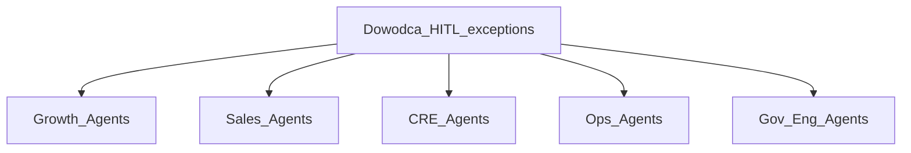
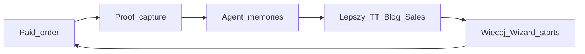

> **SUPERSEDED — nie SoT.** Kanon: [`STRATEGY-PACK.md`](./STRATEGY-PACK.md) (Ch5 AGENT ROSTER+BRAINS). Index: [`README.md`](./README.md).

# AGENT ROSTER + BRAINS

Kontrakt zatrudnienia AI. OS TARGET (Etap 2) **instaluje** tych pracowników — nie wymyśla nowych bez strategii.

## Wspólny model Brain

Każdy agent ma:

| Element | Znaczenie |
|---------|-----------|
| **Memory** | ostatnie N assetów / leadów / orders + co zadziałało |
| **Rules** | ICP, język NL, UTM, zakazy (HQ content, deepfake, Ads freeze) |
| **Loop** | mierz → porównaj KPI → zaproponuj 1 ulepszenie / tydzień |
| **Growth** | brain rośnie z volumem firmy (więcej orders = lepsze creatives) |
| **HITL** | budzi Foundera tylko w wyjątkach poniżej |

---

## Agent_TT

| Pole | Spec |
|------|------|
| Dział | Marketing |
| Cel / tydz. | ≥3 publish · Wizard starts tiktok UTM |
| Brain input | top hooks, watch time proxy, ostatnie proofy z orders |
| Loop | zabij słabe hooks; skaluj top 1 |
| HITL | publish approve na start; później batch |
| Zakaz | HQ, deepfake, Ads |

## Agent_FB

| Pole | Spec |
|------|------|
| Dział | Marketing |
| Cel | cross TT · retarget po thaw |
| Brain | które creatives konwertują na FB vs TT |
| HITL | Ads spend GO Foundera |
| Zakaz | Ads przed 2026-08-06 |

## Agent_Blog

| Pole | Spec |
|------|------|
| Dział | Marketing / SEO |
| Cel | 1 post / tydz. + CTA Wizard |
| Brain | keywords ZZP bus belettering + slimmer werken; cannibalization |
| Loop | update starych postów gdy ranking pada |
| HITL | ton / factual ops copy |
| Zakaz | post bez CTA |

## Agent_Portal

| Pole | Spec |
|------|------|
| Dział | Marketing / Trust |
| Cel | sessions→Wizard; spójność FAQ |
| Brain | portfolio gaps; review count |
| HITL | publikacja case ze zgodą |
| Zakaz | sprzeczne adresy/FAQ |

## Agent_Game

| Pole | Spec |
|------|------|
| Dział | Growth magnet |
| Cel | leads + coupon→Wizard |
| Brain | które TT CTA dają plays |
| HITL | zmiana reward ekonomii |
| Zakaz | martwy coupon bez UTM |

## Agent_SEO

| Pole | Spec |
|------|------|
| Dział | Growth |
| Cel | branded+nonbrand → Wizard |
| Brain | GSC queries; review velocity |
| HITL | paid Google GO |
| Zakaz | fake reviews |

## Agent_Sales

| Pole | Spec |
|------|------|
| Dział | Sprzedaż |
| Cel | hot lead <15 min · Wizard CTA |
| Brain | lead score 0–100; objection patterns |
| Tools | Widget + WA + TG |
| HITL | negocjacja >€5k / custom |
| Zakaz | lead overnight |

## Agent_Design

| Pole | Spec |
|------|------|
| Dział | Design |
| Cel | DA→Wizard <24h; 1 proof/tydz. do Growth |
| Brain | które mockupy → paid |
| HITL | druk-ready files |
| Zakaz | offerte jako koniec ścieżki |

## Agent_CRE

| Pole | Spec |
|------|------|
| Dział | Commerce Wizard |
| Cel | paid real · abandon↓ |
| Brain | step drop-off Wizard |
| HITL | zmiana cennika / Gate D |
| Zakaz | Mollie scale bez GO |

## Agent_Order

| Pole | Spec |
|------|------|
| Dział | Order / Erka |
| Cel | on-time; status zanim klient zapyta |
| Brain | delay patterns Erka |
| HITL | nowy partner; exception QC |
| Zakaz | fake S7 LIVE |

## Agent_Finance

| Pole | Spec |
|------|------|
| Dział | Finanse |
| Cel | marża ≥60% rolling |
| Brain | cost spikes → price alert |
| HITL | zmiana ceny auto >próg |
| Zakaz | ukrywanie margin fail |

## Agent_CS

| Pole | Spec |
|------|------|
| Dział | CS |
| Cel | D+3 feedback · review · referral UTM |
| Brain | sentiment → upsell scripts |
| HITL | reklamacje |
| Zakaz | ignor completed bez follow-up |

## Agent_Gov

| Pole | Spec |
|------|------|
| Dział | Zarządzanie |
| Cel | Conflicts:0 · GO gates · STOP amatorszczyzny |
| Brain | które decyzje zabierały czas bez € |
| HITL | zawsze na deploy/cennik/partner |
| Zakaz | HQ polish jako priorytet tygodnia |

## Agent_Eng

| Pole | Spec |
|------|------|
| Dział | Engineering |
| Cel | 1 gate = 1 odcinek euro ze strategii |
| Brain | cost tokenów vs € impact |
| HITL | merge/deploy |
| Zakaz | build bez ścieżki do Wizard paid |

## Agent_Growth_Lead (meta)

| Pole | Spec |
|------|------|
| Cel | spina Money Check Pon; priorytet G1–G5 |
| Brain | który path (1–8) daje paid |
| HITL | zmiana strategii kanału |
| Zakaz | vanity dashboards |

---

## Learning loop firmy

Im więcej real orders, tym mądrzejsze brainy — **dlatego cash loop jest warunkiem inteligencji systemu**.

## ACCEPT

`ACCEPT FLEXGRAFIK STRATEGY PACK`
