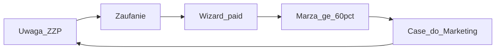
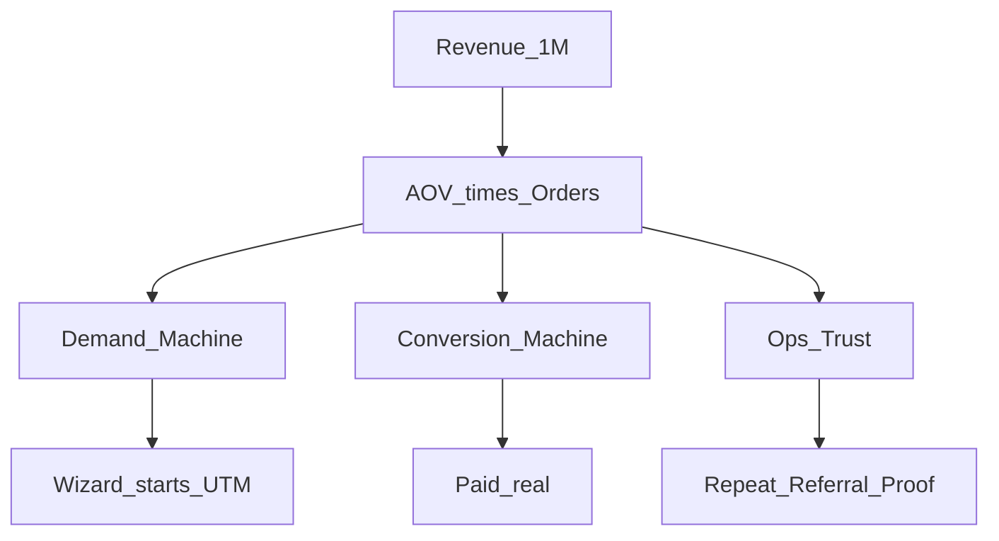

> **SUPERSEDED — nie SoT.** Kanon: [`STRATEGY-PACK.md`](./STRATEGY-PACK.md) (Ch1 BUSINESS). Index: [`README.md`](./README.md).

# STRATEGY BUSINESS — FlexGrafik

## 1. North Star

FlexGrafik zarabia wyłącznie wtedy, gdy ZZP w NL kupuje branding przez **Wizard** (paid real), przy marży ≥60% i checkout ≥€199.

**Cel systemu (hipoteza operacyjna):** €1 000 000 przychodu / rok z cash loop FlexGrafik — nie z vanity HQ i nie z QuietForge przed proof.

## 2. ICP (Ideal Customer Profile)

| Warstwa | Definicja |
|---------|-----------|
| **Primary** | Ambitny ZZP w bouw / techniek / buitendienst (NL) |
| **Role z live** | installateur, hovenier, schilder, dakdekker, loodgieter, elektricien |
| **Ból** | Witte anonieme bus · brak logo na kleding · particuliere, prijs-kritische klanten |
| **Pragnienie** | Premium Vakman · B2B contracten · respect op de bouw · wyższe uurtarief |
| **Trigger** | „Opdrachtgevers zien je bus vóór ze bellen” |
| **Nie-ICP** | Duża drukarnia B2B multi-tenant; inwestor QuietForge jako zamiennik cash FG |

**Obietnica rynkowa (live, kanon):** *Van anoniem naar Premium Vakman* — konfiguracja w minutach, montaż/dostawa w **10 werkdagen** po akkoord.

## 3. Model przychodu

| Element | Reguła |
|---------|--------|
| Cash Engine | **Wizard-only** (`zzpackage.flexgrafik.nl`) |
| Min checkout | **€199** (excl. BTW na ofercie produktowej) |
| Marża | **≥60%** brutto (cena − koszt Erka/produkcji) |
| Płatność | iDEAL / Bancontact / Mollie — skala LIVE tylko z GO Foundera |
| Partner produkcyjny | ErKa (Heesch) + PostNL / odbiór |
| Feedery (nie cash) | Portal, blog, gra, Design Agent, TT/FB, widget |

**Zakaz modelu:** sprzedaż „poza Wizard” jako osobny cash (offerte 48h = **lead**, nie zamknięcie płatności poza OS).

## 4. Unit economics i ścieżka €1M

| Założenie | Wartość (hipoteza) |
|-----------|-------------------|
| Target rok | €1 000 000 |
| AOV roboczy | ~€800 (pakiety powyżej minimum; korygować danymi) |
| Paid potrzebne / rok | ~1 250 |
| Paid / tydzień | ~24 |
| Marża | ≥60% inaczej skala zabija |

**PASS biznesowy nie jest vanity:** rooms LIVE / agent runs ≠ sukces.  
Sukces tygodnia = Wizard starts (UTM) + paid real + sample marży.

## 5. Co firma obiecuje / czego nie

| Obiecuje | Nie obiecuje |
|----------|--------------|
| Profesjonalny branding ZZP online | Gwarantowany viral TikTok |
| 10 werkdagen po akkoord (weekend nie liczy) | Natychmiastowy full-wrap bez partnera |
| Premium materiały (3M / Avery / Oracal — spójność copy) | Najniższa cena na rynku |
| Bezpieczna płatność Mollie/iDEAL | Skala paid bez Gate D GO |
| Chat AI z disclosure | Że HQ/Agent OS = produkt klienta |

## 6. QuietForge (osobno)

| | FlexGrafik | QuietForge |
|--|------------|------------|
| Rola | Firma-proof, cash TERAZ | Produkt OS / Print Pack później |
| Priorytet | **P0** | Po cash proof FG lub funding GO |
| Zakaz | — | Budowa SaaS zamiast popytu FG |

## 7. KPI euro (Business)

| KPI | Definicja | Owner-agent |
|-----|-----------|-------------|
| Paid real / tydzień | WC + class real | Agent_CRE + Agent_Finance |
| Wizard starts growth / tydzień | UTM growth | Agent_Growth_Lead |
| Margin sample | rolling ≥60% | Agent_Finance |
| CAC proxy | spend / starts (po Ads thaw) | Agent_FB / Agent_SEO |

## 8. Wymagania pod OS (Automation Elite)

- Każdy agent ma KPI € lub proxy €
- HITL Foundera: wypłaty/wyjątki >€5k, nowi partnerzy, Gate D, deploy ceny
- Standard 24/7: treść→lead→Wizard path bez czekania na „nastrój HQ”

## 9. ACCEPT

Część packu. Komenda packu: `ACCEPT FLEXGRAFIK STRATEGY PACK`
