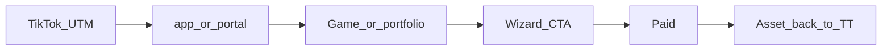
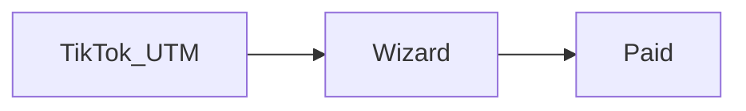
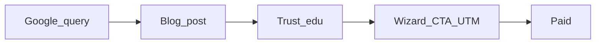
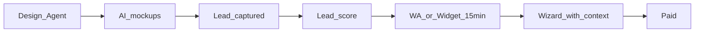
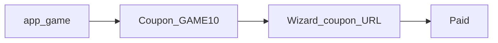
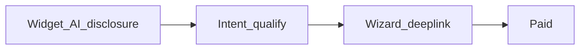
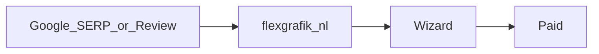
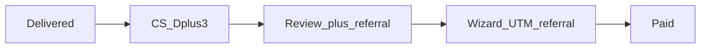
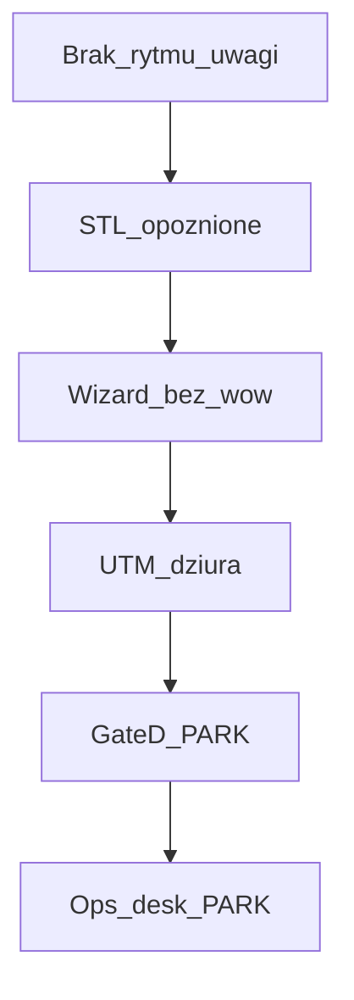

> **SUPERSEDED — nie SoT.** Kanon: [`STRATEGY-PACK.md`](./STRATEGY-PACK.md) (Ch4 CONVERSION). Index: [`README.md`](./README.md).

# STRATEGY CONVERSION PATHS

Każda ścieżka: **entry → trust → CTA → friction → paid → proof→Growth**.  
Cash koniec zawsze = **Wizard paid**.

## Path 1 — TikTok → app/portal → Wizard → paid

| | AS-IS | TO-BE strategiczne |
|--|-------|-------------------|
| Entry | rytm TT słaby | ≥3/tydz. Agent_TT |
| Friction | brak UTM dyscypliny | UTM Lock obowiązkowy |
| KPI | starts `utm_source=tiktok` · paid |

## Path 2 — TikTok → Wizard direct

| | AS-IS | TO-BE |
|--|-------|-------|
| Friction | słaby mockup-before-pay | Design proof w creatives + later CRE mockup |
| KPI | direct starts · paid |

## Path 3 — Blog SEO → Wizard

| | AS-IS | TO-BE |
|--|-------|-------|
| Entry | ~kilka postów | 1/tydz. + CTA zawsze |
| KPI | organic→starts |

## Path 4 — Design Agent → offerte/WA → Wizard (NIE omijać)

| | AS-IS | TO-BE |
|--|-------|-------|
| Luka | offerte 48h jak osobny koniec | Wizard = obowiązkowy next step |
| KPI | DA→Wizard <24h · paid |

## Path 5 — Gra → coupon → Wizard

| | AS-IS | TO-BE |
|--|-------|-------|
| Bridge | istnieje | każdy growth CTA co 2. TT |
| KPI | coupon redemption · paid |

## Path 6 — Widget / COM-AI → Wizard

| | AS-IS | TO-BE |
|--|-------|-------|
| Luka | martwy bez ruchu | karmiony Path 1–3 |
| KPI | CTA click · paid |

## Path 7 — Google brand/review → portal → Wizard

| | AS-IS | TO-BE |
|--|-------|-------|
| Trust | 6 reviews | volume reviews + spójny FAQ |
| KPI | brand clicks → starts |

## Path 8 — CS / referral → Wizard

| | AS-IS | TO-BE |
|--|-------|-------|
| Luka | CS manual rzadki | obowiązek D+3 + zgoda case |
| KPI | referral starts · reviews |

## Friction map (global)

Naprawa strategiczna kolejność = G1→G3→G5→G4→G6(GO)→G7(GO) — zgodna z AS-IS mapą działów.

## KPI konwersji (pack)

| Funnel stage | Metryka |
|--------------|---------|
| Attention | publish · impressions proxy |
| Landing | CTR UTM |
| Start | Wizard starts |
| Pay | paid real ≥€199 |
| Loop | proof reused in TT/blog |

## ACCEPT

`ACCEPT FLEXGRAFIK STRATEGY PACK`
