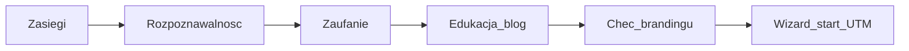
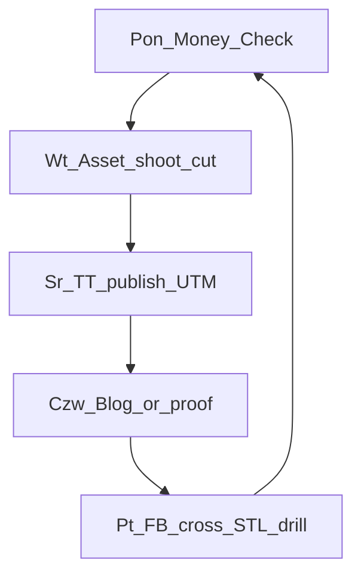

> **SUPERSEDED — nie SoT.** Kanon: [`STRATEGY-PACK.md`](./STRATEGY-PACK.md) (Ch3 MARKETING). Index: [`README.md`](./README.md).

# STRATEGY MARKETING — FlexGrafik

## 1. Cel marketingu (łańcuch)

Marketing pracuje **codziennie** (HITL na start → 24/7 agentów w OS).  
**Komunikat 1 linia:** problem witte bus → dowód wizualny → CTA Wizard.  
**Zakaz:** HQ / dashboard / Agent OS jako content dla ZZP.

## 2. Kanon Growth Engine

Primary channel: **TikTok**. Bridge: gra / portal → Wizard. Attribution: UTM + Jadzia.

North star marketingu = **Qualified Wizard starts from growth channels** (nie vanity views).

## 3. Kanały — cel, rytm, CTA, KPI, agent

### TikTok — Agent_TT

| Pole | Spec |
|------|------|
| Cel | Uwaga ZZP; test hipotez viral |
| Treść | before/after bus, chaos bouw, Belastingdienst/relatable, reveal pakietu |
| Rytm | min **3 publish / tydzień** (organic ≥2026-08-02) |
| CTA | UTM → `app.flexgrafik.nl` lub Wizard |
| KPI | watch>8s proxy · CTR landing · Wizard starts `utm_source=tiktok` |
| Zakaz | deepfake; HQ screenshots |

### Facebook — Agent_FB

| Pole | Spec |
|------|------|
| Cel | Cross-post + retarget (po thaw) |
| Treść | te same mastery co TT; lokalne ZZP bez spamu grup |
| Rytm | cross w dniu TT; Ads dopiero po **2026-08-06** |
| CTA | UTM |
| KPI | starts · CAC proxy po paid |
| Zakaz | Ads w freeze |

### Blog ZZPackage — Agent_Blog

| Pole | Spec |
|------|------|
| Cel | Edukacja + SEO + zaufanie → branding |
| Filary | (1) Branding & uitstraling (2) Slimmer werken |
| Rytm | **1 post / tydzień** minimum; każdy z CTA Wizard + UTM |
| KPI | organic sessions → Wizard starts |
| Zakaz | post bez CTA |

### Portal flexgrafik.nl — Agent_Portal

| Pole | Spec |
|------|------|
| Cel | Trust brand + SEO + CTA |
| Treść | portfolio real, FAQ spójne z Erka/Heesch, reviews |
| Rytm | weekly trust polish (1 proof asset) |
| KPI | sessions → Wizard clicks |
| Zakaz | sprzeczne lokalizacje w FAQ |

### Gra — Agent_Game

| Pole | Spec |
|------|------|
| Cel | Lead magnet + coupon |
| Treść | promowanie z TT („win korting GAME10”) |
| Rytm | push w każdym TT CTA co 2. publikacja |
| KPI | leads · coupon→Wizard |
| Zakaz | gra bez mostu UTM |

### Google / SERP — Agent_SEO

| Pole | Spec |
|------|------|
| Cel | Intent + brand capture |
| Praca | reviews volume (dziś 6×5.0 — za mało), Search Console, local consistency |
| Rytm | 1 review ask / completed order (CS) |
| KPI | branded + nonbrand clicks → Wizard |
| Zakaz | kupowanie fake reviews |

### WA / Widget — Agent_Sales (marketing↔sales)

| Pole | Spec |
|------|------|
| Cel | Speed-to-Lead <15 min |
| Treść | NL, disclosure AI, CTA Wizard |
| Rytm | 24/7 monitoring hot leads |
| KPI | median response · close→Wizard |
| Zakaz | lead overnight |

## 4. Cadence tygodnia (system musi to realizować)

## 5. Trust & social proof

- Priorytet: **real bus before/after** z zamówień (CS zgoda)
- Google reviews: cel wzrostu liczby (nie tylko 5.0)
- Portfolio portal = żywe, nie stock HQ

## 6. Paid (po freeze)

| Faza | Start | Budget test (meta guidance) |
|------|-------|-----------------------------|
| Organic only | ≥2026-08-02 | €0 ads |
| Retarget FB | po 2026-08-06 + GO | mały test |
| TT/Google paid | po baseline UTM 30d | tylko z CAC proxy |

## 7. KPI marketing (euro proxy)

| KPI | Cel kierunku |
|-----|--------------|
| Publish count / tydz. | ≥3 TT + 1 blog |
| Wizard starts growth UTM | rosnąco tydzień/tydzień |
| Proof assets in circulation | ≥1 świeży / tydzień |
| Hot lead <15m | 100% hot |

## 8. ACCEPT

`ACCEPT FLEXGRAFIK STRATEGY PACK`
