# STRATEGY PACK — FlexGrafik

**Doktryna:** MAX EFFECT · MIN COMPLEXITY. Snajper, nie shotgun.  
**Cash:** tylko Wizard paid (≥€199 · marża ≥60%).  
**Decyzja klienta:** YES (Wizard) albo scroll away — nie ma „later”.  
**Status:** **ACCEPTED · SOT** · egzekutor = [`SYSTEM-FIRM-OPERATING-SYSTEM-TARGET.md`](../SYSTEM-FIRM-OPERATING-SYSTEM-TARGET.md)

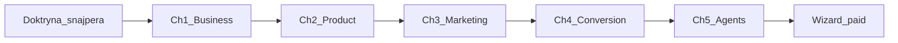

---

## Ch1 — BUSINESS

### North star

FlexGrafik zarabia wyłącznie gdy ZZP w NL kupuje branding przez **Wizard** (paid real).  
€1 000 000 / rok = **hipoteza operacyjna** (zamówienia × AOV × okres) — nie obietnica marketingowa.

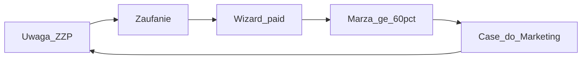

### ICP

| Warstwa | Definicja |
|---------|-----------|
| Primary | Ambitny ZZP NL — bouw / techniek / buitendienst |
| Role | installateur, hovenier, schilder, dakdekker, loodgieter, elektricien |
| Ból | Witte anonieme bus · brak logo · prijs-kritische particuliere |
| Pragnienie | Premium Vakman · B2B · wyższe uurtarief |
| Trigger (NL) | „Opdrachtgevers zien je bus vóór ze bellen” |
| Nie-ICP | Multi-tenant drukarnia B2B; QuietForge jako zamiennik cash FG |

**Obietnica:** *Van anoniem naar Premium Vakman* — konfiguracja w minutach; montaż/dostawa **10 werkdagen** po akkoord.

### Model przychodu

| Element | Reguła |
|---------|--------|
| Cash engine | **Wizard-only** (`zzpackage.flexgrafik.nl/wizard/`) |
| Floor | checkout ≥**€199** · marża brutto ≥**60%** |
| Framing cen | max **2 bieguny** (masa vs premium) tylko żeby wskazać MAIN offer — nigdy menu 5 pakietów w jednym poście |
| Płatność | iDEAL / Bancontact / Mollie — skala LIVE tylko z GO Foundera |
| Produkcja | ErKa (Heesch) + PostNL / odbiór |
| Feedery ≠ cash | portal, blog, gra, Design Agent, TT/FB, widget |

**Zakaz:** offerte / WA / „gratis ontwerp” jako zamknięcie sprzedaży poza Wizard paid.

### €1M — wzór (hipoteza)

| Założenie | Wartość robocza |
|-----------|-----------------|
| Target rok | €1 000 000 |
| AOV roboczy | ~€800 (korygować danymi) |
| Paid / rok | ~1 250 |
| Paid / tydzień | ~24 |

**Sukces tygodnia ≠ rooms LIVE.** Sukces = Wizard starts (UTM) + paid real + sample marży ≥60%.

### QuietForge

| | FlexGrafik | QuietForge |
|--|------------|------------|
| Rola | Cash TERAZ · firma-proof | Produkt OS / Print Pack później |
| Priorytet | **P0** | **AFTER cash proof FG** (lub funding GO) |
| Zakaz | — | Budowa SaaS zamiast popytu FG |

### KPI euro (Business)

| KPI | Definicja | Owner |
|-----|-----------|-------|
| Paid real / tydz. | WC + class real | Agent_CRE + Agent_Finance |
| Wizard starts growth | UTM WoW | Agent_Growth_Lead |
| Margin sample | rolling ≥60% | Agent_Finance |
| CAC proxy | spend / starts (po Ads thaw) | Agent_FB / Agent_SEO |

### HITL Foundera

Wypłaty/wyjątki >€5k · nowi partnerzy · Gate D · deploy ceny · Mollie scale.

---

## Ch2 — PRODUCT

### Hierarchia (święta)

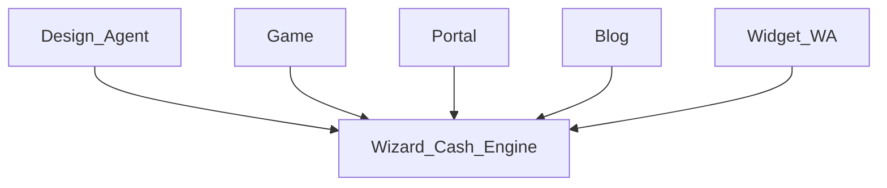

| Asset | Rola | Primary CTA | Park? |
|-------|------|-------------|-------|
| Wizard 9-step + WC + Mollie | **L0 Cash** — jedyna płatność | Checkout / paid | Nie |
| Design Agent (`voertuigreclame-ontwerp`) | Feeder wow + lead | **Wizard** (deep link / HITL <24h) | Dual cash = **KILL** |
| app.flexgrafik.nl + GAME10 | Lead magnet | **Wizard** (coupon URL) | Nie |
| flexgrafik.nl | Trust + SEO | **Wizard** | FAQ lokalizacji → 1 SoT ops copy |
| Blog ZZPackage | Edukacja → brand | **Wizard** + UTM | Thin blog = rytm 1/tydz. |
| Widget + WA +31 687286151 | Speed-to-lead | **Wizard** | Lead overnight = **KILL** |
| QuietForge | Poza cash loop FG | — | **PARK** do cash proof |

**UI klienta:** NL. Disclosure AI w widget: LIVE (COM-AI-50).

### Wizard (Cash Engine)

| Aspekt | Spec |
|--------|------|
| URL | `https://zzpackage.flexgrafik.nl/wizard/` |
| Job | Konfiguracja brandingu ZZP → paid |
| Guard | ≥€199 · 10 werkdagen po akkoord |
| Primary KPI | paid real / tydz. |
| Primary CTA | Zapłać / checkout |
| Owner | Agent_CRE |

### Design Agent — snajper (nie dual cash)

Live AS-IS: 2 AI mockupy + offerte 48h + WA **bez** obowiązkowego Wizard = **break**.

| Reguła TO-BE | |
|--------------|--|
| Offerte / WA | = lead scored — **nie** koniec ścieżki |
| Binary | YES → Wizard session <24h · albo leave |
| Zakaz | „Gratis ontwerp” kończący się mailem bez Wizard |

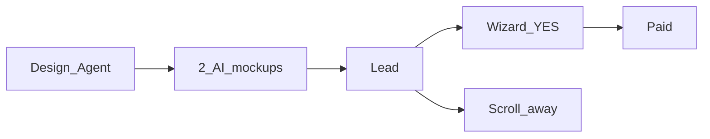

### Backlog produktowy (kolejność € — nie wishlist)

| # | Item | Dlaczego € | Gate |
|---|------|------------|------|
| 1 | UTM Lock na każdym CTA | pomiar | measurement |
| 2 | DA → Wizard deep link | kill dual cash | convert |
| 3 | Mockup-before-pay w Wizard | abandon↓ | CRE |
| 4 | Speed-to-Lead alert | hot lead | sales |
| 5 | ops_state desk | trust po paid | ops GO |
| 6 | Margin lock / dynamic price | marża | po volume |
| 7 | Retarget pixels | odzysk | po Ads thaw |

### KPI produktowe

| KPI | Definicja |
|-----|-----------|
| Feeder→Wizard rate | % sesji feedera → Wizard start |
| DA lead→Wizard <24h | % Design Agent leads |
| Coupon→checkout | GAME* redemption |
| Copy consistency | 0 sprzecznych lokalizacji (Schiedam vs Heesch/Erka) |

---

## Ch3 — MARKETING

### Cel (jeden łańcuch)

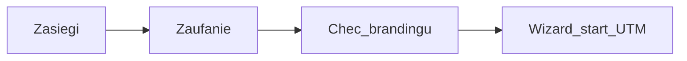

**1 linia creativu:** problem witte bus → dowód wizualny → **CTA Wizard**.  
**Zakaz:** HQ / dashboard / Agent OS jako content dla ZZP.  
**Zakaz:** multi-CTA (like/comment/save/newsletter/buy).

**North star marketingu:** Qualified Wizard starts z kanałów growth (nie vanity views).  
**Primary channel:** TikTok. Organic ≥**2026-08-02**. Ads **FREEZE** do **2026-08-06**.

### Kanały — 1 job · 1 CTA · 1 KPI

| Kanał | Job | ONE primary CTA | Primary KPI | Cadence | Agent |
|-------|-----|-----------------|-------------|---------|-------|
| **TikTok** | Demand / uwaga ZZP | Wizard + UTM `tiktok` | Wizard starts `utm_source=tiktok` | ≥3 publish / tydz. | Agent_TT |
| **Facebook** | Cross TT · retarget po thaw | Wizard + UTM `facebook` | starts · CAC proxy po paid | Cross w dniu TT; Ads ≥2026-08-06 + GO | Agent_FB |
| **Blog ZZPackage** | Educate → brand | Wizard + UTM `blog` | organic sessions → starts | 1 post / tydz. | Agent_Blog |
| **Portal** | Trust + SEO | Wizard | sessions → Wizard clicks | 1 proof asset / tydz. | Agent_Portal |
| **Gra** | Lead magnet | Wizard + coupon URL | coupon→Wizard starts | Push z TT co 2. publish (osobny post = 1 CTA game→Wizard) | Agent_Game |
| **Google / SERP** | Intent + brand | Wizard via portal | branded+nonbrand → starts | 1 review ask / completed order | Agent_SEO |
| **WA / Widget** | Speed-to-Lead | Wizard | median response · close→Wizard | Hot <15 min · 0 overnight | Agent_Sales |

**Filary bloga (nie menu CTA):** (1) Branding & uitstraling (2) Slimmer werken — każdy post = jeden CTA Wizard.

### Cadence tygodnia (jeden rytm)

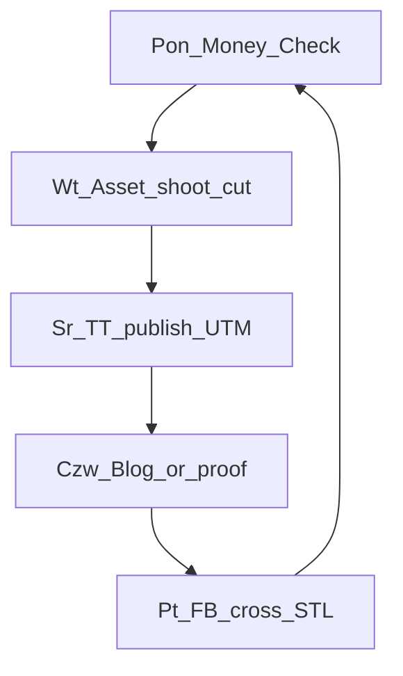

### Trust

- Real bus before/after ze zgodą CS (priorytet nad stock).
- Google: dziś ~6×5.0 — rosnąć **volume** reviews (0 fake).
- Portfolio portal = żywe case’y.

### Paid (po freeze)

| Faza | Start | Spend |
|------|-------|-------|
| Organic only | ≥2026-08-02 | €0 ads |
| Retarget FB | po 2026-08-06 + GO Foundera | mały test |
| TT/Google paid | po baseline UTM ~30d | tylko z CAC proxy + GO |

### KPI marketing (euro proxy)

| KPI | Cel kierunku |
|-----|--------------|
| Publish / tydz. | ≥3 TT + 1 blog |
| Wizard starts growth UTM | WoW ↑ |
| Proof assets | ≥1 świeży / tydz. |
| Hot lead <15 min | 100% hot |

---

## Ch4 — CONVERSION

**Reguła ścieżki:** entry → trust → **ONE CTA Wizard** → paid → proof→Growth.  
**Koniec zawsze:** Wizard paid.  
**Binary:** YES Wizard / leave.  
**Framing cen:** max 2 bieguny wokół MAIN offer — nie katalog.

### AS-IS breaks (z mapy firmy)

| Break | Objaw | Naprawa snajper |
|-------|-------|-----------------|
| G1 | Słaby rytm uwagi (TT) | ≥3 TT / tydz. · 1 CTA Wizard |
| Dual cash | Design Agent offerte bez Wizard | Lead → Wizard <24h |
| G3 | STL opóźnione | Hot <15 min · 0 overnight |
| G4 | Wizard bez wow | Proof w creatives → później mockup-in-Wizard |
| G5 | UTM dziura | UTM Lock na każdym CTA |
| G6 | Gate D PARK | tylko GO Foundera |
| G7 | Ops desk PARK | po paid · nie blokuje marketing |

Kolejność naprawy: **G1 → G3 → G5 → G4 → G6(GO) → G7(GO)**.

### Path A — TikTok → Wizard (primary)

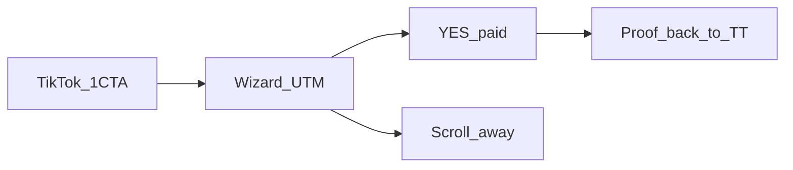

| KPI | starts `utm_source=tiktok` · paid |
| Binary | post link = Wizard only |

### Path B — TikTok → Gra → Wizard

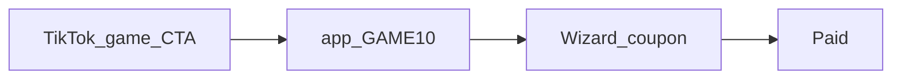

| KPI | plays · coupon→starts · paid |
| Binary | ten post = tylko link gry (gra kończy Wizard) |

### Path C — Blog SEO → Wizard

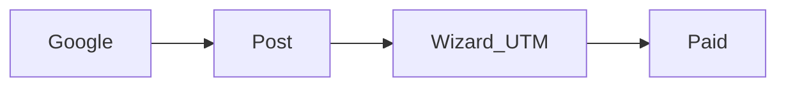

| KPI | organic→starts · paid |
| Binary | 1 CTA Wizard na post |

### Path D — Design Agent → Wizard (nie omijać)

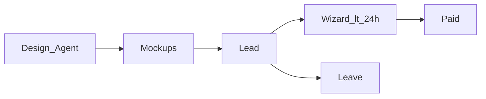

| KPI | DA→Wizard <24h · paid |
| Binary | next step = Wizard lub koniec |

### Path E — Widget / WA → Wizard

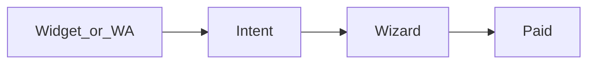

| KPI | CTA click · paid · STL median |
| Binary | rozmowa pcha Wizard — nie „wyślę ofertę i czekam” |

### Path F — Google review / brand → Portal → Wizard

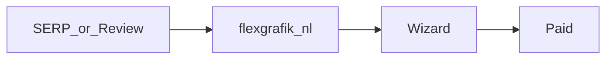

| KPI | brand clicks → starts · review volume |
| Binary | portal CTA = Wizard |

### Path G — CS / referral → Wizard

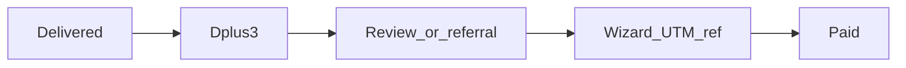

| KPI | referral starts · reviews |
| Binary | 1 ask / kontakt (review **albo** referral — nie oba naraz jako primary) |

### Funnel KPI

| Stage | Metryka |
|-------|---------|
| Attention | publish · watch>8s proxy |
| Landing | CTR UTM |
| Start | Wizard starts |
| Pay | paid real ≥€199 |
| Loop | proof reused in TT/blog |

---

## Ch5 — AGENT ROSTER + BRAINS

OS TARGET (później) **instaluje** tych pracowników — nie wymyśla nowych bez strategii.  
**1 AI employee / kanał·dział.** Zakaz agentów „od wszystkiego”.

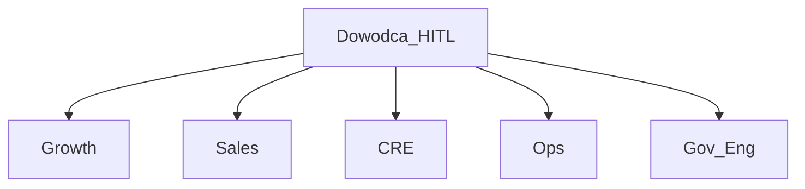

### Wspólny Brain

| Element | Znaczenie |
|---------|-----------|
| Memory | ostatnie N assetów / leadów / orders + co zadziałało |
| Rules | ICP · NL · UTM · snajper CTA · Ads freeze · zakaz HQ/deepfake |
| Loop | mierz → porównaj KPI → **1** ulepszenie / tydzień |
| Growth | więcej paid orders = lepsze creatives / scripts |
| HITL | budzi Foundera tylko w wyjątkach |

### Roster (1 KPI · 1 CTA)

| Agent | Dział | Primary KPI | Primary CTA | Brain / growth loop | HITL | Zakaz |
|-------|-------|-------------|-------------|---------------------|------|-------|
| **Agent_TT** | MKT | Wizard starts `tiktok` | Wizard UTM | Top hooks · zabij słabe · skaluj #1 | publish approve → batch | HQ · deepfake · Ads · multi-CTA |
| **Agent_FB** | MKT | starts · CAC po thaw | Wizard UTM | Creatives FB vs TT | Ads spend GO | Ads przed 2026-08-06 |
| **Agent_Blog** | MKT/SEO | organic→starts | Wizard UTM | Keywords ZZP · update padających | ton / ops copy | post bez CTA · multi-CTA |
| **Agent_Portal** | Trust | sessions→Wizard clicks | Wizard | Portfolio gaps · review count | case + zgoda | sprzeczne FAQ |
| **Agent_Game** | Magnet | coupon→Wizard | Wizard coupon | które TT dają plays | zmiana reward | martwy coupon bez UTM |
| **Agent_SEO** | Growth | SERP→starts | Wizard via portal | GSC · review velocity | paid Google GO | fake reviews |
| **Agent_Sales** | Sprzedaż | hot→Wizard <15m | Wizard | score 0–100 · objections | negocjacja >€5k | lead overnight · offerte-koniec |
| **Agent_Design** | Design | DA→Wizard <24h | Wizard | mockupy→paid · 1 proof/tydz. | druk-ready | offerte jako sukces |
| **Agent_CRE** | Commerce | paid real · abandon↓ | Checkout | step drop-off Wizard | cennik / Gate D | Mollie scale bez GO |
| **Agent_Order** | Order/Erka | on-time · proaktywny status | status→CS trust | delay patterns Erka | partner / QC | fake S7 LIVE |
| **Agent_Finance** | Finanse | marża ≥60% rolling | price/margin alert | cost spikes | auto-price >próg | ukrywanie margin fail |
| **Agent_CS** | CS | D+3 · review **lub** referral | 1 ask → Wizard UTM | sentiment → upsell | reklamacje | completed bez follow-up |
| **Agent_Gov** | Zarządzanie | Conflicts:0 · GO gates | STOP amatorszczyzny | decyzje bez € | deploy/cennik/partner | HQ polish jako P0 tygodnia |
| **Agent_Eng** | Eng | 1 gate = 1 odcinek € | merge tylko z path→Wizard | token cost vs € | merge/deploy | build bez Wizard paid |
| **Agent_Growth_Lead** | Meta | Money Check · path→paid | priorytet G1→G5 | który path daje paid | zmiana strategii kanału | vanity dashboards |

### Learning loop firmy

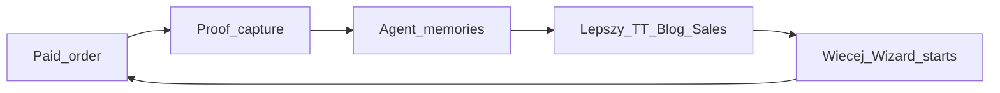

Cash loop jest warunkiem inteligencji systemu — dlatego QuietForge i HQ polish nie są P0.

---

## Consistency checklist (sniper)

- [x] Każdy kanał: dokładnie **1** primary CTA  
- [x] Żadna ścieżka nie kończy się poza **Wizard paid**  
- [x] Brak A/B/C/D/E menu w copy rules  
- [x] QuietForge ≠ cash path teraz  
- [x] Ads freeze datowany (**2026-08-06**); organic ≥**2026-08-02**; TT primary  
- [x] Multi-file drafts ≠ SoT (patrz README + banery SUPERSEDED)  
- [x] Zero product code / deploy / Mollie GO / HQ polish w tym packu  

## ACCEPT

**DONE:** Strategy Pack = SoT.  
**Następny gate:** `ACCEPT SYSTEM-FIRM-OPERATING-SYSTEM-TARGET` · potem `GO TIKTOK ORGANIC` (≥2026-08-02).
