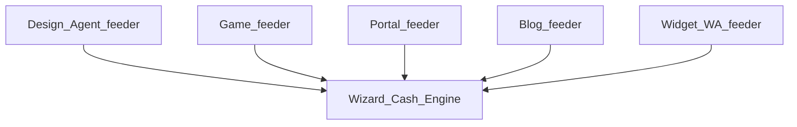
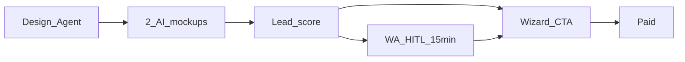

> **SUPERSEDED — nie SoT.** Kanon: [`STRATEGY-PACK.md`](./STRATEGY-PACK.md) (Ch2 PRODUCT). Index: [`README.md`](./README.md).

# STRATEGY PRODUCT — FlexGrafik

## 1. Hierarchia produktu (święta)

| Warstwa | Surface | Rola produktowa | euro |
|---------|---------|-----------------|------|
| **L0 Cash** | Wizard 9-step + WC + Mollie | Jedyna płatność | `GENERUJE` |
| **L1 Trust/Design** | Design Agent (AI mockupy) | Feeder lead + wow | `POŚREDNIO` |
| **L1 Magnet** | app.flexgrafik.nl + GAME10 | Lead + coupon | `POŚREDNIO` |
| **L1 Brand** | flexgrafik.nl | Trust, SEO, CTA Wizard | `POŚREDNIO` |
| **L1 Edu** | zzpackage blog | SEO + edukacja → CTA | `POŚREDNIO` |
| **L1 Concierge** | Widget + WA +31 687286151 | Speed-to-lead | `POŚREDNIO` |
| **L2 Ops** | INT-002, Erka, desk | Po paid | trust powtórki |

**UI klienta:** NL. Disclosure AI w widget: LIVE (COM-AI-50).

## 2. Wizard (Cash Engine)

| Aspekt | Spec |
|--------|------|
| URL | `https://zzpackage.flexgrafik.nl/wizard/` |
| Job | Konfiguracja brandingu ZZP → checkout |
| Guard | ≥€199 · produkcja po briefing/akkoord · 10 werkdagen |
| KPI | starts · checkout reach · paid real · abandon rate |
| Owner-agent | Agent_CRE |

**TO-BE produkt (euro justification):** Mockup AI **w** checkout (3s) — dziś Design Agent jest obok; Elite CRE wymaga połączenia, żeby nie porzucać koszyka.

## 3. Design Agent — dual-path naprawiony strategicznie

Live: `voertuigreclame-ontwerp` — 2 AI mockupy + **offerte 48h bez Wizard** + WA.

| AS-IS ryzyko | TO-BE reguła produktowa |
|--------------|-------------------------|
| Osobny cash/offerte omija Wizard | Offerte/WA = **lead scored** → CTA Wizard / deep link z mockupem |
| „Gratis ontwerp” kończy się mailem | System wymusza następny krok: Wizard session w <24h HITL/auto |

**Zakaz produktowy:** traktować offerte jako sukces sprzedaży bez Wizard paid.

## 4. Gra

| Aspekt | Spec |
|--------|------|
| URL | `https://app.flexgrafik.nl/` |
| Job | Attention → coupon (np. GAME10) → Wizard |
| KPI | plays · leads · coupon→Wizard starts |
| Owner-agent | Agent_Game |

## 5. Portal + Blog

| Surface | Job produktowy | Naprawa wymagana |
|---------|----------------|------------------|
| flexgrafik.nl | Trust + CTA Wizard | Spójność FAQ lokalizacji (Schiedam vs Heesch/Erka) — jeden SoT ops copy |
| Blog ZZPackage | Edukacja branding + slimmer werken | Cadence > „kilka postów”; każdy post = CTA Wizard + UTM |

## 6. Backlog produktowy (kolejność euro — nie wishlist)

| # | Item | Dlaczego € | Gate |
|---|------|------------|------|
| P1 | UTM Lock na wszystkich CTA | skalowanie | measurement |
| P2 | Design Agent → Wizard deep link | domknięcie dual-path | convert |
| P3 | Mockup-before-pay w Wizard | konwersja | CRE |
| P4 | Speed-to-Lead alert | utrata hot lead | sales |
| P5 | ops_state desk | trust po paid | ops GO |
| P6 | Dynamic pricing / margin lock | marża | po volume |
| P7 | Retarget pixel loops | odzysk | po Ads thaw |

## 7. KPI produktowe

| KPI | Definicja |
|-----|-----------|
| Feeder→Wizard rate | % sesji feedera z Wizard start |
| DA lead→Wizard <24h | % Design Agent leads |
| Coupon redemption | GAME* → checkout |
| FAQ/ops copy consistency | 0 sprzecznych lokalizacji w prod copy |

## 8. ACCEPT

Część packu: `ACCEPT FLEXGRAFIK STRATEGY PACK`
