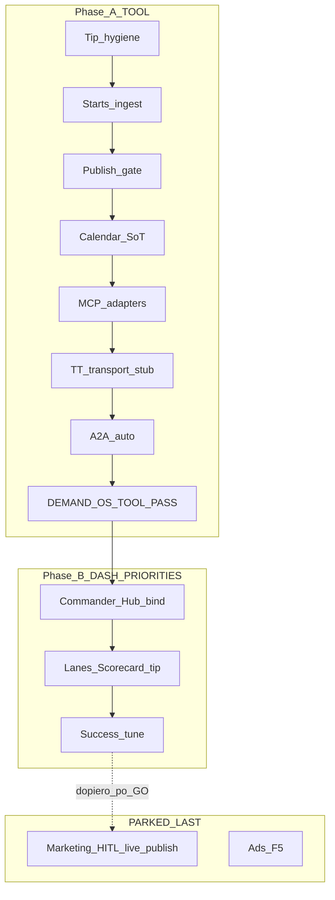

# OS TARGET — TOOL COMPLETE → DASHBOARD TUNE

> **For agentic workers:** `/vibe-init` → `/demand-os-execute` (1 DOS-* na sesję) → `/jadzia-test` → `/post-coding`. SoT: [`docs/ops/SYSTEM-FIRM-OPERATING-SYSTEM-TARGET.md`](docs/ops/SYSTEM-FIRM-OPERATING-SYSTEM-TARGET.md). Marketing HITL = **PARKED_LAST**. Publikacje live = **STOP** (dozwolone tylko dry-run / fixture / mock). F5 Ads = PARK cash. VPS = STOP bez GO.

## Werdykt (bez zgadywania)

| Warstwa | Status |
|---------|--------|
| F1–F4 + Hub v0 | LOCAL DONE (37 pytest) |
| OS TARGET 100% | **PARTIAL** — brakuje wires: starts ingest, publish gate, dual calendar, MCP adapters, TT transport stub, A2A auto, tip hygiene |
| Dashboard / priorytety | **STALE** — Commander `wizard_starts (UTM)=insufficient_data`; lanes B/B2 nadal „organic ACTIVE” |
| Marketing | PARKED_LAST — nie ruszać |

---

## Phase A — TOOL 100% (OS TARGET residual)

### A0 — Tip hygiene (kill organic drift)
**Files:** [`docs/ops/PROGRAM-LANES-SOT.md`](docs/ops/PROGRAM-LANES-SOT.md) B/B2 · [`docs/ops/demand-os/set-now/GO-DAY-TODAY.md`](docs/ops/demand-os/set-now/GO-DAY-TODAY.md) · [`docs/ops/demand-os/set-now/README.md`](docs/ops/demand-os/set-now/README.md) · [`.agents/workflows/demand-os-execute.md`](.agents/workflows/demand-os-execute.md) (usuń regułę „zero kodu do W1-PASS” — Founder już GO build; tryb = TOOL FIRST) · STATE / OPERATOR (już TIP — zweryfikuj).

**DoD:** Zero dokumentów kanonicznych mówi „organic sprint ACTIVE / next = TT publish/hunt”. Lanes B2 = `PARKED_LAST · wait TOOL PASS`. Workflow egzekucji = tool residual, nie hunt.

### A1 — Starts ingest (North Star P0 wire) — `DOS-TOOL-01`
**OS:** §D · §M · §E MCP (GA4/jadzia.db).  
**Build:** `agent/demand_os/starts_ingest.py` + rozszerz `growth_events.py` o `wizard_start` / `paid` · CLI w `tools/demand_os_hub.py` (`ingest` / wire do `money-check`) · fixture CSV/JSONL · opcjonalnie cienki wrap [`agent/marketing/dtl/ga4.py`](agent/marketing/dtl/ga4.py) (read-only, fail-closed bez sekretów).

**DoD:**
- `hub money-check` pokazuje `starts_by_utm` z ≥1 fixture UTM **bez** ręcznej edycji `LEDGER.csv`
- pytest ≥3 (fixture ingest · bad UTM reject · paid optional)
- zero network wymagany w CI; live GA4 = env-gated stub

### A2 — Publish-path gate bridge — `DOS-TOOL-02`
**OS:** §E publish path · §G · Val przed światem.  
**Build:** `agent/demand_os/publish_gate_bridge.py` · podpiąć `assert_publish_allowed` w entrypointach [`agent/publishers/`](agent/publishers/) (najmniejszy diff) lub hard DENY shim jeśli publisher nie ma dry-run.

**DoD:**
- publish bez validated slot / pass_token → **DENY** (test)
- z tokenem z F2 calendar → **ALLOW** (dry-run)
- 0 ścieżek omijających Val w Demand OS path

### A3 — Dual calendar SoT — `DOS-TOOL-03`
**OS:** §E content_calendar.  
**Decyzja (locked):** Growth gate SoT = `CONTENT-CALENDAR.json` (F2). SQLite INT-010 / `content_calendar_node` = **ops calendar** — dokumentowany split; adapter sync **read-only tip** lub explicit „nie używaj do growth publish”.

**DoD:**
- 1 strona SoT w `docs/ops/demand-os/CALENDAR-SOT.md`
- test: F2 gate nie czyta SQLite jako źródła prawdy
- brak cichego divergencji w docs tip

### A4 — MCP adapter stubs (map §E) — `DOS-TOOL-04`
**OS:** §E MCP table.  
**Build (cienkie facades, nie nowe produkty):**
- `agent/demand_os/ga4_adapter.py`
- `agent/demand_os/gdrive_cf.py` (wrap [`agent/media/gdrive.py`](agent/media/gdrive.py))
- `agent/demand_os/widget_leads.py` → `emit_handoff(lead_hot|engage_event)`
- Hub subcommands lub `tools/demand_os_mcp.py`

**DoD:** każdy adapter: 1 CLI smoke + 1 pytest; fail-closed bez creds; **zero fake HTTP MCP server**; DOS-MCP-01 evidence zaktualizowane uczciwie.

### A5 — LiveTikTokTransport stub — `DOS-TOOL-05`
**OS:** §L F3 · §E social connectors.  
**Build:** `agent/demand_os/connectors/tiktok_transport.py` · Protocol jak FB · default mock · live = env+GO, comment PARKED (jak FB).

**DoD:** `get_transport` wybiera TT/FB po platform; bez sekretów = fail closed; mock smoke nadal PASS; **zero live comment / zero hunt**.

### A6 — A2A auto-emit — `DOS-TOOL-06`
**OS:** §E A2A.  
**Build:** Val PASS → emit/ack `publish_request`; engage z Wizard UTM → `engage_event` (hook w `engage.py` / validator).

**DoD:** 1 pytest: JSONL record + SLA fields bez ręcznego `hub a2a emit`; nie wymaga Facebooka.

### A7 — TOOL PASS gate — `DEMAND-OS-TOOL-PASS`
**DoD (wszystkie true):**
1. A0–A6 `done` + pytest demand_os zielone (baseline ≥37 + nowe)
2. `hub status` / `money-check` czytelne z fixture starts
3. Publish path DENY bez tokena
4. Dokument `docs/ops/demand-os/TOOL-PASS.md` z checklistą
5. tip `todo.json` `active_gate=DEMAND-OS-TOOL-PASS` → next = dashboard phase
6. Marketing nadal PARKED_LAST · F5 parked · NO VPS

---

## Phase B — Dashboard + priorytety na sukces (po TOOL PASS)

### B1 — Commander bind Hub §M — `DOS-DASH-01`
**Files:** [`commander-ui/app.js`](commander-ui/app.js) (demand stage ~L2072 `wizard_starts`) · [`api/routes/commander.py`](api/routes/commander.py) RO endpoint wrap `build_screen()`/`money_check()` · ewentualnie [`agent/commander/money_narrative.py`](agent/commander/money_narrative.py).

**DoD:**
- Demand stage pokazuje: publish · comments · val FAIL · starts_by_utm · paid · top_hook · HITL queue (OS §M only)
- **NIE** views / VHQ vanity
- przy fixture/local: nie `insufficient_data` na starts gdy ingest ma dane
- pytest/API smoke lokalny; deploy VPS tylko z GO (osobny gate)

### B2 — System priorities tip — `DOS-DASH-02`
**Files:** [`docs/ops/PROGRAM-LANES-SOT.md`](docs/ops/PROGRAM-LANES-SOT.md) · [`docs/ops/SCORECARD-AI-OS-ZALICZENIE.md`](docs/ops/SCORECARD-AI-OS-ZALICZENIE.md) (#3/#4 pointer do Demand OS Hub) · [`docs/ops/FLEXGRAFIK-CAMPUS-MAP.md`](docs/ops/FLEXGRAFIK-CAMPUS-MAP.md) Marketing Studio → Hub+UTM · OPERATOR · STATE · `todo.json` · AGENTS.md.

**DoD:** Jedna kanoniczna kolejka priorytetów:
1. Demand OS TOOL (done po A7)
2. Commander Money Highway (B1)
3. Ledger/Money Check rytm (narzędzie)
4. Marketing HITL = last (parked)
5. Ads/F5 = parked_cash  
Zero „organic sprint ACTIVE” w lanes.

### B3 — Success tune (system, nie content) — `DOS-DASH-03`
**Build:** Hub `weekly` — agregacja episodic + 1 recommended improvement z #1 hook · Money Check append helper · opcjonalnie Commander NBA tip „next tool action” (nie „post TT”).

**DoD:**
- `hub weekly` wypisuje: starts WoW · top_hook · val compliance · **1** improvement suggestion
- zapis do `MEMORY.json` episodic
- brak CTA do live publish w output (tylko test/dry-run jeśli w ogóle)

---

## Explicit PARK (nie w planie egzekucji)

| Item | Status |
|------|--------|
| Live TT/FB publish / hunt / blog ship | PARKED_LAST |
| Organic Agency Sprint HITL | PARKED_LAST |
| F5 Ads / boost | parked_cash |
| VHQ polish / HQ / S7 / QuietForge P0 | STOP (§N) |
| VPS deploy | tylko `GO DEPLOY` |

Testowe OK: mock transport, Val dry-run, fixture ingest, gate DENY/ALLOW unit tests.

---

## Workflow egzekucji (obowiązkowy)

Każdy task A0–B3:
1. `/vibe-init` — hydrate STATE + TODO
2. `/demand-os-execute` — jeden `DOS-*`
3. `/jadzia-test` — pytest scope
4. `/post-coding` — handoff + tip gate (bez VPS)
5. Update [`docs/ops/DEMAND-OS-TODO.md`](docs/ops/DEMAND-OS-TODO.md) + [`STATE.md`](docs/ops/demand-os/STATE.md)

Podczas egzekucji zapisać też plan roboczy: `docs/superpowers/plans/2026-08-01-os-target-tool-complete.md` (kopia checklist).

---

## Definition of Program Done

**PROGRAM PASS** gdy:
- `DEMAND-OS-TOOL-PASS` = done (A7)
- Commander Demand stage bound do Hub §M (B1)
- Lanes/scorecard/OPERATOR mówią jedną prawdę: tool → dashboard → marketing last (B2)
- Success weekly rytm w Hub (B3)
- Marketing nadal nie wystartował bez osobnego Founder GO

**Następny human GO (później):** `GO MARKETING HITL` — poza tym programem.
