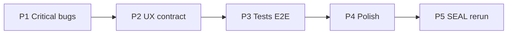

# Plan — domknięcie luk Biuro Popytu (post-Etap 5)

**Cel:** §8 PASS + Hard DoD 15/15 + SEAL tool 100% (bez VPS bez GO)



---

## P1 — Krytyczne (sesja + dane + VHQ) · 1 sesja

| ID | Luka | Fix | Plik |
|----|------|-----|------|
| **B1** | refresh kasuje JWT | `refresh()` scope-aware: tylko active view; **nie** clearToken na 401 z opcjonalnych loaderów gdy demand-desk active; alternatywa: `loadDemandDesk()` izolowany bez full refresh | `app.js` |
| **B2** | E assety „?” | Map `a.asset \|\| a.asset_id` | `renderDemandDesk` |
| **B3** | VHQ drift | Room manifest: primaryAction → Biuro Popytu; KPI „Desk Etap 5 LIVE” | `app.js` VHQ_ROOMS |
| **U6** | More sheet | ✅ done — verify test | już w kodzie |

**Verify P1:**
```bash
# lokalnie: JWT → Biuro Popytu → Odśwież → nadal zalogowany + dane
# E: top assety = tt_w32_install_01 nie „?”
```

---

## P2 — UX / kontrakt · 1 sesja

| ID | Luka | Fix |
|----|------|-----|
| **U24** | Hierarchia A0>B>A | Przenieś `#desk-praca` (B) **przed** `#desk-puls` (A) w HTML; CSS spacing |
| **dual_cash** | Tylko open_fail | Render `dual_cash.columns` + `red` flag; tooltip rule string |
| **U22** | Brain link | Footer link: `DEMAND-CONTROL-PANEL-DESIGN.md` (GitHub raw lub ops path) |
| **U14** | Empty copy | Bind `top_wizard_note` z API gdy puste E |
| **loading** | Stuck „Ładowanie” | Skeleton + error state gdy fetch fail bez 401 |

---

## P3 — Testy (prawdziwe, nie grep-only) · 1 sesja

| Test | Co |
|------|-----|
| `test_render_desk_golden.py` | Załaduj `desk_status_v21.min.json` + fixture MIXED; assert HTML snippet z `renderDemandDesk` logic (Node-less: extract mapping table) |
| `test_demand_desk_api_icp_ledger.py` | POST icp + ledger RBAC |
| `test_hunt_dry_updates_queue.py` | Po dry → status hunt SENT dla target |
| `test_refresh_preserves_session` | Playwright lub jsdom: mock 401 on /home nie czyści token gdy fix B1 |
| Update contracts | VHQ CTA strings, `asset` field |

**Gate:** `pytest tests/unit/test_demand_desk* tests/test_demand_os_api_desk.py -q` PASS

---

## P4 — Polish · 0.5 sesji

- Responsive 320 / 768 / 1280 (no horizontal scroll)
- Keyboard: HITL row focus ring
- `aria-live` na `#desk-fixture-banner` (już jest — verify)
- Microcopy PL: „PREP” → hint „przygotuj slot”
- Manual §8 rerun przez Dowódcę (wpis PASS w handoff)

---

## P5 — SEAL rerun · 0.5 sesji

1. Agent/browser §8 — wszystkie 7 ✅
2. Hard DoD 15/15
3. `STATE.md` → `tool_100: SEALED`
4. CLOSE handoff update
5. **VPS:** COMMAND_BLOCK do GO Dowódcy

---

## Kolejność wykonania (1-1-1)

| Sesja | Deliverable |
|-------|-------------|
| S1 | P1 (B1–B3) + verify browser refresh |
| S2 | P2 UX + dual_cash |
| S3 | P3 tests |
| S4 | P4 + Dowódca §8 PASS |
| S5 | P5 SEAL |

---

## OUT (bez zmian)

Marketing live · Ads · VPS bez GO · one-click publish

---

## Szacunek

**4–5 sesji 1-1-1** do prawdziwego SEAL (nie „kod istnieje = done”).
