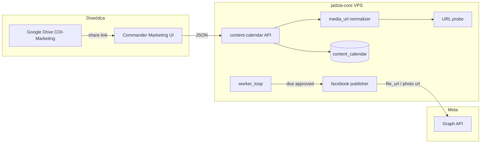

# Design: COI Content Intake — Marketing Supply (Opcja A + zewnętrzne media URL)

**Date:** 2026-07-09  
**Status:** DRAFT — wymaga approve Dowódcy przed implementacją  
**Owner:** Norbert Wozniak (Dowódca)  
**Repo:** jadzia-core  
**Poprzednik:** [`COI-COMMANDER-PLAN-v3.md`](../../design/coi-commander/COI-COMMANDER-PLAN-v3.md) (control plane — **DONE**)

---

## North star

Dowódca **sam dostarcza treści** (tekst NL, grafiki, wideo) i **planuje publikację** w jednym miejscu — zakładka **Marketing** w COI Commander — bez uploadu plików na VPS Jadzia.

**Pytanie przewodnie:** *Czy w poniedziałek rano wiesz, co i kiedy wychodzi na FB — i czy to wychodzi bez dotykania kodu?*

---

## Problem (dlaczego v3 nie wystarcza)

Plan v3 zbudował **panel sterowania** (kolejka, HITL, audyt, deeplink, delegacja).  
Nie zbudował **źródła treści**:

| Dziś w repo | Brak |
|-------------|------|
| `content_calendar` + API INT-010 | Formularz w UI |
| `media_url`, `scheduled_publish_at` w DB | Pola w create/update API |
| Publish FB **tylko tekst** (`/{page_id}/feed`) | Publish zdjęcia/wideo z URL |
| Marketing UI = lista kart | Composer + kolejka chronologiczna |
| `pending_approval` flow | Solo operator flow (draft → zaplanowany) |

Efekt: Commander działa, ale **nie ma czego zatwierdzać**, dopóki wpis nie powstanie ręcznie przez API.

---

## Decyzja produktowa (zatwierdzona na brainstormie)

| Obszar | Decyzja |
|--------|---------|
| Kto pisze treść | **Dowódca** (Opcja A) |
| Gdzie leżą pliki | **Google Drive** (konto Google One 5 TB) |
| Jak trafiają do Jadzi | **Publiczny link URL** wklejony w panelu — **zero uploadu na VPS** |
| Platforma M1 | **Facebook Page** tylko |
| Język posta | **NL** (`body_nl`) |
| Język UI | **PL** (Commander) |

---

## Trzy podejścia (media URL)

### Podejście 1 — Surowy URL (YAGNI minimum)

Użytkownik wkleja dowolny link; system zapisuje string; publish wysyła do Meta bez walidacji.

| + | − |
|---|---|
| Najszybsze do kodu | GDrive `view` linki **nie działają** z Meta crawlerem |
| | Błędy dopiero przy publikacji |

### Podejście 2 — Normalizacja GDrive + walidacja (REKOMENDOWANE M1)

Użytkownik wkleja link z Drive; backend wyciąga `file_id`, zapisuje kanoniczny rekord, przy zapisie robi **HEAD/GET probe** (dostępność, MIME). Przy publikacji buduje URL `uc?export=download&id=`.

| + | − |
|---|---|
| Profesjonalne UX (wklej jak w Drive) | Duże wideo (>~100 MB) mogą mieć interstitial Google |
| Jeden string w DB + metadane | Wymaga jasnej instrukcji „udostępnij: każdy z linkiem” |
| VPS lekki (tylko HTTP do FB + probe) | |

### Podejście 3 — Google Drive API (service account)

Backend pobiera plik przez API i uploaduje do Meta jako multipart.

| + | − |
|---|---|
| Najwyższa niezawodność wideo | OAuth/service account, sekrety, quota — **overkill na M1** |
| | Łamie zasadę „zero obciążenia VPS” |

**Rekomendacja:** **Podejście 2** na M1/M2. Podejście 3 tylko jeśli M2 pokaże systematyczne fail'e wideo z GDrive.

---

## Fazy dostawy

### M1 — Content Intake (PIERWSZA implementacja)

**Cel:** Dowódca dodaje posty z harmonogramem; FB dostaje tekst lub tekst+zdjęcie.

| Element | Zakres |
|---------|--------|
| UI Marketing | Composer + kolejka chronologiczna |
| Typy treści | `text`, `image` |
| Media | `media_url` — link GDrive (znormalizowany) |
| Harmonogram | `scheduled_publish_at` — datetime lokalny → UTC w API |
| Statusy | `draft` → `approved` (przycisk „Zaplanuj”) → `published` / `failed` |
| Publish | Rozszerzyć `facebook.py`: `publish_photo(message, image_url)` |
| Worker | Istniejący `publish_due_scheduled_entries()` — bez zmian koncepcji |
| Walidacja | Probe URL przy zapisie; komunikat PL w UI |

**DoD M1:** Dowódca wkleja link do JPG/PNG na Drive, tekst NL, datę środy 09:00 → o czasie (lub „Opublikuj teraz”) post z obrazem jest na FB Page.

### M2 — Wideo / Reels

| Element | Zakres |
|---------|--------|
| Typ treści | `video` |
| Publish | `facebook.py`: `publish_video(message, file_url)` — Meta pobiera z URL |
| UI | Ten sam formularz; MIME `video/*` z probe |
| Fallback | Jeśli GDrive probe fail → toast + TG alert; instrukcja R2 w playbooku |

**DoD M2:** MP4 na Drive → zaplanowany post wideo na FB (niekoniecznie format Reels — to osobna decyzja Meta API).

### Poza zakresem (explicit)

- Upload plików na VPS / S3/R2 w panelu
- TikTok, Instagram
- AI generowanie copy
- Kalendarz miesiąca / drag-and-drop
- INSPIRE auto-draft
- `pending_approval` dla wpisów tworzonych przez Dowódcę w UI

---

## Operator workflow (Dowódca — 3 kroki)

### Przygotowanie (jednorazowo)

1. W Google Drive utwórz folder: **`COI-Marketing`** (root lub Shared Drive).
2. Dla każdego pliku: **Udostępnij → Każdy, kto ma link → Wyświetlający**.
3. Skopiuj link z paska (format `https://drive.google.com/file/d/…/view`).

### Per publikacja

```
Krok 1  Wrzuć gotowy plik (JPG/PNG/MP4) do COI-Marketing na Drive
Krok 2  Skopiuj link udostępniania
Krok 3  Commander → Marketing → wklej link + tekst NL + data → „Zaplanuj publikację”
```

### Co system robi za Ciebie

- Normalizuje link → `file_id`
- Sprawdza, czy Meta może pobrać plik (probe)
- O czasie wysyła do Graph API: „opublikuj, oto URL”
- Zapisuje wynik w `publish_result` + audyt Commander

---

## UI — Marketing Studio (jedna strona, dwa bloki)

### Blok A — Pasek statusu (1 linia)

```
Następna publikacja: śr 09:00 · Zaplanowane: 3 · Szkice: 1
```

### Blok B — Composer „Nowy wpis” (domyślnie otwarty gdy kolejka pusta)

| Pole | Typ | Wymagane | Uwagi |
|------|-----|----------|-------|
| Typ treści | select | tak | `Tekst` / `Grafika + tekst` / `Wideo` (M2: wideo disabled do czasu gate) |
| Tytuł | text PL | tak | Etykieta wewnętrzna, max 200 znaków |
| Treść | textarea NL | tak* | *Dla samego tekstu; dla wideo może być krótki caption |
| Link do media | url | gdy image/video | Placeholder: „Wklej link z Google Drive” |
| Data i godzina | datetime-local | przy Zaplanuj | `scheduled_publish_at` |
| Podgląd | thumbnail | auto | Jeśli probe OK — miniatura z `thumbnailLink` lub ikona typu |

**Przyciski (2):**

| Przycisk | Akcja API | Status |
|----------|-----------|--------|
| Zapisz szkic | `POST /content-calendar` status=`draft` | Bez wymogu daty |
| Zaplanuj publikację | `POST` + `PATCH` status=`approved` | Wymaga daty ≥ teraz + 10 min |

**Ukryte w M1 (szum v3):** graduation badge, bulk approve, case-study suggestions.

### Blok C — Kolejka (sort: `scheduled_publish_at` ASC)

Karta wpisu:

- Miniatura / ikona typu
- Tytuł PL + 2 linie `body_nl`
- Data + badge: `szkic` | `zaplanowany` | `opublikowany` | `błąd`
- Akcje: **Edytuj** | **Anuluj** | **Opublikuj teraz** (tylko `approved`)

Filtry (chipy): `Wszystkie` · `Zaplanowane` · `Szkice` · `Opublikowane`

---

## Architektura techniczna



### Nowe / rozszerzone komponenty

| Komponent | Odpowiedzialność |
|-----------|------------------|
| `agent/media/gdrive.py` | `parse_gdrive_url(url) → file_id`, `build_direct_url(file_id)`, `probe_media_url(url) → {ok, mime, size}` |
| `core/models.py` | `content_type`, `media_url`, `scheduled_publish_at` w Create/Update |
| `agent/publishers/facebook.py` | `publish_photo`, `publish_video` (M2) |
| `agent/nodes/content_calendar_node.py` | Routing publish po `content_type` |
| `commander-ui/app.js` | Composer + kolejka (zastąpić płaską listę) |
| `docs/ops/COI-MARKETING-PLAYBOOK.md` | Instrukcja GDrive + troubleshooting |

**Brak nowego mikroserwisu.** Wszystko w istniejącym `jadzia-core`.

---

## Model danych (rozszerzenie INT-010)

### Pola `content_calendar` (istniejące + nowe)

| Kolumna | M1 | Opis |
|---------|-----|------|
| `title` | ✅ | PL, wewnętrzne |
| `body_nl` | ✅ | Treść FB |
| `platform` | ✅ | `facebook` (default w UI) |
| `media_url` | ✅ | Kanoniczny URL lub `gdrive:{file_id}` |
| `scheduled_publish_at` | ✅ | ISO UTC — **źródło prawdy** dla workera |
| `scheduled_at` | ✅ | Zachować dla kompatybilności = kopia lub legacy |
| `content_type` | ✅ NEW | `text` \| `image` \| `video` |
| `media_source` | ✅ NEW | `gdrive` \| `external` (default gdrive jeśli parse OK) |
| `status` | ✅ | Patrz flow poniżej |

### Flow statusów (solo operator)

```
draft ──[Zaplanuj]──► approved ──[worker due / Opublikuj teraz]──► published
  │                      │
  └──[Anuluj]──► cancelled
                      └──[FB error]──► failed (retry z UI)
```

`pending_approval` **nie używamy** dla wpisów z Composer UI (Dowódca = autor i approver).

---

## Kontrakt Google Drive (profesjonalny)

### Akceptowane formaty wklejki

- `https://drive.google.com/file/d/{FILE_ID}/view`
- `https://drive.google.com/open?id={FILE_ID}`
- `https://drive.google.com/uc?id={FILE_ID}&export=download`

### Reguły normalizacji

1. Wyciągnij `FILE_ID` regexem.
2. Zapisz w DB: `media_url = https://drive.google.com/uc?export=download&id={FILE_ID}`.
3. Zapisz `media_source = gdrive`, opcjonalnie `gdrive_file_id` w `publish_result` meta przy pierwszym zapisie.

### Wymagania udostępniania (playbook)

- Plik: **„Każdy, kto ma link”** — rola **Wyświetlający** (nie Edytor).
- Folder COI-Marketing: ta sama polityka (dziedziczenie).
- **Nie** używaj linków „ograniczony do konta FlexGrafik” — Meta nie ma dostępu.

### Probe przy zapisie (Podejście 2)

```
HEAD/GET na direct URL
→ 200 + Content-Type image/*  = OK dla image
→ 200 + Content-Type video/* = OK dla video (M2)
→ 403/404 = błąd UI: „Link niedostępny — sprawdź udostępnianie Drive”
```

### Znane ograniczenia (ujawnione w playbooku)

| Problem | Objaw | Obejście |
|---------|-------|----------|
| Duży plik wideo GDrive | Virus scan interstitial | M2: R2/S3 jako fallback URL; lub mniejszy plik |
| Link `view` bez normalizacji | FB publish fail | Zawsze normalizuj w backendzie |
| Wygasły token share | probe 403 | Re-share w Drive, edytuj wpis w Commander |

---

## Publish — Graph API (per content_type)

| content_type | Endpoint | Payload |
|--------------|----------|---------|
| `text` | `POST /{page_id}/feed` | `message`, opcjonalnie `scheduled_publish_time` |
| `image` | `POST /{page_id}/photos` | `message`, `url={media_url}` |
| `video` (M2) | `POST /{page_id}/videos` | `description`, `file_url={media_url}` |

Scheduling: użyć `scheduled_publish_time` (unix) tam, gdzie API wspiera; inaczej worker publikuje gdy `now >= scheduled_publish_at` (obecny wzorzec).

---

## Błędy i powiadomienia

| Zdarzenie | UX | Kanał |
|-----------|-----|-------|
| Zły link Drive | Toast PL + pod polem | UI |
| FB publish fail | Status `failed` + `publish_result` JSON | UI + istniejący TG alert z `content_calendar_node` |
| Worker miss | SLA `scheduled_publish_due` w Commander queue | Już zdefiniowane D0.8 |

---

## Bezpieczeństwo

- `media_url` walidacja: tylko `https://`, hosty allowlist: `drive.google.com`, `*.googleusercontent.com`, opcjonalnie `lh3.googleusercontent.com`.
- Brak pobierania pliku na dysk VPS (tylko probe HEAD, max 1 MB nie — HEAD only).
- JWT + `marketing:approve` scope na create/update (istniejące).
- Audyt Commander przy publish (istniejące `commander/publish.py`).

---

## Testy (DoD techniczny)

| Test | Typ |
|------|-----|
| `parse_gdrive_url` — 3 formaty linków | unit |
| `probe_media_url` — mock HTTP | unit |
| Create entry z `media_url` + `scheduled_publish_at` | API unit |
| `publish_photo` — mock Graph API | unit |
| Composer E2E — brak w CI; manual checklist w playbooku | human |

---

## Zależności / prereqs prod

| Wymaganie | Status |
|-----------|--------|
| Commander deployed | ✅ |
| `FB_PAGE_ID` + `FB_ACCESS_TOKEN` na VPS | Dowódca verify |
| Folder COI-Marketing na Drive | Dowódca (jednorazowo) |
| Linki publiczne (viewer) | Dowódca per plik |

---

## Następny dokument (po approve tego spec)

1. **Approve** ten plik przez Dowódcę  
2. **`writing-plans`** → `docs/plans/PLAN-COI-CONTENT-INTAKE-M1.md` (taski T1–Tn, 1 sesja = 1 task)  
3. Implementacja M1 w `jadzia-core`  
4. Po M1 E2E proof → handoff → dopiero wtedy plan „co dalej w repo” (AI draft, INSPIRE, cleanup kolejki E2E)

---

## Relacja do planów

| Plan | Status |
|------|--------|
| COI Commander v3 | **DONE** — control plane |
| COI Phase B INT-010/011 bootstrap | **DONE** — tekst publish |
| **Ten spec (Content Intake)** | **NEXT** — supply chain Opcja A |
| COI Content AI (przyszłość) | Po M1+M2 + 2 tygodnie manual loop |

---

## Approve

- [ ] Dowódca: design M1 UI + GDrive workflow OK
- [ ] Dowódca: akceptacja ograniczenia wideo GDrive → M2 + playbook fallback
- [ ] Agent: przejście do `writing-plans` po approve
